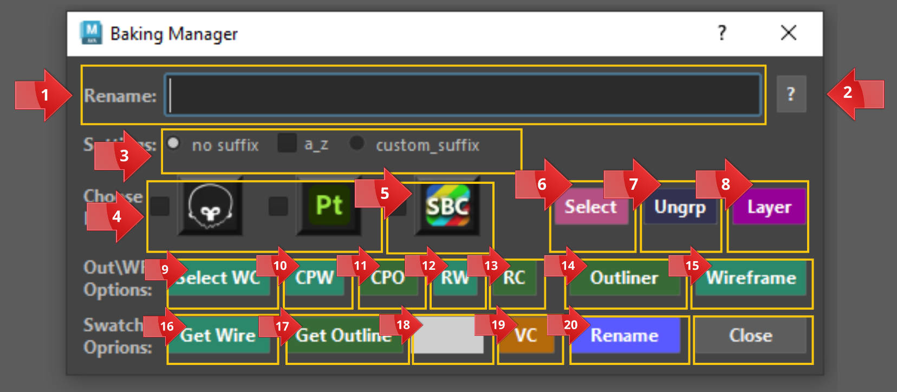

# **Buttons Overview**

{ .img-medium}

# **Buttons**

1. **Rename** textfield *(use to rename or select assets in your scene)*.
2. **Help** menu *(here you will find documentation hotkeys etc.)*.
3. **a_z & Custom Suffixes** *(for more info check the [**Rename Features**](../Baking%20Manager/Rename%20Features.md) section)*.
4. **Marmoset**  and **Substance** options *(for more info check [**Baking Workflows**](../Baking%20Manager/Baking_workflow/index.md))*.
5. **SBC** - Select by Color button. When checked if the user clicks on the Select Button, the tool will filter through all meshes in the outliner and select those that match the color of the swatch.
6. **Select** - will select any asset that matches what is entered in the rename textfield or if the SBC checkbox is checked will select groups/meshes that match the color of the Swatch (check Baking Workflow for alternative uses of this button).
    *  ??? Info "Select Additional Info"
        * When nothing selected the button acts as a **searchbar** that will select whatever you have entered in the **Rename:** field.
            * Use this button in combination with the **Select by Color** checkbox to quickly filter and select meshes or groups that share the same color in the outliner.
            * If nothing specified and you have something selected it will select the parent of that selection.
        * If **Marmoset** or **Substance** checkboxes are checked it will only select the colored Baking groups that were created by either Marmoset or Substance *(make sure the color of the swatch matches the color of the group)*.
            * If **Nested checkbox** is checked it will only select groups withing the Nested group.
        * Alternative Use Cases: 
            * ++alt++ + Click to get the name of a selected asset  in the rename textfield *(If multiple selected it will cycle through and return the name of the next object in your selection - ++ctrl++ click to cycle backwards)*.
            * ++ctrl+++++alt++ + click to get the number of selected assets in the rename textfield.
            * ++ctrl+++++shift++ + Click to clear the rename textfield.
        * If **Marmoset** or **Substance** checkbox selected:
            * ++alt++ + Click will return the name of the selected object, however if you select an object that belongs in a **baking group** it will return the name you used to create that baking group.
                * e.g. If the name of your asset is *test_01a_low* and belongs to a baking group, then in the rename textfield you will get the name *test_01a.*
            * ++ctrl+++++alt++ Click to set the nested path *(baking workflow)*.
            * ++ctrl++ + Click so the textfield will give you the **&lt;getalllow&gt;** name.
            * ++shift++ + Click so the textfield will give you the **&lt;getallhigh&gt;** name.
            * ++ctrl+++++shift++ + Click so the textfield will give you the **&lt;getall&gt;** name.
    
7. **Ungroup** - Will parent your selection to the world *(check [**Ungroup Features**](../Baking%20Manager/Ungroup%20Features.md) for more info)*.
    * ??? Info "Ungroup Additional Info"
        * ++ctrl++ + Click with nothing selected to delete empty groups that have no parent *(are parented to the world)*.
            * If the user selects a group or groups then ++ctrl++ + Click will search for all descendants of those groups and if there are any groups with no children those will be deleted.
        * ++shift++ + Click to delete groups that have no children from your entire scene.
            * This action repeats 30 times meaning if you have a group within a group with nothing in it the tool will delete both groups.
8. **Layer** - quickly assigns a layer to a selection based on the name chosen in the textfield *(see [**Layer Features**](../Baking%20Manager/Layers%20Button%20Overview.md) and  [**Baking Workflows**](../Baking%20Manager/Baking_workflow/index.md) for alternative uses of this button)*.
    * ??? Info "Layer Additional Info"
        * **Default Click - Creates Layers from selected objects based on a given **name** in the Rename Textfield.**
            * Created Layers will inherit the **color** of the swatch.
            * If you have a selection and that selection belongs in a layer, clicking on the **Layer** button will change the **color** for that layer *(**Marmoset\Substance** must be unchecked for this to work)*.
        * **The folowing will only work if Substance or Marmoset checkboxes are checked**.
            * If **Marmoset** or **Substance** are checked and you select a mesh that belongs in a **Baking Group** the tool will create the appropriate **Baking Layers** *(with the suffix _low/high_grp_bk_layer)*.
                * *(Baking Group is a group that was created when renaming assets while the Marmoset or Substance checkboxes were checked)*.
            * ++shift++ + Click to **remove** an object that belongs in a layer (if **Marmoset/Substance** are checked and the selected mesh is in a **Baking Group** it will be ungrouped or if you select a **Baking group** the whole group will be removed from the layer it belongs).             
                * If you have a Baking Group Selected then all children of that group will be removed from the layer they belong.
            * ++ctrl++ + Alt Click with nothing selected to  **delete** all layers.
                * If you have a selection the tool will check if it belongs in a layer and delete it. 
                * If **Marmoset** or **Substance** checkboxes are checked then only the **^^low/high _bk_layer^^** layers will be deleted.
        * **The following will work with and without the substance/marmoset checkboxes being checked.**
            * ++ctrl+++++shift++ Click to **create** layers for all **HP/LP baking groups** in your scene. 
                * If you type in the word **layers** in the **rename textfield** then a layer will be created for each baking group that exists in your scene *(color for each layer is inherited from the color of the baking group)*. 
                    * **TIP** - ++ctrl+++++alt+++++shift++ the **Rename** button to automatically **fill** in the Rename Textfield with the word **layers**.
                * ++shift+++++alt++ Click to **isolate** layers from objects *(objects must belong in a layer)*. This will hide all other layers. 
                    * Activate again to show re-instate your layers.
                    * If at any point you wish to reset the state of the isolated layers. Type in the rename textfield **&lt;reset_isolate_layers&gt;** and ++shift+++++alt++ Click on the **Layer** button *(you can also just ++shift++ + Click on the **Rename** button the get the name to appear instead of typing)*.
                * ++ctrl++ + Click to open the **Layer Window**.
                * To **change** the color of the swatch to match that of a **colored layer ** simply select an object *(that belongs in that layer)*, type in the rename textfield **&lt;getlayercolor&gt;** and click on the **Layer** button.
                * ++alt++ + Click with a selected object that belongs in a layer, will **return the name** of that layer in the **rename textfield** *(if multiple objects selected it will display only the name of the first selection that belongs to a layer)*.
                * ++ctrl+++++alt+++++shift++ with nothing selected to **toggle** the **color of all layers** *(works only with layers that have RGB colors and not index colors)*. 
                    * **NOTE** - if you select a mesh and it belongs to a colored layer it will only toggle that layer's color.
9. **Select WC**- Select meshes by wireframe color. Use in combination with the SBC checkbox.
10. **CPW** - Copy paste wireframe color (make a selection of 2 or more meshes - this button will take the wireframe color of the first selected mesh and paste it on all others).
11. **CPO** - Copy paste Outliner color (make a selection of 2 or more meshes - this button will copy the color of the first selected mesh and paste it to all others selected).
12. **RW** - Reset wireframe color.
13. **RC** - Reset Outliner color.
14. **Outliner** - with a selection made, this button will set the color of the selected meshes in the outliner to that of the color of the swatch.
15. **Wireframe** - with a selection made, this button will set the color of the wireframe for all selected meshes to that of the swatch color.
16. **Get Wire** - select a mesh that has a wireframe color applied. This button will change the color of the swatch to match that color (check Baking Workflow for alternative uses of this button).
17. **Get Outline** - select a mesh that has a color assigned in the outliner. This button will change the color of the swatch to match that color (check Baking Workflow for alternative uses of this button).
18. **Swatch** - click to set the desired color for the swatch.
19. **VC** - Vertex Color options (check out Vertex Color Buttons Overview for more).
20. **Rename** - click (or hit enter from the textfield) to rename a selection.