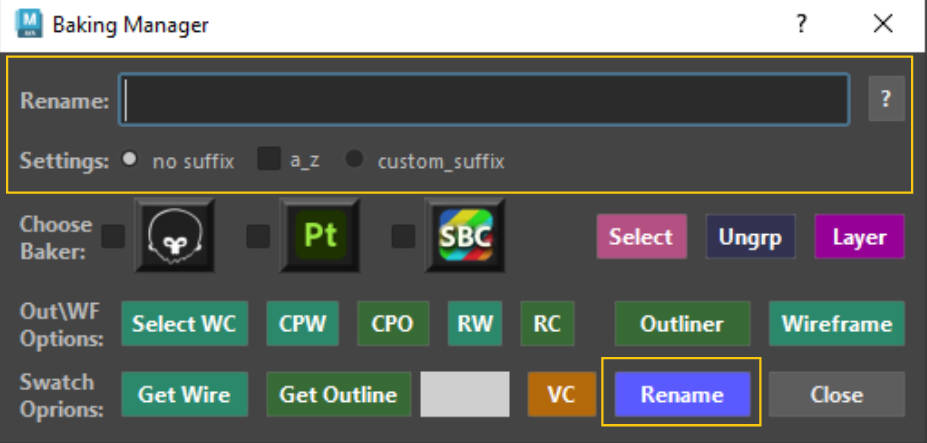
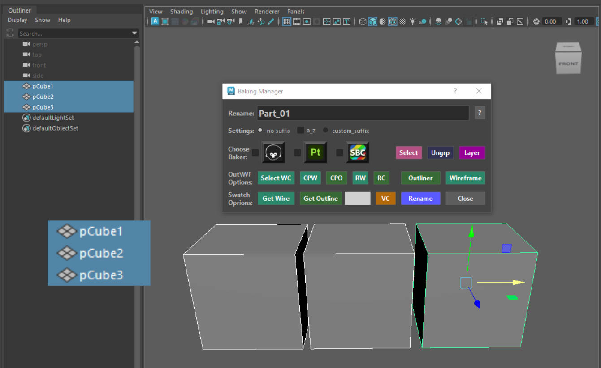
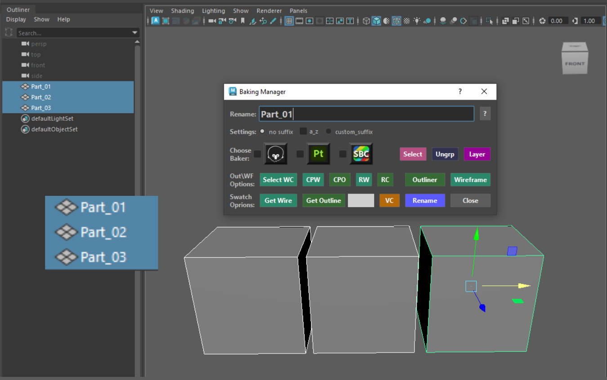
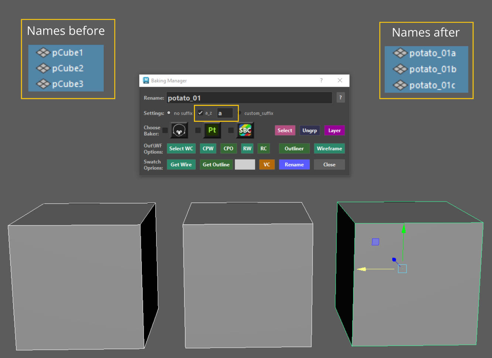
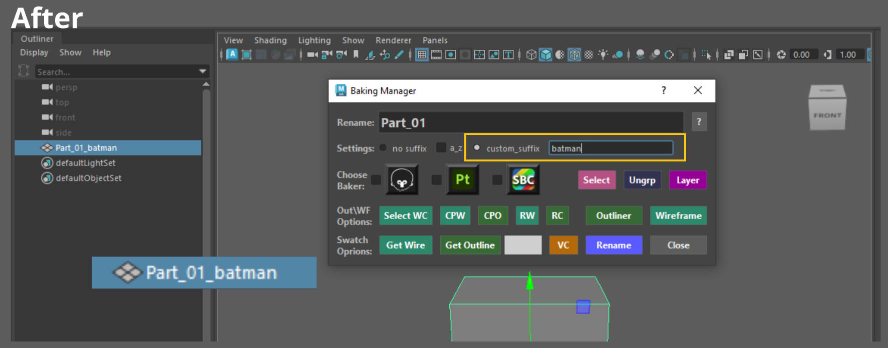
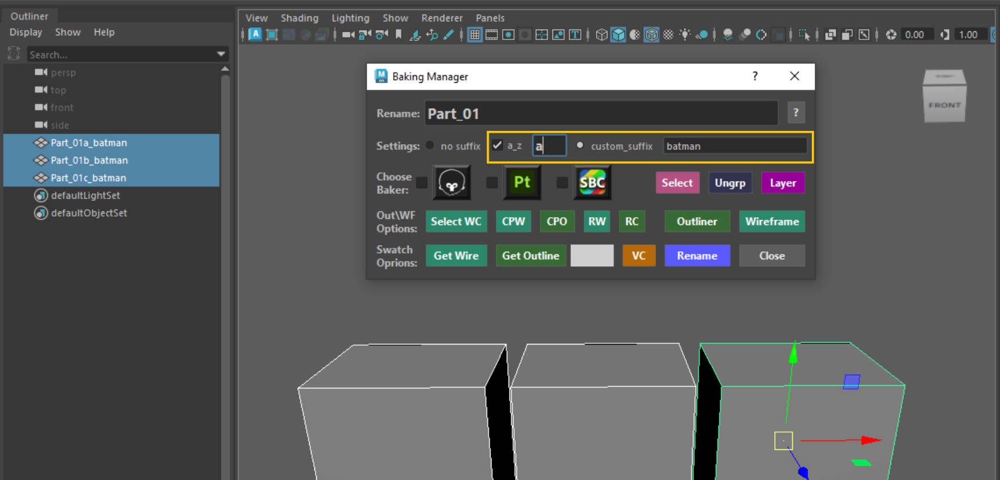
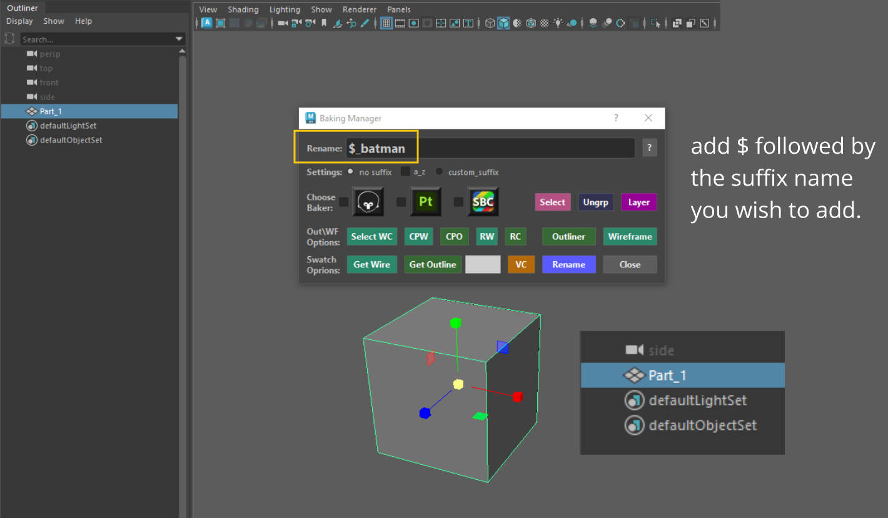
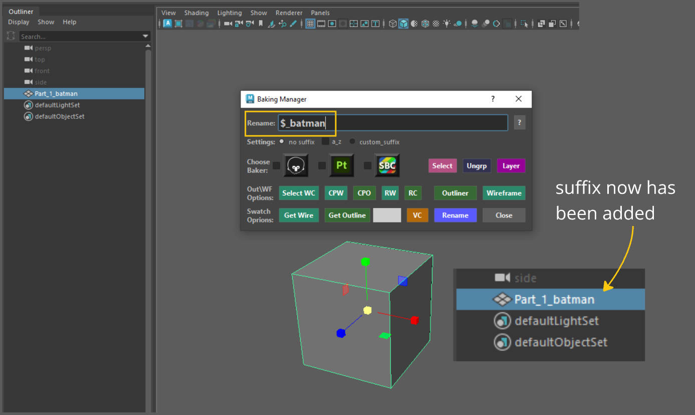
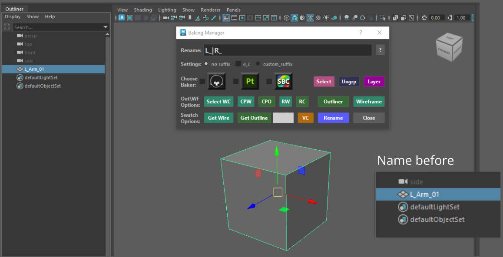
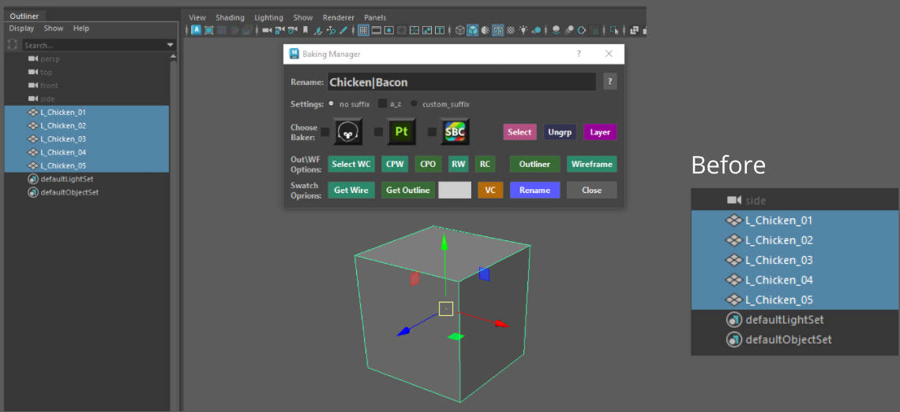

# **Vanilla Rename Features**

{ .img-medium}

One of the primary functions of this tool is its renaming capabilities. 

Lets take a closer look.

??? Tip "Tip - About vanilla naming"
    If you find hard remembering and implementing a lot of the features of the rename tool, I've created a dedicated [**Rename Tool**](../Baking%20Manager/Rename%20Tool.md)  to help with that. 
    Use that tool instead.

## **Rename**

All you have to do to rename anything is:

1. Make a selection.
2. Enter a name in the Rename textfield and either hit the enter button or click on the rename button. This will rename your selection.

{ .img-medium}
{ .img-medium}

### :octicons-dot-fill-16: **a_z Checkbox** 

By entering a letter in the text space, that letter will be added at the end of the name entered in the Rename textfield. If you have more than one meshes selected subsequent meshes will get the next letter *(order of selection is taken into account)*.

{ .img-medium}

Example 1 (a_z):

1. Here I selected 3 assets *(Name in the textfield is potato_01).*

2. The letter chosen is a in the a_z section.

3. Results are potato_01a, potato_01b, potato_01c.

??? Warning "Warning - Reaching the end of the Alphabet"
    When you reach the end of the alphabet for lowercase letters uppercase ones will take over.

    When you reach the end of the end of uppercase letters the tool will inform you that you reached the end of the alphabet.

    *Feel free to reach out for suggestions on how to expand it.* :smiley:

### :octicons-dot-fill-16: **Custom suffix**

Enabling the Custom Suffix checkbox will allow you to do just that. Lets have a look at the example below.

{ .img-medium}
{ .img-medium}

Our suffix has been added.

You can also combine the a_z feature with the custom suffix.

{ .img-medium}

Our cubes have been renamed and include the different subsequent letter of the alphabet and also include the custom suffix given.

### :octicons-dot-fill-16: *** (Star sign) prefix**

Use the * (star) sign to have a prefix added at the beginning of your objects name whilst retaining the objects name.

In the example below we have a cube named "Part_01". 

To add our suffix we add the **$ sign** first followed by the name we want for the suffix *(in our case Batman_)*.

{ .img-medium}
{ .img-medium}

Therefore our new name for the cube has changed to **Batman_Part_01**.

### :octicons-dot-fill-16: **$ (Dollar sign) suffix**

Use the $ (dollar) sign to have a suffix added at the end of your objects name whilst retaining the objects name.

In the example below we have a cube named "Part_01". 

To add our suffix we add the **$ sign** first followed by the name we want for the suffix *(in our case _batman)*.

{ .img-medium}
{ .img-medium}

Therefore our new name for the cube has changed to **Part_01_batman**.

### :octicons-dot-fill-16: **Search and Replace**

The tool will also allow you to search and replace part of a name on selected objects.

To use you need the **|** sumbol *(next to the z button on your keyboard)*, anything typed on the **Left** side of the **|** symbol indicates the leters to search for, and anything written on the **Right** of the **|** symbol will replace those letters.

Once done ++ctrl++ + CLICK the **Rename** button.

{ .img-medium}
{ .img-medium}

Example with multiple object selected.

{ .img-medium}
{ .img-medium}

The search and replace can be applied to a group name and all its children at once. 
Just selected a group and run the search and replace feature.

{ .img-medium}
{ .img-medium}