# **Breakdown**

## **How to export**

When batch exporting - the tool uses the Object's name as the file name.
Lets see an example of the steps involved to export some files.

For our examples we will export using .fbx files as those files utilize the Smooth upon export feature of the exporter
*(other file formats do not utilize this).* We will be using .Marmoset Toolbag to view the exported results. 

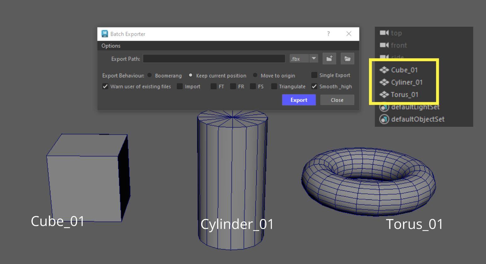{ .img-medium}

Here we have 3 objects (Cube_01, Cylinder_01, Torus_01).

The first thing we need to do when opening the tool, is select a path by clicking on the Select Folder Path button. 

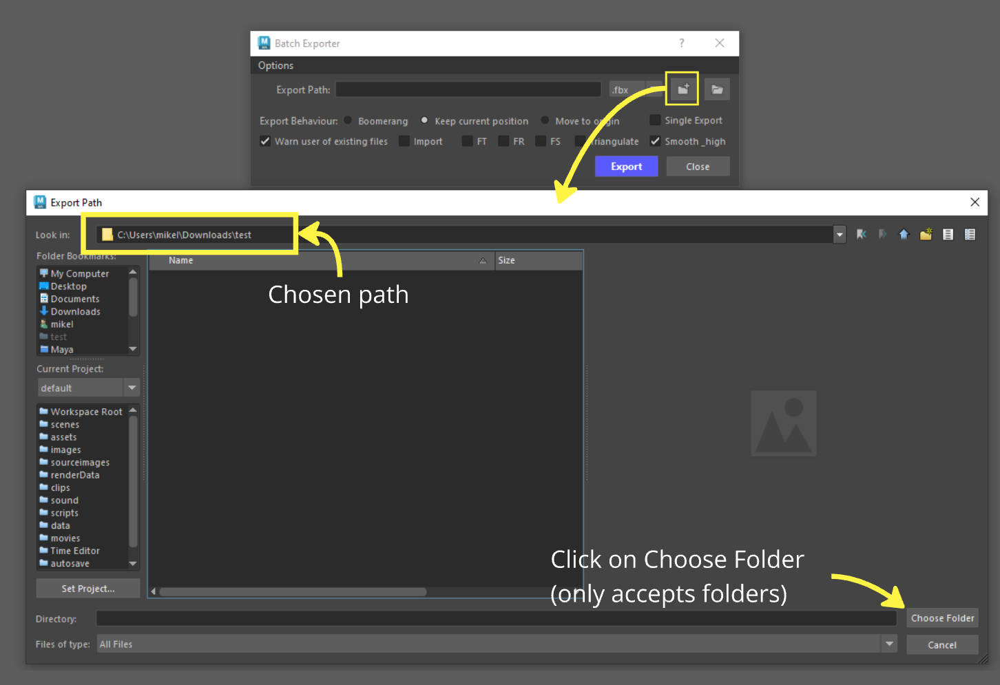{ .img-medium}

The path chosen was *C:/Users/mike/Downloads/test.* 

Clicking on the **Open Folder Path in Explorer** will open that path in explorer.

{ .img-medium}

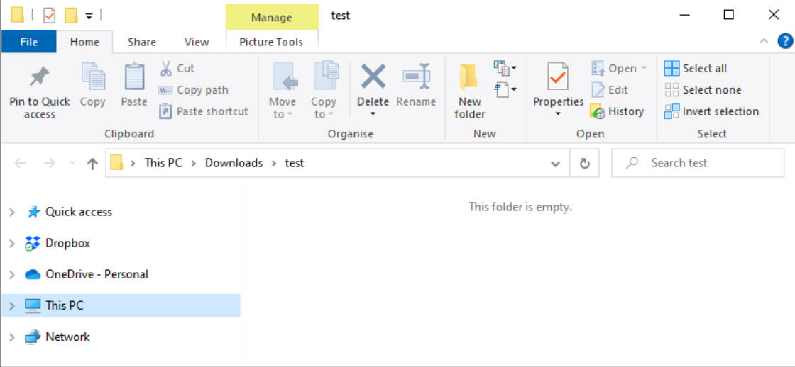{ .img-medium}

Now that the path has been set, lets select our objects and **Click** on the **Export** button. 

{ .img-medium}

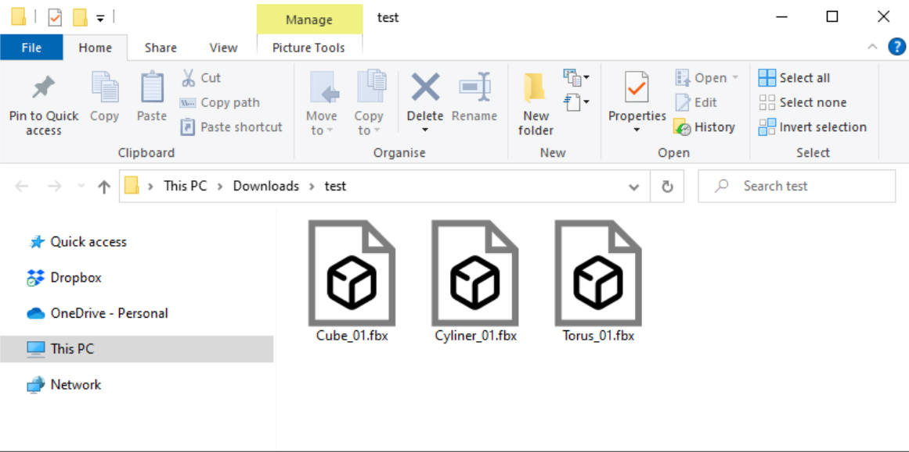{ .img-medium}

We can see our 3 files exported in the selected path and each file has the same name with the accosiated object in Maya. 

Here are the files in **Marmoset.**

{ .img-medium}

## **Exporting with Smooth .fbx files**

If you expand the Options menu you will see that by default the Smooth exported .fbx files checkbox is checked. 

This means that any object selected that is exported with smooth preview on *(by just hitting 3 on your keyboard)*, it will be subdivided upon export. 

Lets use the same meshes as before and select our 3 objects. Here they are with smooth preview turned off. 

{ .img-medium}

But lets enable Smooth Preview *(keyboard shortcut 3)*, and Export.

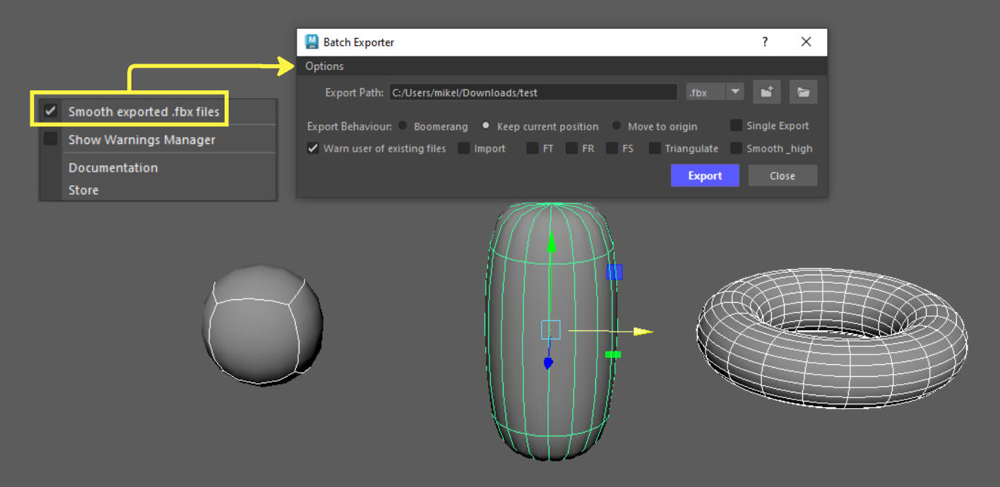{ .img-medium}

Here are the results in Marmoset.

{ .img-medium}

As you can see Smooth Preview objects were subdivided upon export.

### **How to Control Smooth Subdivision**

You can control the amount of subdivision by using the Page UP /Page Down buttons on your keyboard when Smooth Preview is on.

Alternatively you can open the Attribute Editor and under the Shape tab, go to Smooth Mesh.
There you can see the Smooth Mesh options.

By increasing the Preview Divisions number you increase the 

Lets see what happens when we export our **Cube_01** with 4 Preview Division Levels.

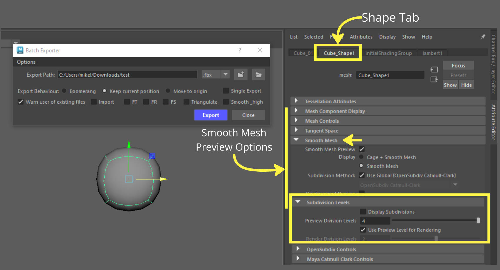{ .img-medium}

{ .img-medium}

Our cube has a lot more subdivisions than before.

???+ Info "Info - Exporting with Smooth checkbox turned off"
    If you do not wish to have your objects subdivided upon export, just uncheck the Smooth exported .fbx files checkbox or alternatively ensure your smooth preview on your objects is disabled *(keyboard shortcut key 1)*.

## **Exporting with Smooth and Triangulate options**
If for some reason you also want to export your objects subdivided and triangulated, checking the Triangulate checkbox will do just that. 

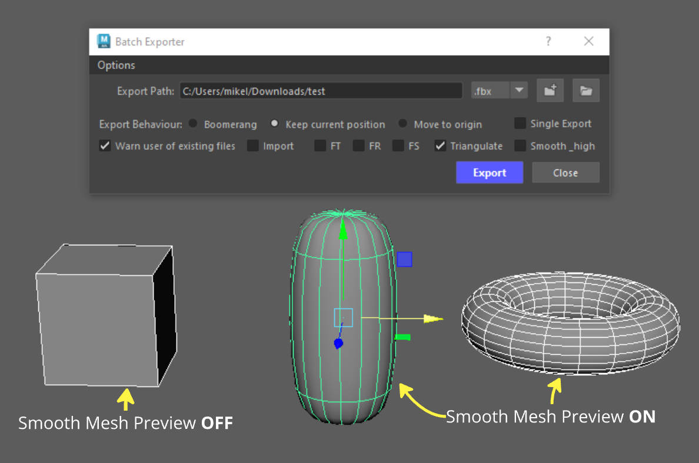{ .img-medium}

For this example our Cube_01 is not smoothed but the other objects are.
Lets see the results once again.

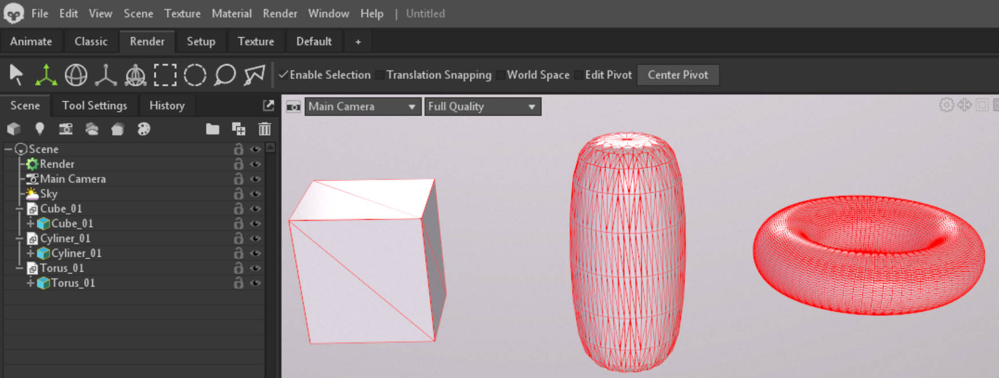{ .img-medium}

All of our Objects have been triangulated.
Those will Smooth Mesh Preview on were also Smoothed upon export.

## **Exporting with Smooth_high .fbx files**

The Smooth_high checkbox automatically sets the smoothing preview on our object based on their naming convention.

* If the name of our object contains the "_high" then, the smooth preview is enabled.
* If the name of our object contains the "_low" then, the smooth preview is disabled.

This is done to ensure our _high and _low poly object are exported correctly. 

???+ Info "Info - Exporting groups with _high"
    If you want to export groups that have objects that contain the name **_high** or **_low** in them, the tool will ensure each object from that group gets the treatment it needs in order to be exported correctly. 
    
    So if you have loads of baking groups, you can group all of those in a single group and export that as a single file or you could bunde up your _high and _low in two separate groups and export those. 

    Either way **Marmoset** will be able to read those files and import them correctly for **Baking**. 

In this next example lets see what the Smooth_high checkbox does.
For this we changed the naming of our files to include the words _low and _high.

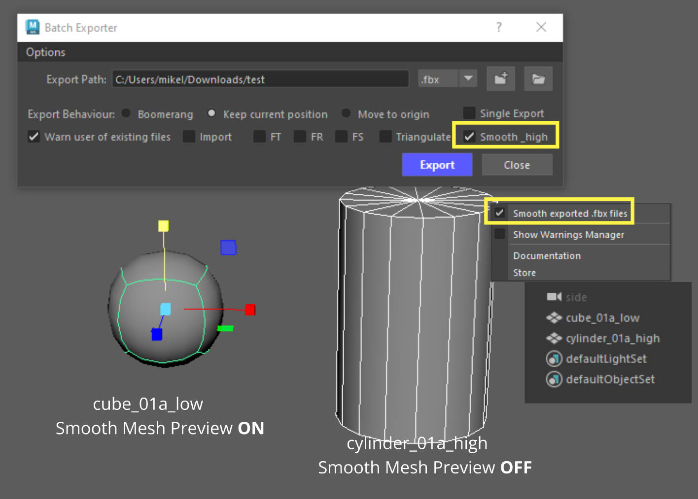{ .img-medium}

We set the Smooth Mesh Preview for these object to be:

* **On** for the **Cube_01a_low**.
* **Off** for the **Cylinder_01a_high**.

However, we want to export our files in the opposite fashion (not smoothed for the low and smoothed for the high).

The tool handles that and sets the correct Smooth Preview settings based on the naming convention.

Lets export those 2 files and see what we get.

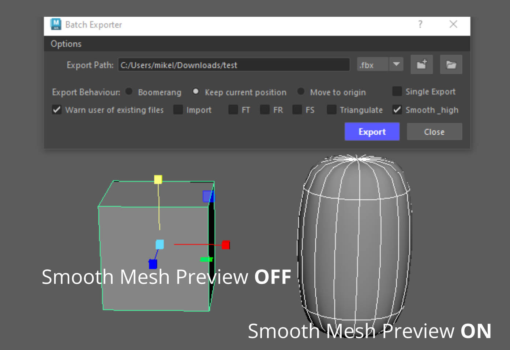{ .img-medium}

Operation after Export.

The Smooth Mesh Preview settings were automatically changed because of the naming convention.

* _low mesh had smooth mesh preview set to 1
* _high mesh had smooth mesh preview set to 3

Results in Marmoset.

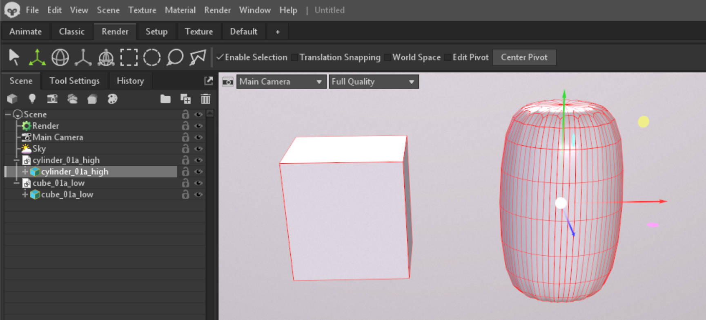{ .img-medium}

As expected the **_low** was not smoothed and the **_high** was.

If Triangulate checkbox is also enabled the tool will skip the _high and only triangulate anything else selected.

???+ Info "Remember - _low objects with Smooth_high"
    When the **smooth_high** checkbox is checked, objects with _low in their name will also get their smooth preview disabled.

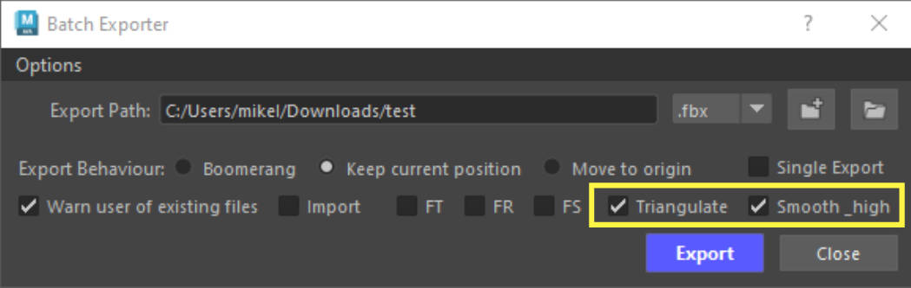{ .img-medium}

{ .img-medium}

### **Exporting Groups using Smooth_high**

The tool also works with selected groups.

When a group is selected, the tool will look for all objects within that group and perform the same operations as illustrated on our previous examples.

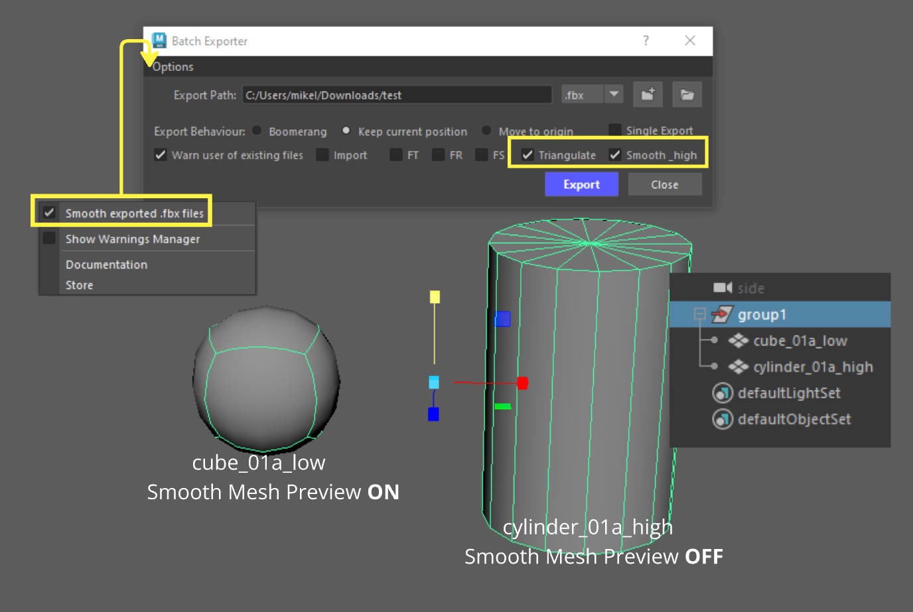{ .img-medium}

Here's the result in the viewport after we clicked the Export Button.

The Smooth Mesh Preview is restored based on the naming convention of each object.

{ .img-medium}

The result in Marmoset.

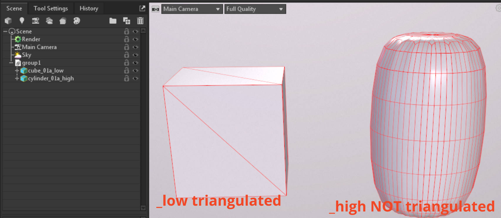{ .img-medium}

### **Exporting Decimated Objects**
???+ Info "Info - Exporting Decimated objects from Zbrush"
    If the Smooth_high chechbox is checked and you have a decimated hp mesh that you imported from Zbrush, then the tool will export that object subdivided.
    
    Because its likely the object is triangulated smoothing that triangulated _high object will mess up your object when subdivided. 

    To ensure your _high mesh wont get subdivided upon export, simply include the following in the name of your high poly objects:

    "_dm_high" or "_zb_high" or "_ZB_high" or "_DM_high" 

    The tool will skip the smooth_high process.

    *Example name of a high poly object: Chair_01a_dm_high*

## **Batch Import**

To import multiple files at once simply enable the Import checkbox and click on the  Select folder path button.

You will now get a new window that will allow you to select multiple files.

{ .img-medium}

Simply select the files you want and click on the Import  button.

{ .img-medium}

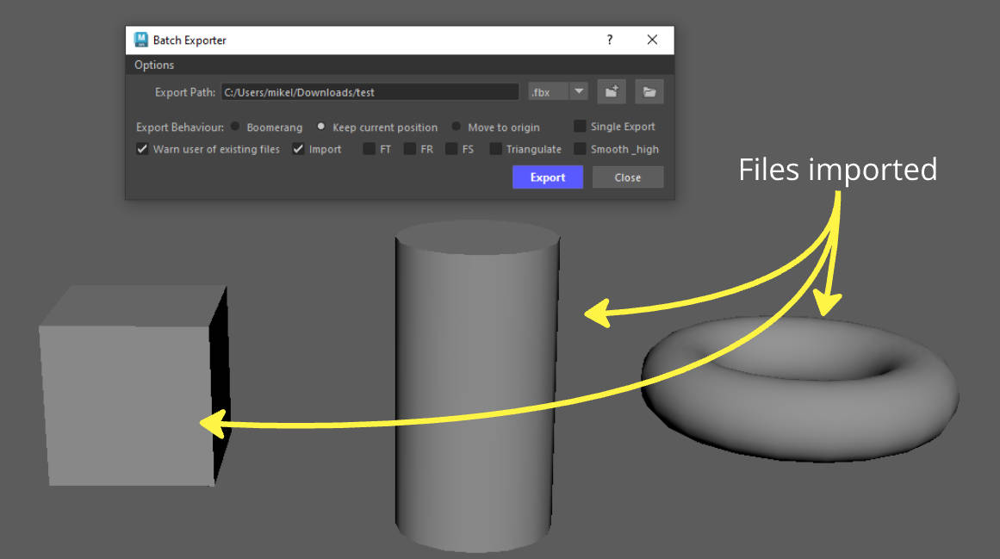{ .img-medium}

## **Export Behaviors**

### **Keep Current Position**

The default option to export is Keep Current Position, which retains the position of your objects in the scene.

### **Boomerang**

The Boomerand options, moves your objects to World Origin (0,0,0), exports and moves them back to their previous location.

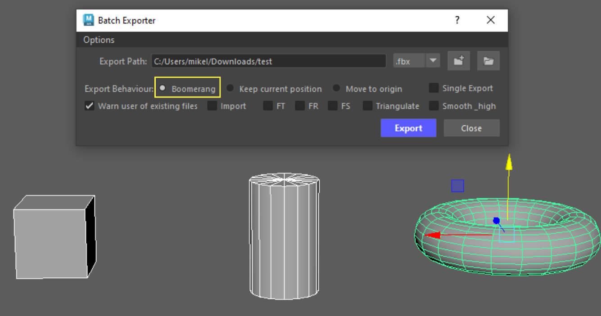{ .img-medium}

Result in Marmoset, all objects sit in world origin at (0,0,0).

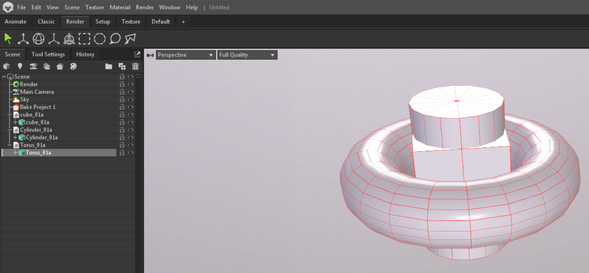{ .img-medium}

???+ Tip "Tip - exporting modular sets :simple-unrealengine:"
    Using the Boomerang option is very useful when working on modular static meshes for :simple-unrealengine: Unreal Engine.

    Unreal needs each file to be exported from the origin position (0,0,0).

    The Boomerang operation will allow you to just do that without dirsupting your workflow. This is not limited to modular sets but for any kind of static mesh you wish to export. 

    Combine this with Freeze Transforms and the tool will give you the distance from world origin.

    This is very useful is you need to precicely position something in Unreal but need the pivot point of your static mesh to be at a certain position on your object. 

    { .img-medium}

    FT checkbox enabled us to see the distance from world origin. 

    { .img-medium}

### **Move to Origin**

Move to Origin will move you objects to the world origin (0,0,0) after being exported. 

## **Freeze Transforms for groups**

???+ warning "Warning - Freezing Transforms on group objects"
    When using any of the Freeze Transform options on a group node, it will Freeze the transforms of the group and all of the descendants of that group.

## Single Export

[Link to Single Export documentation](../Batch%20Exporter/Buttons_overview.md#single-export){ .md-button .md-button--primary }
