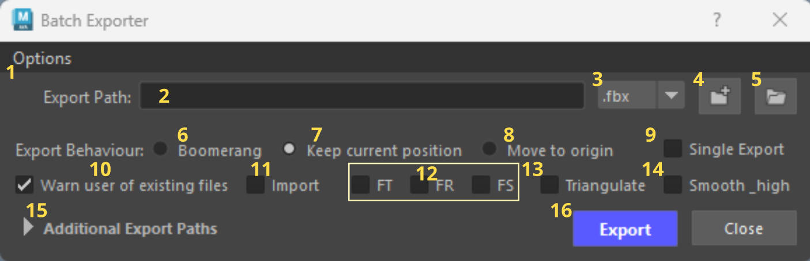
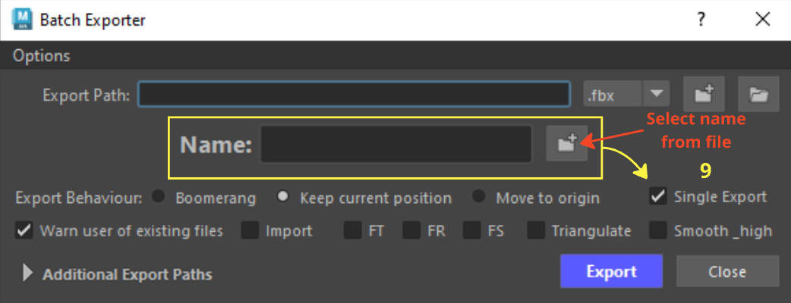
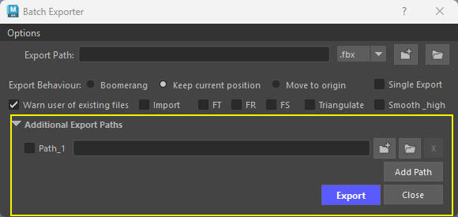
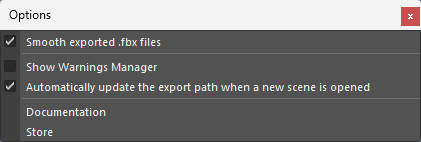
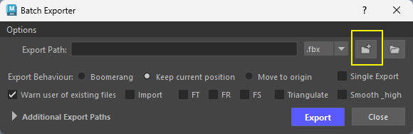

# **Buttons Overview**

{ .img-medium } 

## **Buttons**

1. Options  - Check the [options menu](#options-menu) below for more.

2. Export Path - Displays the path of your exported files in the textfield.
3. Dropdown menu - Choose between different file types to export.
4. Select Folder Path :material-folder-plus: - Opens up a window for users to navigate to a desired folder and export their files.
5. Open Folder Path in explorer :material-folder: - Opens the path set in the Export Path textfield.
6. Boomerang Export Behavior - Moves your selected objects to the world origin, exports your files and moves them back to where they were.
7. Keep current position  - Exports your files from the Object's current position.
8. Move to Origin - Moves your selected Objects to the World Origin, exports your files and keeps them there.
9. Single Export - Exports a selection as a single file.
10. Warn user of existing files - does exactly as it says. Un-check to disable the warning.
11. Import - Batch Import selected files. Use the Export Path to Select files to Import.
12. Freeze transform options - Will freeze any transforms selected upon export.
    1. FT - Freeze Translate
    2. FR - Freeze Rotate
    3. FS - Freeze Scale
13. Triangulate - Triangulates your meshes before export. If Smooth exported .fbx files (from the Options menu) is checked the tool will export your smooth mesh preview Objects smoothed and triangulated. If Smooth_high checkbox is checked any Object with _high in its name will not be triangulated.
14. Smooth_high - Any Object in your scene that contains the name _high will have its smoothness display set to 3 and will be exported Smoothed. Any Objects with that contain the name _low will have their smoothness display set to 1. 
This is done so users wont have to worry about if their HP was smooth previewed before export, or if their LP had their smoothness display set to 1.
15. Additional Stored Export Paths - Adds the ability for the users to store as many additional paths as they want. Also users have the ability to export to multiple different folder paths at the same time.
16. Export - Exports your selected Objects

### **Single Export**

{ .img-medium } 

The Single Export checkbox allows you export multiple selected objects as one file. 
The only things you have to do is give your file a name and path. 

When checking the Single Export checkbox you will see the Name textfield.  Use the textfield to type in the desired name for your exported Objects.

The folder icon :material-folder-plus: next to the textfield, will open the folder path that is set up by the Export Path.
Use it to click on an existing file to retrieve its name (this is added to avoid spelling mistakes and ensure your files will always be named correctly).

???+ note
    
    The only export behavior *(when multiple objects are selected)*, that will work when **Single Export** is checked, is **Keep Current Position.** 
    
    Other behaviors like **Boomerang** or **Move to Origin** if checked will be ignored *(unless single objects are selected)*.

    **Freeze Transforms** will also not work *(with multiple objects selected)* whilst Single Export is checked.

### **Additional Export Paths**

{ .img-medium}

- Allows for users to configure, save, and batch-export their assets to multiple directory destinations simultaneously in a single click.

### **Options Menu**

{ .img-medium}

- Smooth exported .fbx files - Allows the user to choose if they want their .fbx files to be smoothed upon export (Turning this off will still smooth your _high poly objects if Smooth_high checkbox is checked).
- Show Warnings Manager - will display any warnings during the export process (mainly any .fbx files that were smoothed upon export).
- Automatically update the export paths when a new scene is opened - When enabled, it loads all paths from a previously loaded scene. Pre-requisit the scene has to be saved whilst the tool is active.

    ???+ Info "Info - Auto Update Path"
        Whenever you save a scene in Maya *(whilst the tool is loaded, ot clicking on the Export or Close Buttons)*, the tool saves that export location of all your paths directly into the Maya scene file.
        
        Opening a previously saved scene will automatically load all paths when that scene was last saved.

- Documentation - Opens a link to the documentation.
- Store - Opens links to ArtStation and Gumroad.

## **Useful info**

### Decimated meshes from Zbrush
???+ Info "Info - Decimated meshes from Zbrush"
    If your objects contains the name _dm_high or _zb_high (or _DM_high or _ZB_high) your objects will not be smoothed. 

    example. Chair_01a_dm_high  
    
    This is done to avoid smoothing any decimated Zbrush files that were brought in Maya.
    
    Decimated files are dense in polycount and already triangulated which can cause unwanted deformations when being smoothed.

### Export Paths Stored in Scene
???+ Info "Info - Storing Paths in Scene"
    Every time you click on the Export or Close button, all paths already set will be stored in the scene. 
    
    Maya needs to be saved in order for those paths to be permanently saved. 

    * If you save your Maya scene whilst the tool is active the tool will do just that.  
    
    Opening a scene, will fill in all previously stored paths automatically. - *(Automatically update the export paths when a new scene is opened)* from the Options Menu needs to be checked.

    * If unchecked you can ++ctrl++ + Click on the main -Select Folder Path button to retrieve all stored paths in your scene.

    * ++alt++ + Click resets the Additional Export Path to its default state.  
   
    { .img-medium .img-centered} 

    
