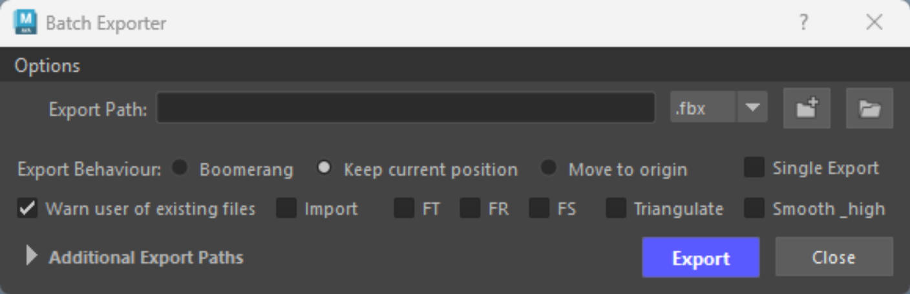

# :octicons-tools-16: **<span style="color:rgb(214, 126, 25);">Installing Batch Exporter</span>**

{ .img-medium } 

### <span style="color:rgb(214, 126, 25);">**Step 1 - Setting up**</span>
<div class="grid cards" markdown>

-   :octicons-copy-16:{ .lg .middle } __[`Setting up`](#)__

    ---

    1.Unzip the [`Batch_Exporter.zip`](#) file.
    
    2.Copy paste the [`Batch_Exporter.py`](#) in your [`\Documents\Maya\Scripts`](#) folder.
    
    3.Open [`Maya`](#). 

    <!-- [:octicons-arrow-right-24: Getting started](#) -->
    


</div>


### <span style="color:rgb(214, 126, 25);">**Step 2- Activating**</span>

<div class="grid cards" markdown>

-   :octicons-copy-16:{ .lg .middle } __[`Python Code`](#)__

    ---

    Copy the 2 ^^**python**^^  lines below on a ^^**shelf**^^  or bind these to a ^^**hotkey**^^  to load the tool.

    ``` py linenums="1"
    from batch_Exporter import OpenImportDialog
    OpenImportDialog.show_dialog()
    ```


</div>


[](../Batch%20Exporter/images/Batch_Export.png){: .md-button download="Batch_Export.png" }


<figure markdown="span" align="center">
  <a href="../Batch Exporter/images/Batch_Export.png" download="Batch_Export.png" class="md-button">
    
  </a>
  <figcaption>Icon</figcaption>
</figure>


Click the button below to learn how to create hotkeys and shelf buttons.

[Creating Hotkeys/Shelf Buttons](../Create%20Hotkeys%20Shelf%20Buttons/index.md){ .md-button .md-button--primary }

