# **Breakdown** :tools:

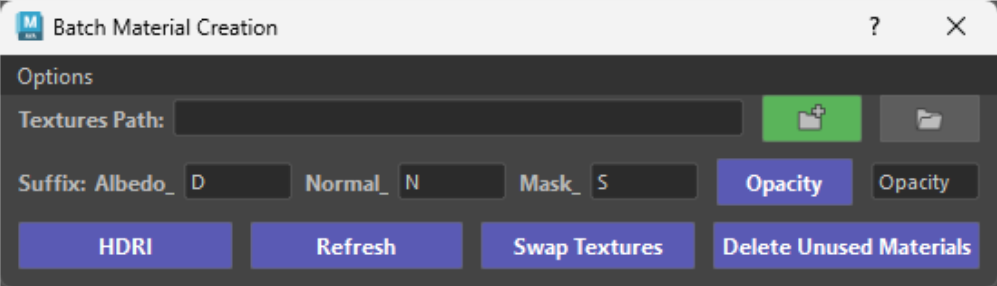{ .img-medium } 

The Batch Material Creation tool automatically creates and sets up materials in Maya directly from your texture selections.

Simply navigate to your folder path and select the texture files you want to use. The tool scans your selection for configurable texture suffixes (such as _D for Albedo/Color, _N for Normal, and _S for Packed Utility Masks). Because these suffixes are completely user-defined, you can easily adapt the tool to fit any studio pipeline or personal workflow.

Using the information gathered from your selected files, the tool automatically builds your Maya materials, wires up nodes, sets appropriate color spaces, only thing left to do is to assign them.

Once it finishes, a handy log window pops up to give you a complete summary of:

- Newly created materials and already existing materials that were skipped.

- Missing textures (if a material expected a matching suffix file that wasn't in the folder).

- Ignored files (non-image or non-matching files).

<figure style="text-align: center;">
    
    <figcaption>Creating Materials</figcaption>
</figure>

## **How to batch create materials** :tools:

### 1. Ensure Suffixes Match our Textures

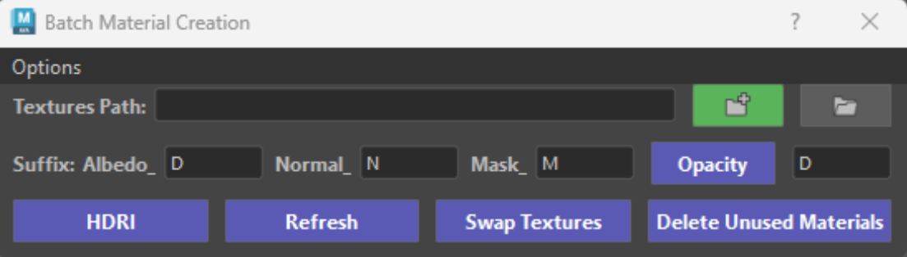{ .img-medium } 

- First thing we need to do, is to ensure our suffixes for Albedo, Normal and Mask match our texture files. 

- Supported formats: 
    * PSD, PSB, PNG, TGA, JPEG, JPG, TIFF, TIF *(more can be added upon request)*.

| Map      | Suffix                          |
| ----------- | ------------------------------------ |
| `Albedo`       |  D |
| `Normal`       |  N |
| `Mask`         |  M |

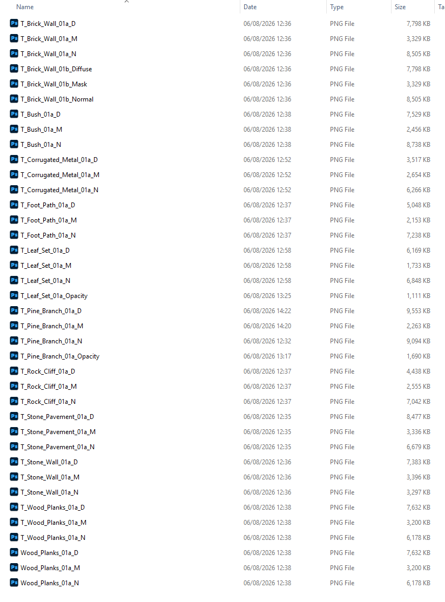{ .img-medium } 

- In our case all files in our folder match the suffixes we applied on the tool, apart from the T_Brick_Wall_01b.
    * The suffixes for Albedo, Normal and Mask do not match our suffixes, thus the tool will skip those on the Material Creation process. 

### 2. Set your path, select your textures and create your materials

- Set a path in the *Textures Path* then click on the **Green** folder button to select your textures. 

<figure style="text-align: center;">
    
    <figcaption>Creating Materials</figcaption>
</figure>

- After the tool has done its business, you will get a log displaying all the important information about your materials.

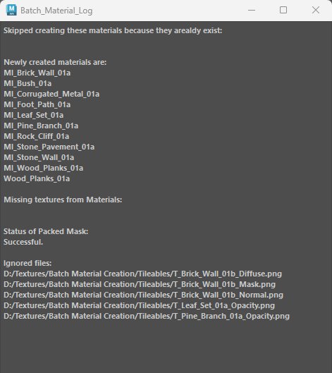{ .img-small .img-centered} 

- In our case we were not missing any textures, but the tool did notify us of files that were ignored.
    * These are files that did not match our suffix.
    * If the tool did find missing textures then it would only create the material with the files it did find. You can fix the missing files and click on the Refresh Button to auto-assign the missing materials.
        * Ensure you select the Object or a Face(s) with the material(s) applied so the tool knows which material you want to refresh. If multiple materials on an object it will Refresh all materials assigned to that object.  

??? Tip "Tip - Select Partial Texture Files"
    * You don't need to select every file in your folder! Selecting just one file (such as an Albedo map) is all it takes.
    * For example, if only the Albedo texture is selected, the tool automatically scans the folder for matching Normal and Mask maps (using your set suffixes) and wires them straight into your new material.

    <figure style="text-align: center;">
        
        <figcaption>Creating Full Material from Albedo</figcaption>
    </figure>

### 3. Materials with Opacity
- Opacity maps aren't assigned automatically during material creation. However, once your materials are applied to your mesh, hooking up opacity is super easy!
    * Simply select any objects *(or faces)* that have the material applied, then click the Opacity button to automatically connect your opacity texture.
    <figure style="text-align: center;">
        
        <figcaption>Applying Opacity</figcaption>
    </figure>

    * Your opacity map can live either inside the Alpha channel of your Diffuse/Albedo texture or as a standalone black-and-white texture file. Just make sure the suffix in the Opacity field matches your file name or Albedo suffix.
    * ++ctrl++ + Click the Opacity button to strip transparency from selected materials.
    <figure style="text-align: center;">
        
        <figcaption>Disconnecting Opacity</figcaption>
    </figure>

## Customizing Material Names
- Custom Material Prefixes: Users have full control over how their materials are named.
    * Head to **Options > Additional Preferences** [*(more info here)*](#Additional_Preferences) to set up automatic search and replace rules (e.g., swapping a texture prefix like T_ for a material prefix like MI_).
    * If no prefixes are defined, your texture name becomes your material name—giving you full control over how your scene stays organized.

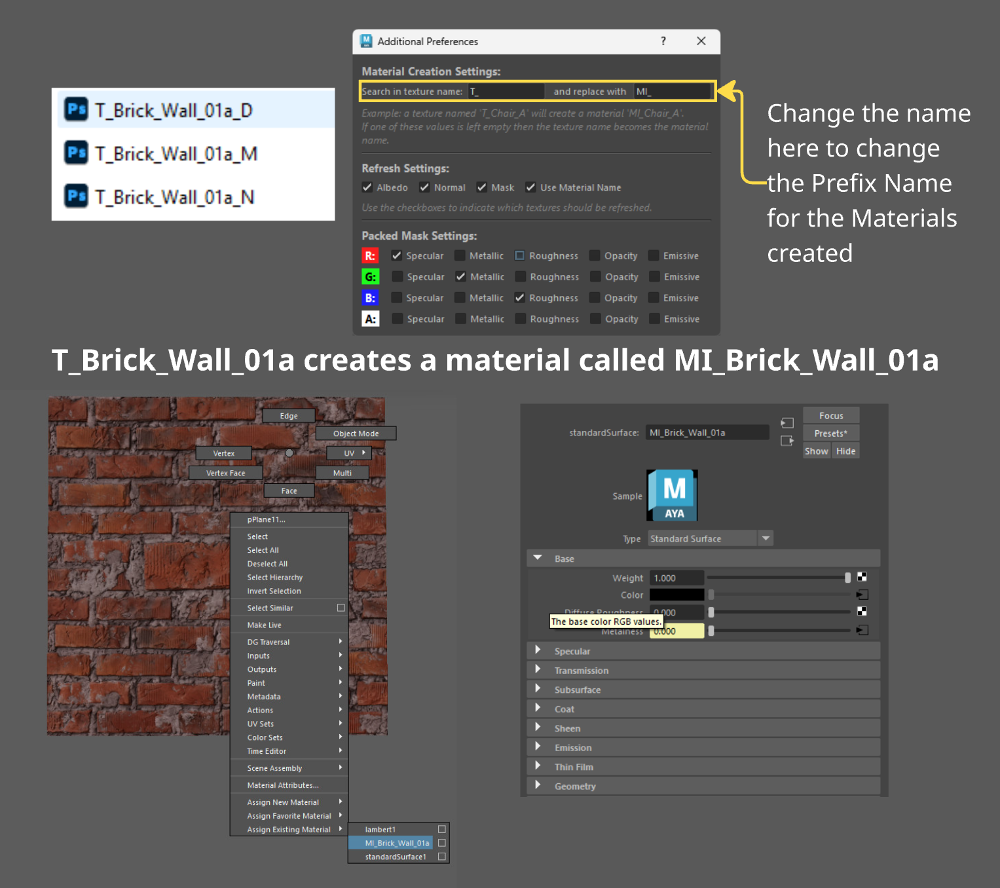{ .img-small .img-centered } 

## **HDRI** 

The HDRI button makes setting up environment lighting quick and easy by automatically creating an Arnold SkyDome light and assigning your chosen HDRI image to it.

If a SkyDome already exists in your scene, clicking the button will update its texture map instead of creating a duplicate dome.

- Opens a file browser to select an HDRI map (.hdr, .exr, .tif, .tiff). Creates a SkyDome light with the image applied (or updates the existing dome).
    * Interactive Rotation: As soon as the SkyDome is created, you can instantly hold down your Middle Mouse Button in the viewport to rotate your lighting and background!

    <figure style="text-align: center;">
        
        <figcaption>Creating a skydome light for Arnold</figcaption>
    </figure>

- ++shift++ + Click: Activates viewport dragging. Hold down your Middle Mouse Button anywhere in the viewport to interactively rotate your SkyDome light and shift your environment lighting.

    <figure style="text-align: center;">
        
        <figcaption>Shift Click to Rotate your Skydome</figcaption>
    </figure>

- ++ctrl++ + Click: Toggles the SkyDome's viewport opacity between 0.0 and 1.0. This hides the background HDRI image in your viewport so it doesn't get in your way while keeping your scene lit!

    <figure style="text-align: center;">
        
        <figcaption>Hide the background in the Viewport</figcaption>
    </figure>

- ++alt++ + Click: Directly opens and launches the Arnold Render View window.

    <figure style="text-align: center;">
        
        <figcaption>Launch Arnold</figcaption>
    </figure>

- ++ctrl++ + ++shift++ + Click: Toggles whether the HDRI environment background is visible to the camera in Arnold renders while preserving its lighting and reflection contribution.

    <figure style="text-align: center;">
        
        <figcaption>Hide Background in Arnold</figcaption>
    </figure>

## **Refresh** :tools:

The Refresh button is your go-to tool for updating, fixing, or checking texture maps on materials that are already in your Maya scene.

If a texture map was missing when you first created a material—or if you updated texture files in your project folders—clicking Refresh rescans your source paths and re-wires any missing or updated maps back into your shaders automatically.

**How Refresh Works Behind the Scenes**:

- When you click Refresh, the tool identifies all materials attached to your currently selected **objects** or **faces**.

    * Reads Existing Connections: It inspects the file paths of textures already plugged into your selected material.

    ??? Failure "Missing source textures"
         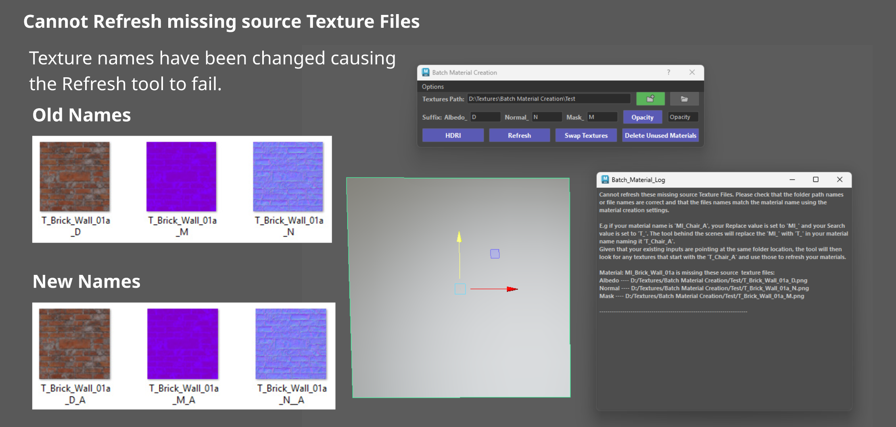{ .img-small .img-centered} 
        
        <figure style="text-align: center;">
            
            <figcaption>Refresh - Missing Albedo</figcaption>
        </figure>

    * If a material loses all of its texture connections, the tool will pop up a prompt allowing you to select a folder directory to relocate them.
        * How it knows what to look for: Thanks to the Use Material Name setting, the tool reads your material's name, reverses your prefix rules (converting custom material prefixes like MI_ back into texture prefixes like T_), and scans your selected folder for matching files automatically.
    ??? Failure "All textures have been disconnected"
         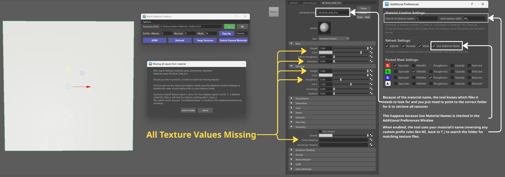{ .img-small .img-centered}    

        <figure style="text-align: center;">
            
            <figcaption>Refresh - All textures are disconnected</figcaption>
        </figure>

    * Checks Source Directories: It verifies if those source folders still exist. If a folder is missing, a pop-up window will notify you.
    ??? Failure "Missing source folder"
         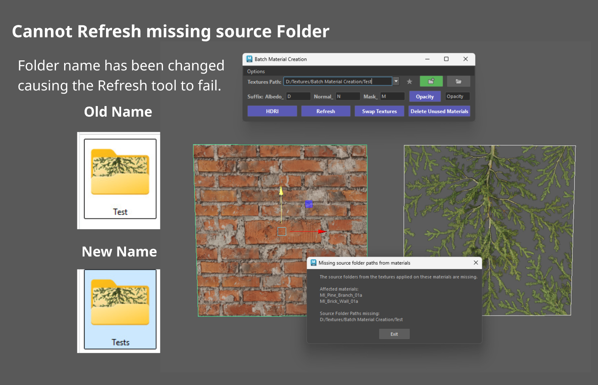{ .img-small .img-centered} 

        <figure style="text-align: center;">
            
            <figcaption>Refresh - Missing Folder</figcaption>
        </figure>         

    * Applies Your Preferences: The tool respects your settings configured under **Options > Additional Preferences**
        
        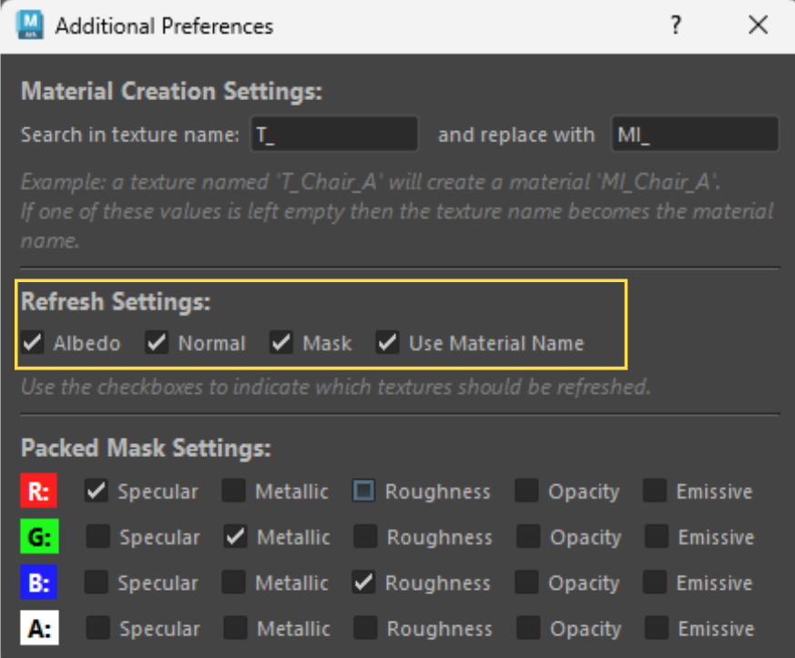{ .img-small .img-centered} 
        
        * Selective Channel Updating: You can toggle off Albedo, Normal, or Mask if you only want specific texture slots refreshed.

        * Use Material Name: When enabled, the tool uses your material’s name (reversing any custom prefix rules like MI_ back to T_) to search the folder for matching texture files.

- ++shift++ + Click: Opens the Maya Hypershade window, clears the graph, and automatically displays and frames the material nodes for your selected objects or faces.

    <figure style="text-align: center;">
        
        <figcaption>Hypershade focus</figcaption>
    </figure>

- ++ctrl++ + Click: Reloads all texture files on selected materials and forces the correct color space rules (sRGB for Albedo, Raw for Normal and Mask utility maps).

    <figure style="text-align: center;">
        
        <figcaption>Fixing Colour Space</figcaption>
    </figure>

## **Swap Textures**

The Swap Texture feature allows you to instantly swap texture maps *(such as Albedo, Normal, or Mask maps)* on materials already assigned in your scene—without breaking shader connections or needing to rebuild your material network from scratch.

<figure style="text-align: center;">
    
    <figcaption>Swapping Albedo with Normal textures</figcaption>
</figure>

??? Failure "Swap Fail"
    * If you are missing any of your source texture files you will get a message to inform you. 

    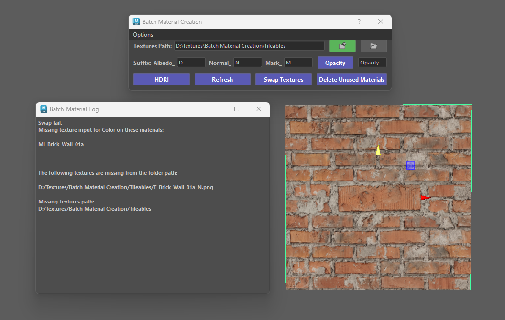{ .img-small .img-centered} 

## **Options Menu**

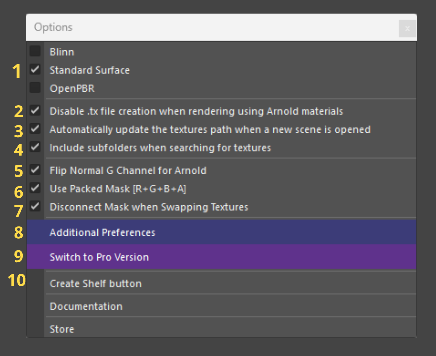{ .img-small } 

### 1. Material Type Selection
- Material Type Selection (Blinn / Standard Surface / OpenPBR): Sets the shader type that the tool will generate when creating new materials.
    * Blinn: Standard legacy Maya shader.

    * Standard Surface: Default Arnold/Maya surface shader (supported in Maya 2019+).

    * OpenPBR: Next-generation open-standard PBR material (available in Maya 2025+).

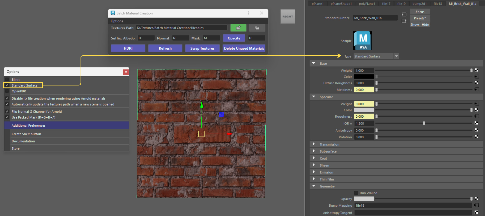{ .img-medium } 
    

### 2. Disable .tx file creation
- Disable .tx file creation when rendering using Arnold materials.

    * Prevents Arnold from automatically converting source texture files (.png, .tga, .jpg, etc.) into optimized .tx texture files during rendering test cycles.

    * Why use it: So you dont create additional .tx texture files in your folders.
    * The .tx files are generated the moment you Render using Arnold. 

<figure style="text-align: center;">
    
    <figcaption>.tx files creating Additional files in your folder</figcaption>
</figure>

### 3. Auto-update textures path
- Automatically update the textures path when a new scene is opened.
    * Listens for when a new Maya scene file is opened and automatically updates the active Textures Path to match the path saved in that scene's metadata.

    * Why use it: Keeps your texture directory aligned with your current Maya scene without requiring manual re-selection.

<figure style="text-align: center;">
    
    <figcaption>.Automatically load the textures path from previous scenes</figcaption>
</figure>

### 4. Flip Normal for Arnold
- Flip Normal G Channel for Arnold.
    * Automatically toggles the Flip Green Channel (aiFlipG) attribute on normal bump nodes generated for Arnold materials.

    * Fixes lighting and shading orientation issues when using DirectX-formatted normal maps instead of OpenGL format.

### 5. Use Packed Mask [R+G+B+A]
* Turns on support for "packed" utility maps (where single image files hold Roughness in Red, Metalness in Green, etc.).

* Checking this unlocks the Mask suffix field in the main window so you can set your packed map suffix.

<figure style="text-align: center;">
    
    <figcaption>.Enabling/Disabling Mask Support</figcaption>
</figure>

### 6. Additional Preferences
- Additional Preferences [*(more info here)*](#Additional_Preferences).
    * Opens up a dedicated window for deeper customization.

    * Set up smart naming rules (like automatically turning T_ texture names into MI_ material names), pick which texture types get refreshed, and map out custom RGBA channels.

### 7. Shelf /Documentation /Store
- Create Shelf Button.
- Documentation.
    * Opens your browser and takes you straight to the online user guide whenever you need a quick hand.
- Store.
    * Opens store links to Gumroad and Artstation. 

## **Additional Prefrences** {: #Additional_Preferences }

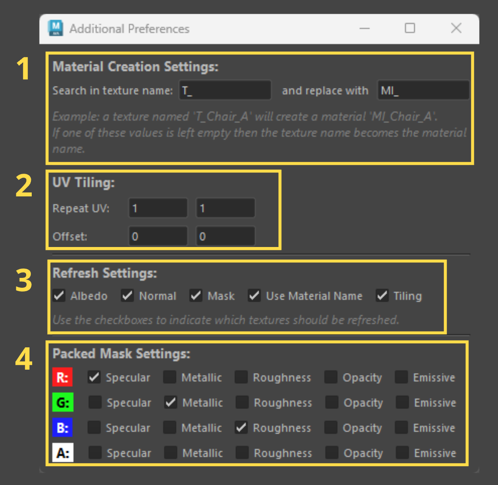{ .img-small } 

### 1. Material Creation Settings

The Material Creation Settings section gives you complete control over how your Maya materials are automatically named when generated from your texture files.

Instead of being stuck with raw image file names, you can set up smart Search & Replace rules to keep your Hypershade clean, organized, and compliant with your project’s pipeline standards.

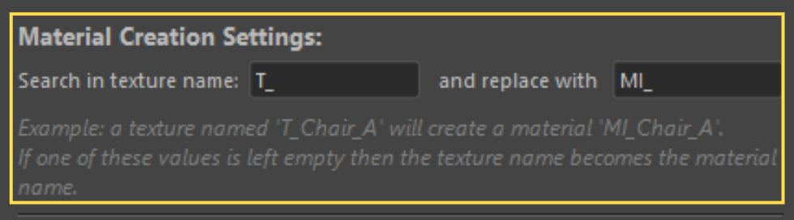{ .img-medium} 

**How the Search & Replace System Works**:

- The tool uses two key text fields to handle automatic material renaming:

    * Search in texture name: Defines the prefix prefix used in your texture file names (e.g., T_).

    * Replace with: Defines the new prefix to apply to the generated Maya material (e.g., MI_).

{ .img-medium} 

**Key Rules & Behavior**:

- Left Blank (Default Behavior): If either prefix field is left empty, the tool bypasses prefix replacement and names the material directly after the base texture file name (e.g., Chair_A).

- Reversible Logic for Refresh: These naming rules work both ways! When you use the Refresh button later on a material named MI_Chair_A, the tool reverses this rule behind the scenes to look for source textures starting with T_Chair_A.

### 2. Refresh Settings

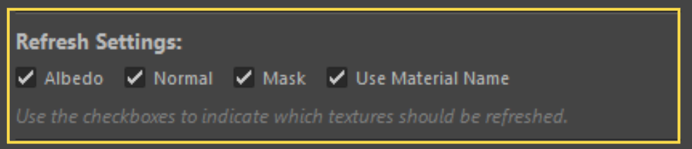{ .img-medium} 

The Refresh Settings section allows you to fine-tune how the Refresh button behaves when rescanning your project folders for texture updates.

- Why use it: If you only want to reload updated Normal maps across your scene without touching your Albedo or Mask connections, simply uncheck Albedo and Mask before clicking Refresh!

**Use Material Name Checkbox**:

- What it does: Uses your material's name in Maya to automatically deduce and search for missing texture files in your target directory.

- Unchecked Behavior: If unchecked, the tool relies strictly on the existing texture file paths already assigned to the shader rather than using the material's name to perform a new search.

### 3. Packed Mask Settings

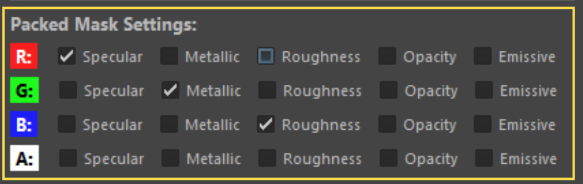{ .img-medium} 

**Packed Mask Settings Overview**:

- Packed Masks *(sometimes called "channel-packed textures")* save memory by storing up to four different black-and-white maps inside a single image file!

- Instead of using separate files for Roughness, Metallic, Specular, and Opacity, a packed mask stores one map in the Red (R) channel, one in the Green (G), one in the Blue (B), and one in the Alpha (A) channel.

- The Packed Mask Settings window lets you tell the tool exactly which map lives inside each channel so it wires everything into Maya automatically.

- Simply choose which property belongs to each channel, and the tool will automatically wire everything into your shader!

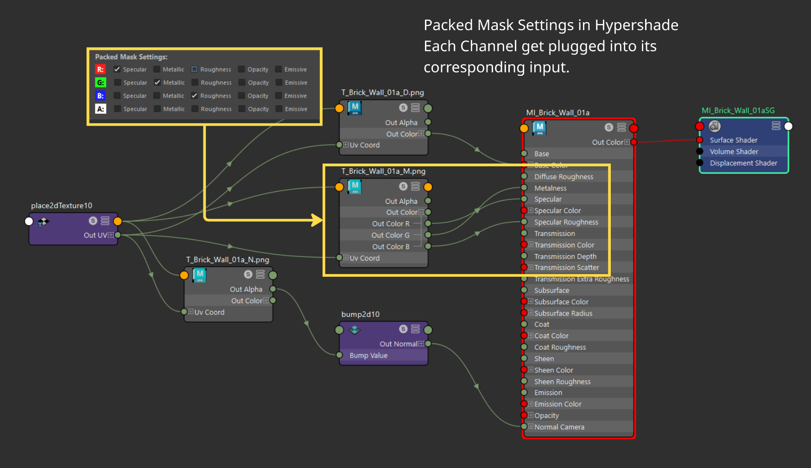{ .img-medium} 

- You don't need to use all channels. Any unchecked options will be ignored during material setup, leaving those shader attributes untouched.

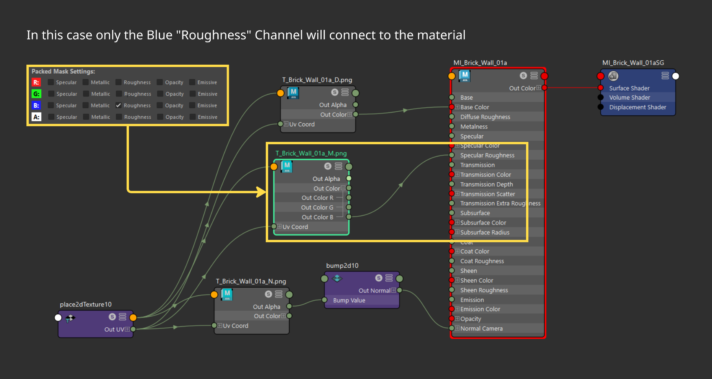{ .img-medium} 