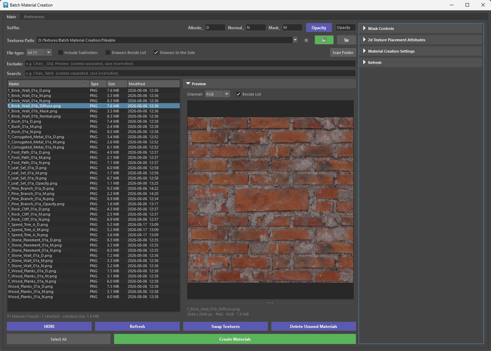
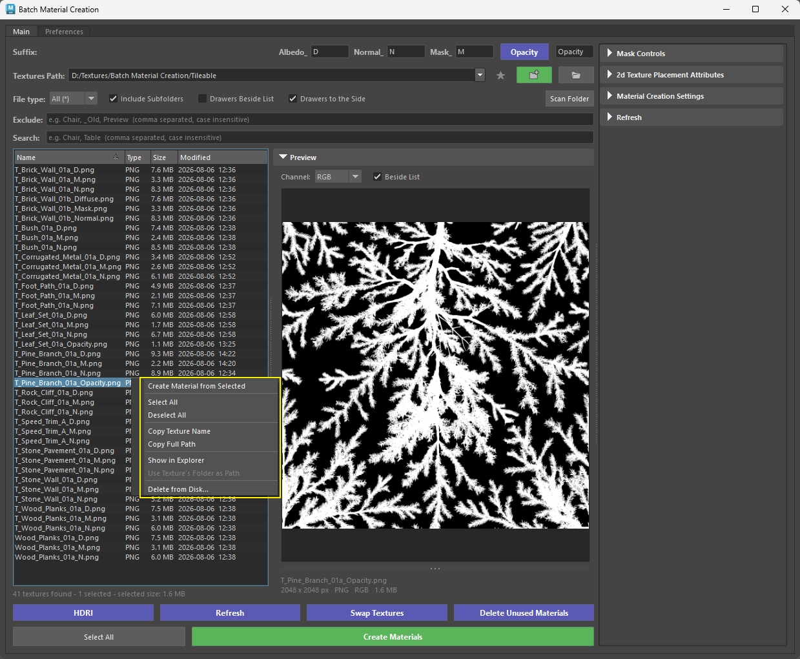
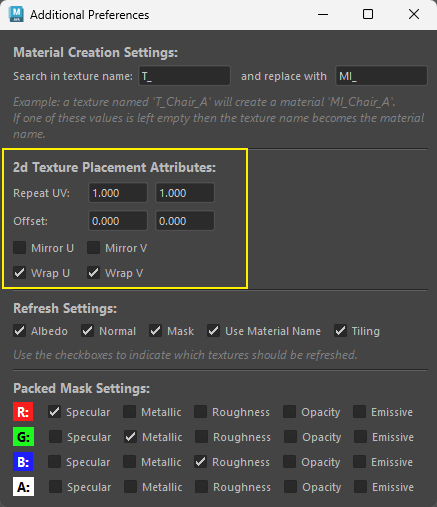

# Changelog:

## **Version: 0.72**

### **Added Pro Version**

{ .img-medium } 

The tool offers a Pro version — switch to that one when you want to see and choose your textures instead of building everything in a folder at once.

<figure style="text-align: center;">
    
    <figcaption>Batch Material Creation Pro</figcaption>
</figure>

Pro adds a live textures list: every texture in the path is shown, you can filter by name or file type, select just the ones you need, or double-click a single texture to build its material on the spot. The list updates itself when new files land in the folder. A built-in preview lets you click any texture and inspect it — zoom, pan, and view individual R, G, B or alpha channels, which is handy for checking packed masks before you commit.

All the settings from the Options menu and the Additional Preferences window are folded into the tool as collapsible drawers, and you can arrange those drawers beside the list or in a side column when the tool is docked. Pro also remembers your layout, filters and window size between sessions.

Switching is one click from the Options menu, and you can go back to Classic at any time from the Preferences tab. Both versions share the same preferences, so whichever you choose is what the shelf button and docked panel open from then on.

### **Added Delete from Disk**

- Users can now right click and select **Delete from Disk...** to remove any unwanted files from their textures path.

{ .img-small } 

### **Updated Tiling/Offset Controls**

- UV Tiling has changed to 2d Placement Texture Attributes
    * New additions:
     * Mirror U - Mirror V
     * Wrap U - Wrap V

{ .img-small  } 

## **Version: 0.69**

### **Added Tiling/Offset Controls**

{ .img-small } 

Three ways the values get applied:

* On creation. Every new material's place2dTexture node is created with the current Repeat/Offset values. Nothing to do beyond setting the fields first.
* Hitting Enter in any field (live apply). Select objects, faces, or materials (Hypershade), type a value, hit Enter. Only repeatU/V and offsetU/V on the selected materials' place2dTexture nodes change — no textures are reconnected or refreshed. Works regardless of the Tiling checkbox. Focus stays in the field so you can type another value and hit Enter again. Undoable as a single step. Warns if nothing is selected or the material has no place2dTexture.
* Refresh button. If the Tiling checkbox (Refresh Settings) is checked, refreshing also pushes the current Repeat/Offset values onto the existing place2dTexture nodes of the selected materials. Uncheck Tiling to refresh textures without touching UVs.

## **Version: 0.64**

### **Stored Paths**

{ .img-medium  } 

* Added **stored paths** - dropdown, favorites button.