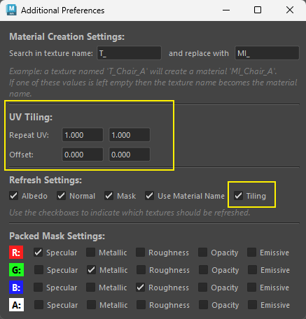
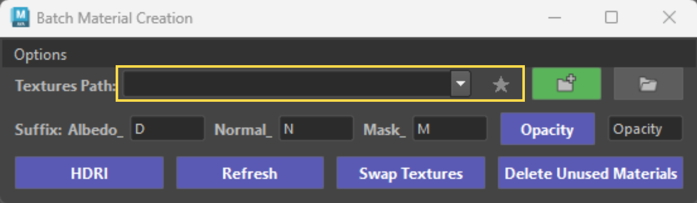

# Changelog:

## **Version: 0.69**
**Added Tiling/Offset Controls. **

{ .img-medium .img-centered } 

Three ways the values get applied:

* On creation. Every new material's place2dTexture node is created with the current Repeat/Offset values. Nothing to do beyond setting the fields first.
* Hitting Enter in any field (live apply). Select objects, faces, or materials (Hypershade), type a value, hit Enter. Only repeatU/V and offsetU/V on the selected materials' place2dTexture nodes change — no textures are reconnected or refreshed. Works regardless of the Tiling checkbox. Focus stays in the field so you can type another value and hit Enter again. Undoable as a single step. Warns if nothing is selected or the material has no place2dTexture.
* Refresh button. If the Tiling checkbox (Refresh Settings) is checked, refreshing also pushes the current Repeat/Offset values onto the existing place2dTexture nodes of the selected materials. Uncheck Tiling to refresh textures without touching UVs.

## **Version: 0.64**

{ .img-medium .img-centered } 

* Added **stored paths** - dropdown, favorites button.