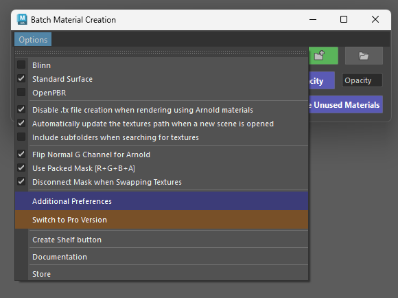
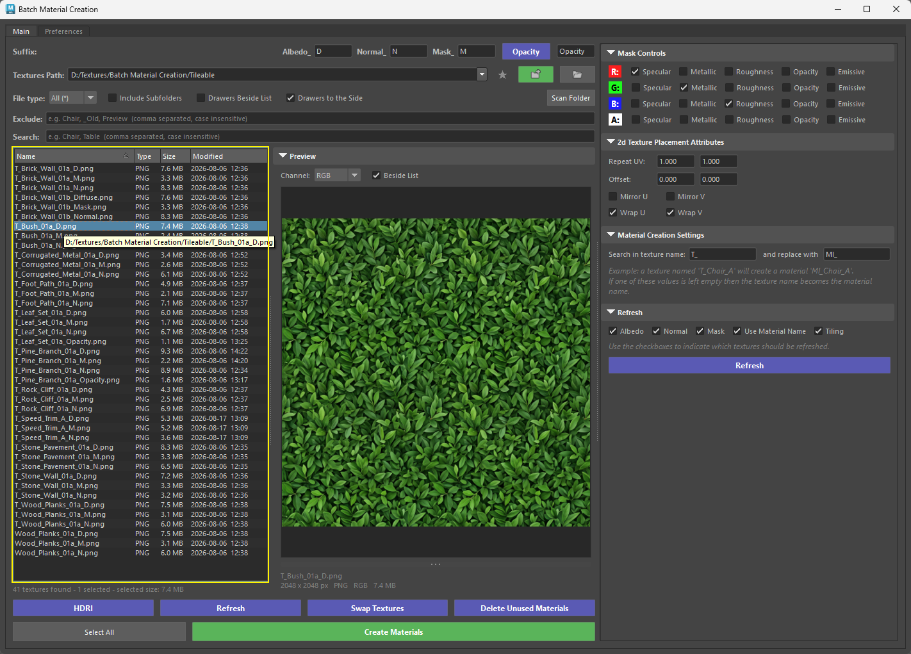
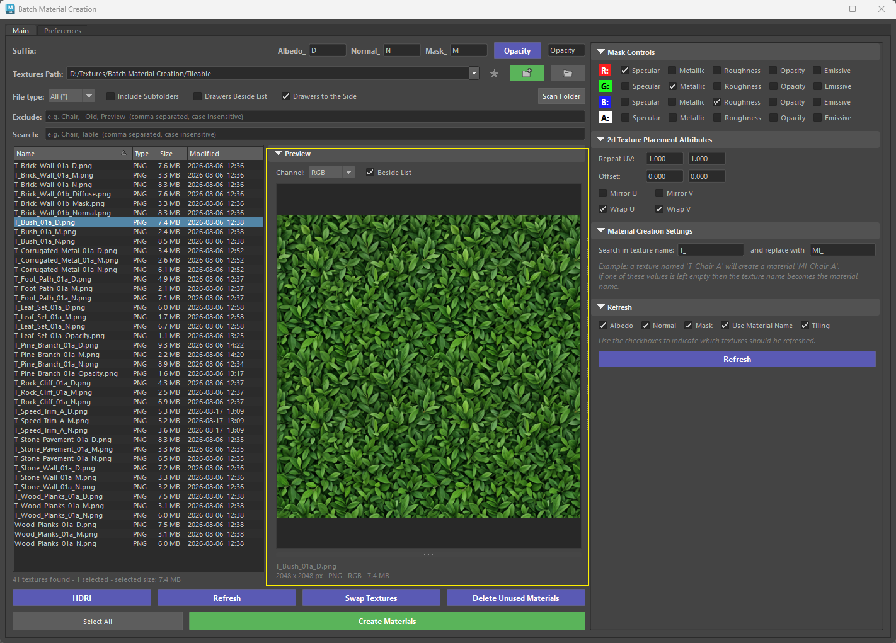

# **Pro Version** :tools:

{ .img-medium .img-centered } 

Switch to Pro from **Options → Switch to Pro Version** in the Classic tool, and back from **Preferences → Switch to Classic Version** in Pro. Whichever version you pick is the one the shelf button and the docked panel open from then on.

{ .img-small .img-centered } 

<figure style="text-align: center;">
    
    <figcaption>Switching from Classic to Pro and back</figcaption>
</figure>

The Pro version gives you more control over which materials get created. Where the Classic tool builds a material for every texture set it finds in the Textures Path, Pro shows you the textures first and lets you pick.

Most settings are identical to the Classic version and the two share the same preferences file, so switching between them loses nothing. What Pro adds is the workflow around them:

## **Textures list**

- **Textures list** – every texture in the path (subfolders included) is listed and kept up to date as files are added. Filter by name or file type, select the textures you want and press Create Materials, or double-click a single texture to build its material right away.

{ .img-medium .img-centered } 

<figure style="text-align: center;">
    
    <figcaption>Creating Materials by Right clicking on the Textures</figcaption>
</figure>

## **Preview**
- **Preview** – click a texture to inspect it without leaving Maya: zoom, pan, and view the R, G, B or alpha channel on its own. Useful for confirming what sits in each channel of a packed mask.

{ .img-medium .img-centered } 

## **Drawers**
- **Drawers** – the Options menu and the Additional Preferences window are replaced by collapsible drawers (Preview, Mask Controls, 2d Texture Placement Attributes, Material Creation Settings, Refresh) that can sit under the list, beside it, or in a full-height side column when the tool is docked.

<figure style="text-align: center;">
    
    <figcaption>Drawers</figcaption>
</figure>

## **Persistent layout**
- **Persistent layout** – filters, drawer states, splitter positions, preview channel, window size and last path are restored the next time the tool opens.

<figure style="text-align: center;">
    
    <figcaption>Persistent Menu sizes</figcaption>
</figure>

