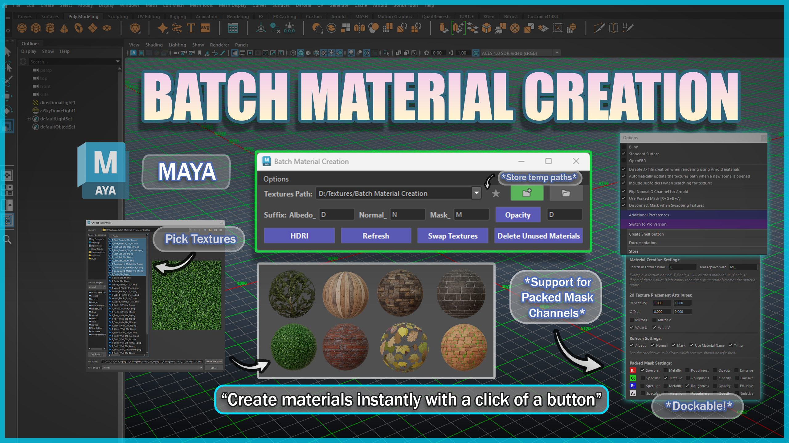
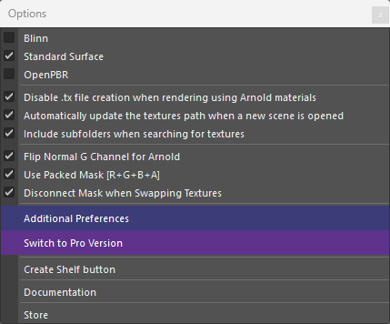
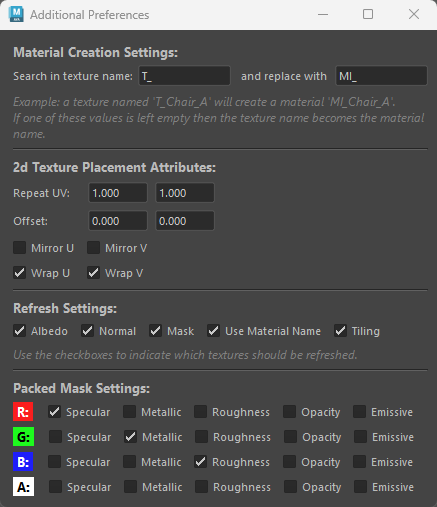

# **Batch Material Creation** :tools:

{ .img-large } 

??? Tip "Maya Versions"
    *Tested in Maya 2022-2027*

Batch Material Creation is a lightweight Python tool designed to accelerate texturing workflows in Maya. 

Built specifically for **game** artists, it lets you instantly generate and assign materials with native support for Albedo, Normal, and custom Packed  Mask maps.

Whether you're building massive environment scenes or prepping prop hero assets, this tool automatically generates materials and plugs in your texture maps based on custom suffixes—in just a single click.

## **Key Features**

- Automated Material & Texture Setup: Instantly generates shaders and links Albedo, Normal, Opacity, and Packed Mask maps *(R+G+B+A)* directly from a selected texture folder or active selection.

- Multi-Shader Support: Full compatibility with Blinn, Standard Surface, and OpenPBR Surface (Maya 2025+).

- Batch Tile/Offset: Allows for changing the tiling and offset values on multiple materials at once. 

- HDRI Skydome Integration: One-click setup for Arnold Skydome lighting with instant HDRI assignment and interactive viewport light toggling.

- Flexible Suffix Mapping & Prefix Controls: Customize naming conventions *(Albedo, Normal, Mask, Opacity)* and automatically handle material prefix overrides (such as converting T_ texture naming to customized material prefixes like MI_).

- Fully Dockable: The tool can be integrated within Maya's UI. .

## **Asset & Scene Maintenance**

- Refresh & Relink: Missing a map? Instantly scan your folders to find and reconnect lost textures.

- Texture Swapping: Swap color and normal maps on the fly without breaking connections.

- Scene Cleanup: Purge unassigned shaders or clear material assignments from selected meshes with ease.

## **Preferences**

{ .img-small } 
{ .img-small } 

The  Additional Preferences window *(located in the Options Menu)* serves as the main configuration hub for the Batch Material Creation tool. 

In short, it allows you to  customize naming conventions, selective texture  refreshing, and  packed mask routing to match your project's pipeline.