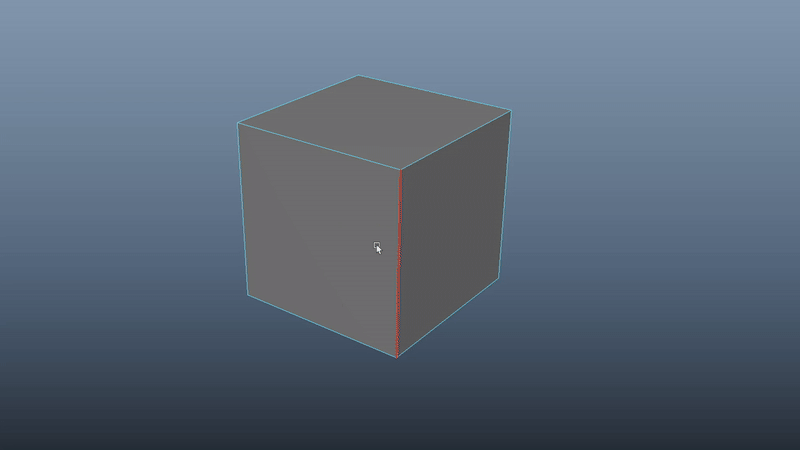

# **<span style="color:rgb(221, 137, 59);">Bevel</span>** 

This script allows you to adjust the width and segments of your bevels on the fly, without having to rely on adjusting the inputs on the little pop-up menu when you bevel the traditional way. 

{ .img-medium .img-centered}

## <span style="color:rgb(199, 192, 99);">**How it works**</span>

Just select some edges run the tool.  Once you fire up the tool you are in bevel mode.

You can hold down <kbd>Middle Mouse</kbd> to adjust the bevel width and hold down ++shift++ key whilst stiil holding down the <kbd>Middle Mouse</kbd> button to adjust the segments.

???+ Tip "Tip"
    Hold down ++ctrl++ whilst adjusting the width for a finer control. 
    


## <span style="color:rgb(199, 192, 99);">**How to install**</span>


### <span style="color:rgb(214, 126, 25);">**Hotkey code**</span>

<div class="grid cards" markdown>

-   :octicons-copy-16:{ .lg .middle } __[`Mel Code`](#)__

    ---

    Copy the 3 ^^**mel**^^  code lines below on a ^^**shelf**^^  or bind these on a ^^**hotkey**^^  to load the tool.

    ``` mel linenums="1"
    dR_DoCmd("bevelPress");
    string $getBevelNode[] = `listHistory -lv 1`;
    setAttr ($getBevelNode[1] + ".subdivideNgons") 1;
    ```

</div>

For best experience, click the button below to learn how to create hotkeys and shelf buttons.

[Creating Hotkeys/Shelf Buttons](../../Create%20Hotkeys%20Shelf%20Buttons/index.md){ .md-button .md-button--primary }
