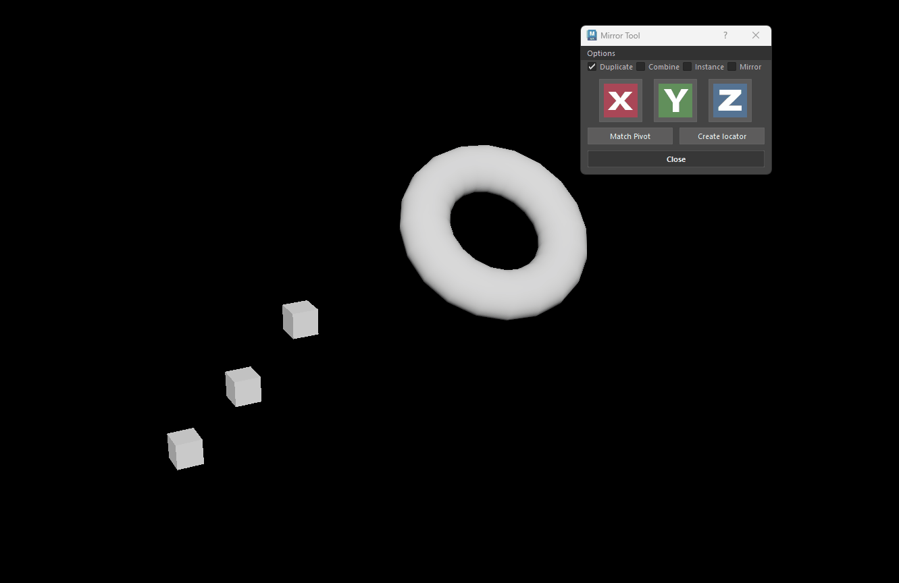

# **Mirror Tool**

## **Overview**

{ .img-small .img-centered }

Mirror Tool is a tool that will help you quickly mirror selected objects. 
A very useful tool for artists that want a quick and easy way to mirror their objects. 

- The tool has different main operations:
    * Duplicate:
        * Duplicates and mirrors selected objects.
    * Combine:
        * Duplicates mirrors and combines each selected object with its mirrored counterpart. 
    * Instance:
        * Creates instances of your selected objects and mirrors them.
    * Mirror:
        * Creats a mirror operation for each selected object.
    * Flip:
        * When all checkboxes are unchecked the tool will just flip your selected objects on the axis you selected.

- Use your manipulators Object / World alignment to mirror in Object or World space *(either Move, Scale or Rotate will do)*.
    * Hold down   W *(Move)*,E *(Scale)* or R *(Rotate)* and left click to choose the desired mode. The tool will then mirrror accordingly.
    * If any other mode is selected the tool will default to use Object. 

{ .img-small .img-centered }

<figure>
  
  <figcaption>Switching from Object to World Space to mirror.</figcaption>
</figure>

- ### **Mirror Operation**
    * When the Mirror checkbox is checked the tool will perform a mirror operation. 
    * If your manipulator mode is set to **Object** the tool will then create the Mirror/cut operation in **Object** mode.
    * If its set to **World** the tool will then be aligned to **Bounding box**.
        * If the checkbox Add Mirror cut Offset for Wold Space checkbox is checked *(from the options menu)*, then the tool will also calculate the offset needed for the mirror operation to start from the pivot points origin.  

        ???+ Info "Info - Applying offset"
            * The tool calculates the difference between your objects pivot point and Bounding box, then uses that difference as the offset value on your mirror operation. 
            
            * Please note this only works when your manipulator is set to World Space and Mirror is checked.

            * Sometimes Maya may fail to calcualate your bounding box *(Maya bug)*. 
            
                * If that happens try and reset your object by combining it with a cube *(and then deleting the cube and reseting your pivot point)* or uncheck the Add Mirror cut Offset for Wold Space checkbox to mirror from the objects Bounding box location. 

<figure>
  
  <figcaption>Mirroring using the  Add Mirror cut Offset for Wold Space  checkbox .</figcaption>
</figure>

- ### Mirror from last selected
    * Hold down ++ctrl++ *(with multiple objects selected)*  and click to mirror from the pivot point of the last selected object.
<figure>
  
  <figcaption>Mirroring from last selected object</figcaption>
</figure>

??? Info "Info - Mirroring from last selected"
    * Will work for all operations (Duplicate, Combine, Instance and Flip) except Mirror.

    * Mirror is not supported but if you really need something similar you could match the pivot point of all your obejcts with the last selected *(using the Match Pivot button)* one and run the Mirror operation. 
        * Just keep in mind that all object must have the same pivot orientation.

- ### Match Pivot 
    * Make a selection of different objects, the tool will match the pivot point *(location/orientation)* of all objects to the last one selected.
    <figure>
    
    <figcaption>Match Pivot from last selected object</figcaption>
    </figure>
    
    * ++ctrl++ click to bake the pivot point of an object.

    <figure>
    
    <figcaption> Bake Pivot</figcaption>
    </figure>

- ### Create Locator 
    * Make a selection of different objects, the tool will match the pivot point location/orientation of all objects to the last one selected.
    * Switch to different modes *(Object/World)* to get the desired orientation.

    <figure>
    
    <figcaption> *Create locators*</figcaption>

<!--  Get it on [Artstation](https://www.artstation.com/a/43532) or [Gumroad](https://mike3d.gumroad.com/l/mayamirrortool). -->

### **Videos**

<iframe width="560" height="315" src="https://www.youtube.com/embed/0dPSwNTMkU0" title="YouTube video player" frameborder="0" allow="accelerometer; autoplay; clipboard-write; encrypted-media; gyroscope; picture-in-picture" allowfullscreen></iframe>

