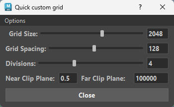
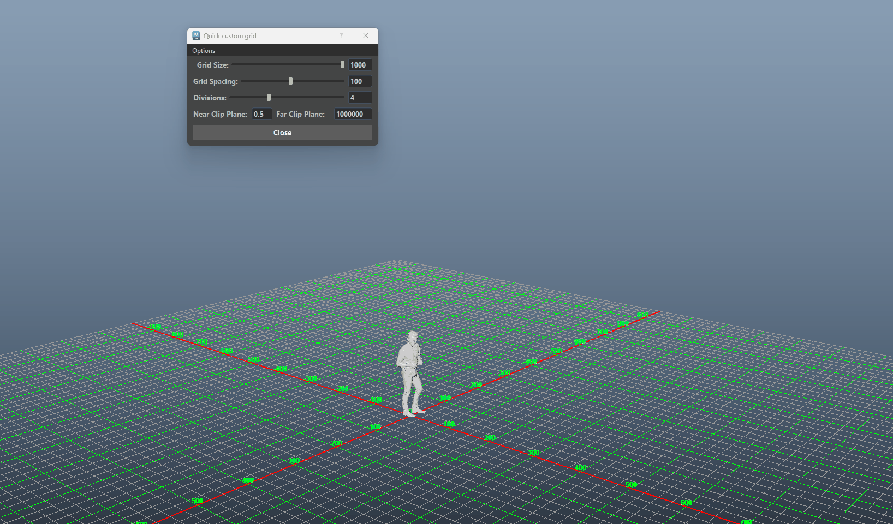
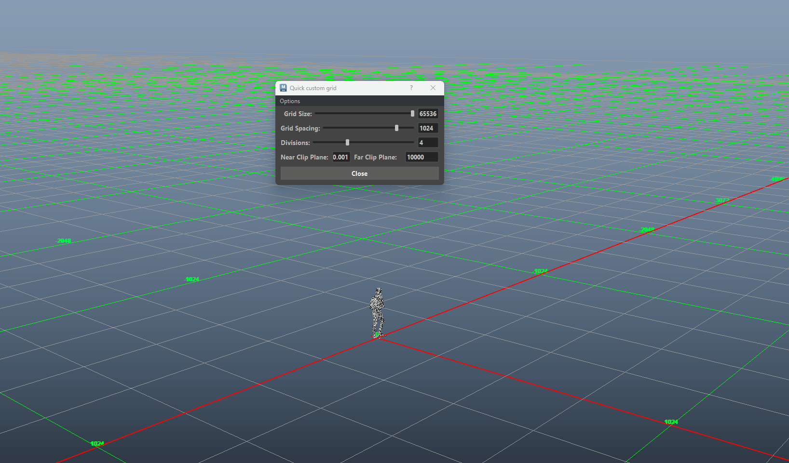
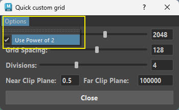

# **Quick Custom Grid** :tools:

{ .img-small } 

??? Tip "Maya Versions"
    *Tested in Maya 2022-2027*

Quick Custom Grid is a dynamic, UI-based utility for Autodesk Maya that allows users to adjust grid properties and camera clipping planes on the fly. 

It features two distinct operating modes to suit different workflows: a standard Base-10 *(Decimal)* mode that intelligently scales based on your current scene units, and a specialized "Power of 2" mode tailored for level designers and game engine compatibility.

## **Key Features**

- Real-Time Grid Updates: Slider and text inputs are directly connected to Maya's grid, allowing for instant visual feedback as values change.

    <figure>
    
    <figcaption>Adjusting the Grid</figcaption>
    </figure>

    ??? Info "Info - Grid Size & Spacing"
        * Expandable Limits with Auto-Snapping: If you need a value larger than what the slider can currently reach, simply type your desired number directly into the text field. The tool will automatically extend the slider's maximum range to accommodate it.

        * If you are in Power of 2 mode, the tool will intelligently calculate and snap your typed number to the closest valid power of 2 (for example, typing "1000" will automatically update to "1024") and extend the slider appropriately.

- Unit Awareness: The tool reads Maya's current working units (Centimeters vs. Meters) and dynamically scales the math behind the sliders so the grid behaves predictably.

- Camera Clip Planes:
    * Near Clip Plane & Far Clip Plane: Two text fields that allow you to adjust the render distance of your viewport.

    * Global Application: Editing these values applies the new clipping planes to all cameras currently in the Maya scene, preventing geometry from flickering or disappearing when working with massive or microscopic grids.

    <figure>
    
    <figcaption>Adjusting Near / Far Clipping Planes</figcaption>
    </figure>

## **Options Menu**

{ .img-small } 

- Use Power of 2 (Checkbox): Found in the top menu bar under "Options". 

    When activated, all grid size and spacing calculations are locked to powers of two (e.g., 8, 16, 32, 64, 128, 256, 512, 1024, 2048).

- Persistent Preferences: The tool creates a Quick_Custom_Grid folder in Maya's user preference directory and saves a JSON file. 

    This ensures the tool remembers your "Power of 2" preference the next time you open it.

* Documentation - Opens a link to the documentation.

* Store - Opens links to ArtStation and Gumroad.