# **Quick Sweep Mesh** :tools:

## **Intro**

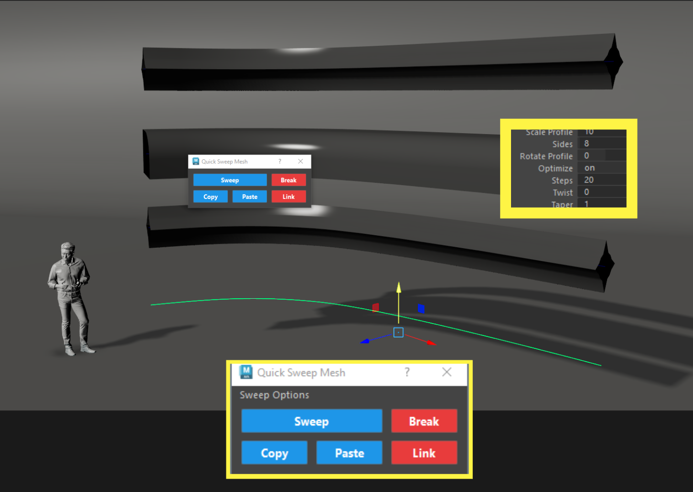{ .img-large .img-centered }

Quick_Sweep_Mesh is a tool that uses the existing Maya **Quick_Sweep Mesh** tool to quickly create pipes and other sorts of geo along a curve.

What's different from the default Maya version is that it allows you to create multiple Sweep Meshes at once and the ability to copy-paste attributes from one Quick_Sweep_Mesh to another or to selected curves.

Works in **Maya 2022 - 2026** 

???+ Info "Info - Hotkey"
    For best experience use the **hotkey** version of the tool.

## **UI Window Breakdown**

{ .img-small .img-centered }

**UI Window - Buttons**

1. **Sweep** - Creates a sweepMesh the same as the default Maya tool. Only difference is that this can be used with multiple objects selected.

    1. ++shift++ + Click activates the **hotkey** version of the tool. This creates and links attributes so that you can use your middle mouse to adjust each setting.
    2. ++ctrl++ + Click to open the attribute editor for the sweepMeshCreator and adjust the settings in there.    

2.  **Break** - Breaks the connections from your sweepMesh and the sweepMeshCreator so you can adjust the settings in the attribute editor. 
    1. Works only with Sweep Meshes that were created using the hotkey version.
3.  **Copy** - Copies all the attribute values of the sweepMeshCreator.
4.  **Paste** - Pastes all the values copied. This works on existing sweepMeshes and curves.
    1. ++ctrl++ + Click to only paste the **TaperCurve** values.

**Sweep Options**

{ .img-large .img-centered }

The **Sweep Options** will give you access to:

- **Documentation** *(link to this page)*.
- Will create a **Shelf Button** on any shelf tab.

## **Hotkey Breakdown**

To create a **Quick Sweep Mesh** simply select a curve and fire up the hotkey.  

<figure>

<figcaption>Creating a Quick Sweep Mesh</figcaption>
</figure>

When you first create a Quick Sweep Mesh using the Hotkey, the tool will create a list of attributes that are directly linked with the **sweepMeshCreator**. 

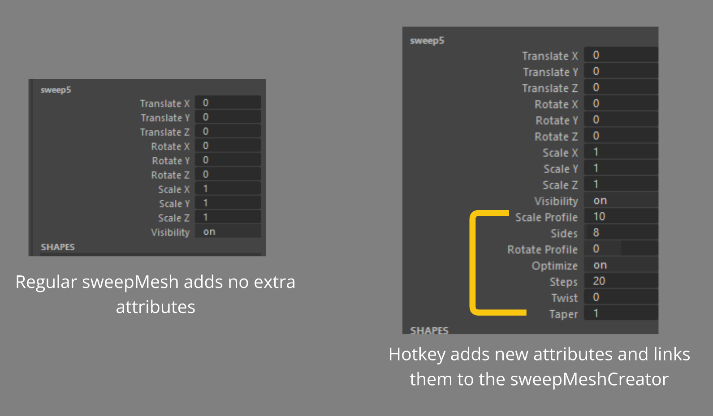{ .img-large .img-centered }

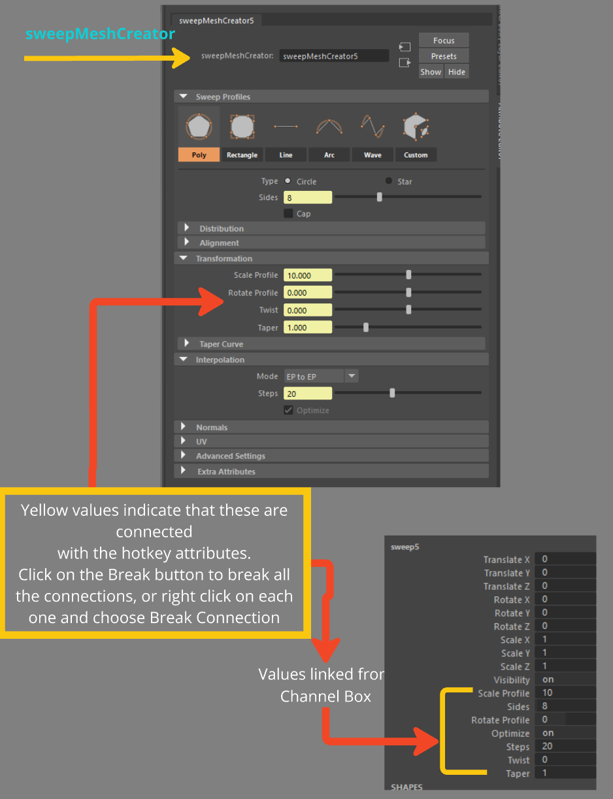{ .img-large .img-centered }

Every time you use the hotkey to create a sweepMesh you will get a little pop up on the  **top right** of your screen indicating which attribute you can control with the **middle mouse**.

<figure>

<figcaption>Switching between attributes</figcaption>
</figure>

The hotkey has the ability to cycle through the different attributes created that will help you adjust your sweepMesh on the fly.

Simply run the hotkey command *(repeatedly)* with a sweepMesh selected to cycle through.

Here is the order of attributes you can control and cycle through:

{ .img-large .img-centered }

### **Copy/Paste**

Another feature of the hotkey is that it can also **copy/paste** sweepMesh attributes from selected objects (existing sweepMeshes need to have their history intact for this to work).

{ .img-large .img-centered }

Here I have 3 objects selected.

The first selected object (the middle one) is the one where its attributes will be copied from  onto the other sweepMeshes.

In my example I also selected an existing sweepMesh and a curve (keep in mind this will only work with these type of selections).

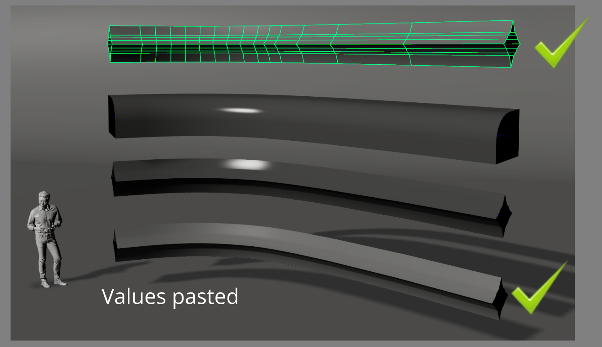{ .img-large .img-centered }

The last selected object is now selected and you can immediately adjust its radius with the middle mouse button.

{ .img-large .img-centered }

Hit any key on your keyboard to exit that mode (e.g. W,E,R)

??? Info "TIP - How to reset the cycle"
    
    Every time you select a new sweepMesh and run the hotkey the tool will start from the first attribute option which is SweepRadius.
    
    (This is done so you can just jump from sweepMesh to sweepMesh and quickly adjust its size.)

    Another way to reset it is to run the hotkey with nothing selected or to click on the **Link button** in the ** UI Window**.

    <figure>
    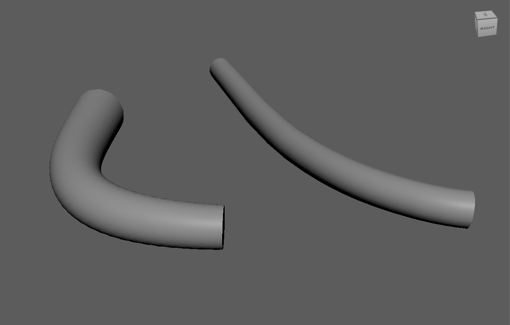
    <figcaption>Resetting the cycle</figcaption>
    </figure>

### **Edges/Faces**

QuickSweep also works with selected faces or polygon edges.

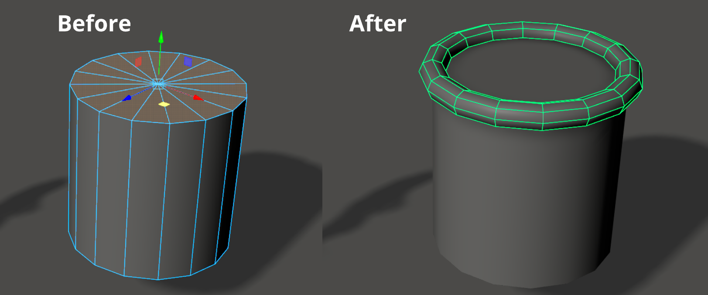{ .img-large .img-centered }

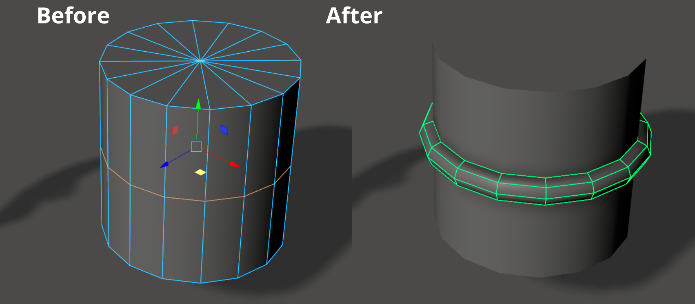{ .img-large .img-centered }

??? Info "TIP - How quickSweepMesh from Face is generated"
    
    When having faces selected the tool will convert your face selection to perimeter edge and then convert that edge to a curve.
    
    Just make sure you select faces that are connected to each other. 
    

When you create a Quick Sweep Mesh from an edge or a face a curve is created (by default it's automatically hidden).

The curve created is degree 1 Linear curve, this means it creates spans (edge rings) where vertices were placed along a selected edge.

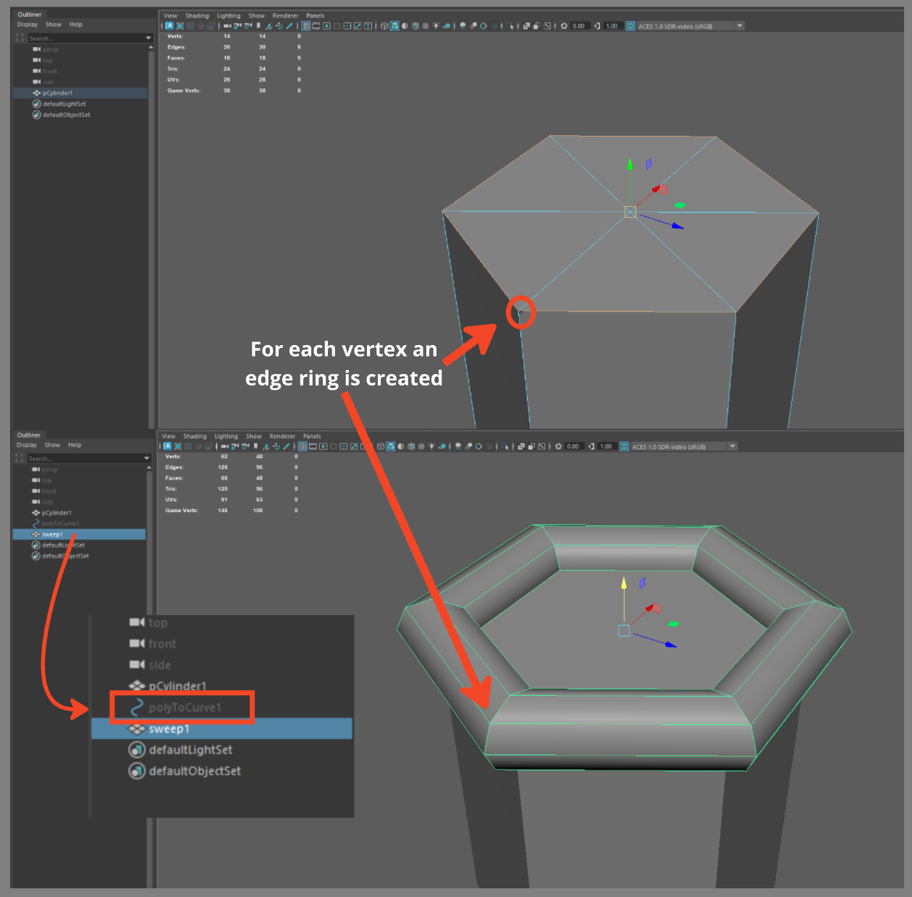{ .img-large .img-centered }

You can change the curve smoothness from Linear to any Degree you want (or even rebuild the curve after the fact).

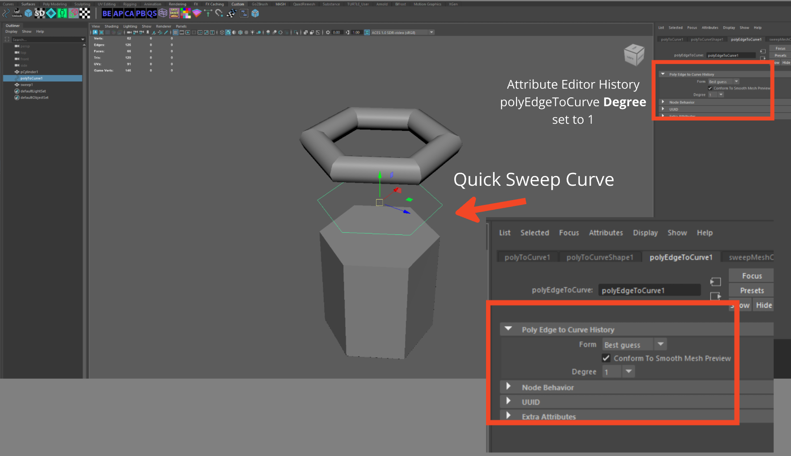{ .img-large .img-centered }

{ .img-large .img-centered }

This will translate to your Quick Sweep Mesh and make it smoother.

### **Tapered Curve**

The tool even copies over the points assigned in your **tapered curve**.

{ .img-large .img-centered }

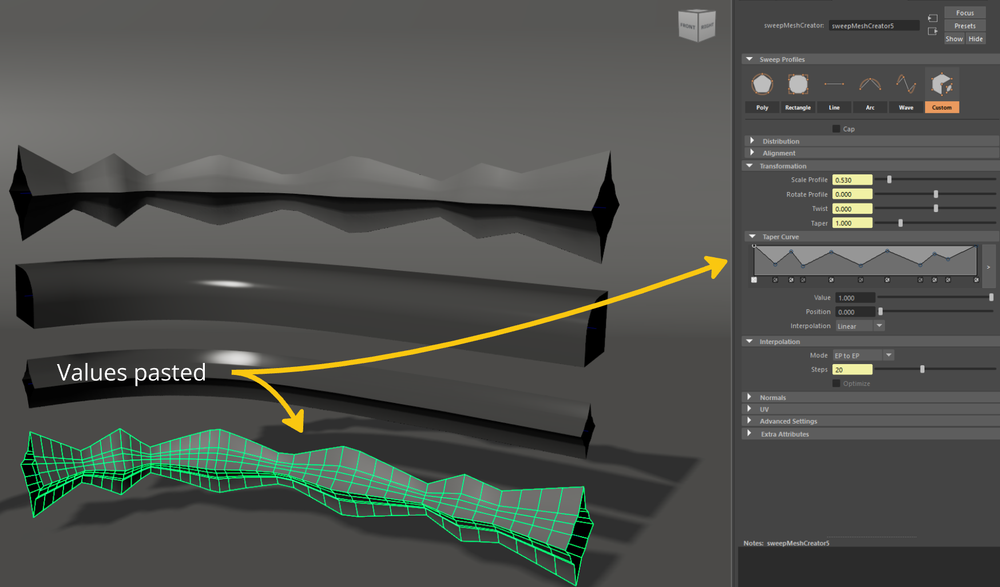{ .img-large .img-centered }

??? Info "TIP - Copy/Paste only tapered values"

    Use the UI window to **ONLY** paste the TaperCurve values of a SweepMesh by ++ctrl++ + Clicking on the **Paste** Button.

    - First select an object that has the tapered curve values you desire and click **Copy** 

    - Then ++ctrl++ Click the **Paste** button with the desired curve/Sweep Mesh selected to transfer over the tapered curve values. 

    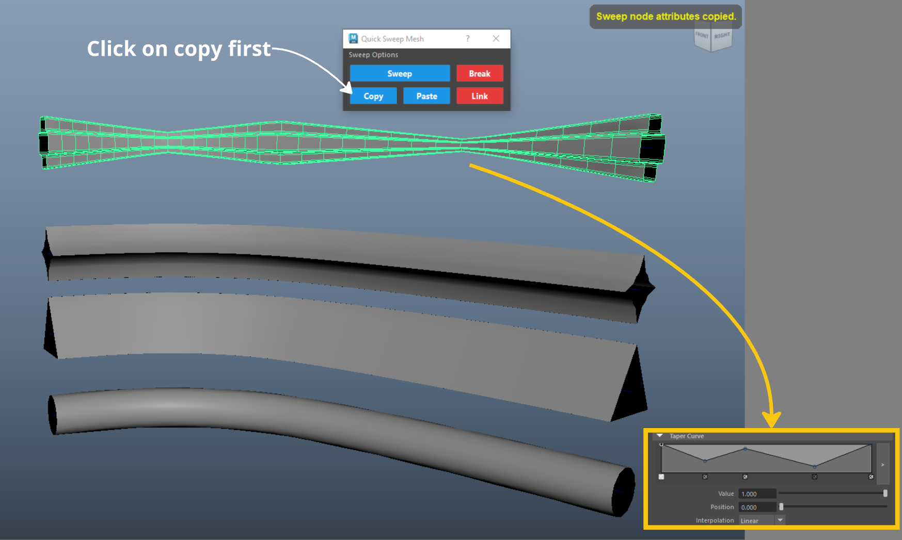{ .img-large .img-centered }

    { .img-large .img-centered }

### **Custom Curve**

In Maya, a custom sweep mesh lets you extrude any polygon object (like a custom profile shape) along a curve or edge, offering more control than built-in presets for unique geometry like complex moldings, ropes, or pipes.

The tool can copy any custom mesh and paste it on any curve/Sweep Mesh.

{ .img-large .img-centered }

{ .img-large .img-centered }

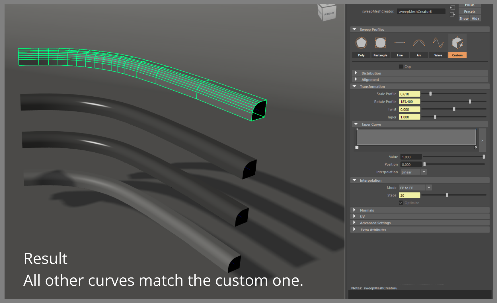{ .img-large .img-centered }

## **Help / Additional information**

### **Can't create Sweep Meshes**

If the tool is not working make sure the Plugin is loaded in Maya.

Please note that the Sweep Mesh tool was added in **Maya 2022**, earlier versions will not have it.

If you are using Maya 2022 but the tool is not working it could be the case that the **Plugin** is not loaded.

Go to **Windows -> Setting and Preferences -> Plug-in Manager**.

{ .img-large .img-centered }

Type in Sweep and ensure the sweep.mll loaded and Auto-load checkboxes are checked.

Sweep Mesh should now appear under the Create tab.

### **Open/Closed Curves**

The tools adds a **Merge Vertices** operation on a Sweep Mesh that is derived from a closed curve.

{ .img-large .img-centered }

This ensures your geometry is sealed tight. 

<figure>

<figcaption>Merging vertices on Closed curves</figcaption>
</figure>

### **Interpolation mode**

The tool will work with any existing Sweep Mesh that has it's history not deleted.

One thing to notice is that when using the hotkey, the tool is using a different **interpolation mode**  than the one used when you create a curve from Maya's native Sweep Mesh menu.

The default Mode is set to **Precision** but the one used by the tool is **EP to EP**.

{ .img-large .img-centered }

???+ Info "Important"

    Copying the values from a Sweep Mesh that has its Mode set in Precision, will paste and set that Mode in any new Sweep Meshes created by the tool.

However when using the hotkey to cycle through the different attributes when you reach  **steps** the tool will switch the interpolation mode to EP to EP. 

Your Precision values are pasted but the Mode is just changed, if you want to keep the Mode to Precision you will have to switch it back manually within the Attribute Editor.

{ .img-large .img-centered }

<figure>

<figcaption>Interpolation mode changed</figcaption>
</figure>

### **Stacking QuickSweepMeshes**

When creating a sweep mesh from an edge that is derived from a mesh that already is a SweepMesh, there are some limitations to what you can and cannot do.

{ .img-large .img-centered }
{ .img-large .img-centered }

Tweaking the values of the original sweep mesh has a drastic effect on the Sweep Meshes that were derived from it.

{ .img-large .img-centered }

Changing the Sides Value breaks the derived Sweep Meshes.

This happens because when you selected the edge to create the derived sweep mesh, it created a curve and its history is directly linked with how many steps the original Sweep Mesh had.

<figure>

<figcaption>Stacking Quick Sweep Meshes</figcaption>
</figure>

