# **Breakdown**

## **Rename** 

The simplest version of the tool is to make a selection. Simply type anything in the name textfield and click the **Rename** button.

- The **interactive update** feature of the tool will update the preview window, the moment you type in the **Name**, or make a **New** selection. 

<figure markdown>
  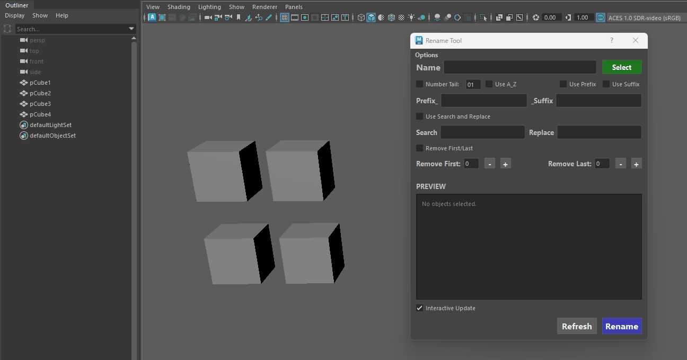{ .img-medium }
  <figcaption>Plain Rename Feature</figcaption>
</figure>

- **Selection Order Matters**: The tool respects the exact order in which you select your objects in the viewport or Outliner. 

<figure markdown>
  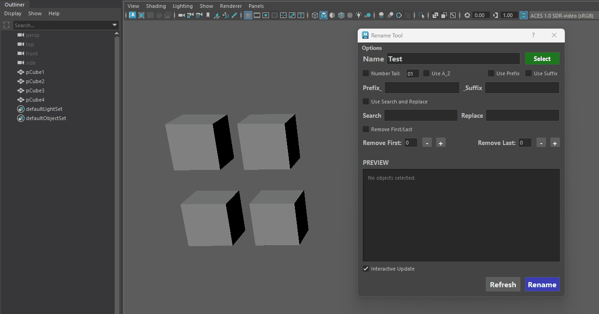{ .img-medium }
  <figcaption>Selection order tracked</figcaption>
</figure>

???+ Warning "Important - Selection Order"
    If your selection order is not tracked, make sure it is enabled in your **settings/Preferences** window *(under Selection)*.
    
    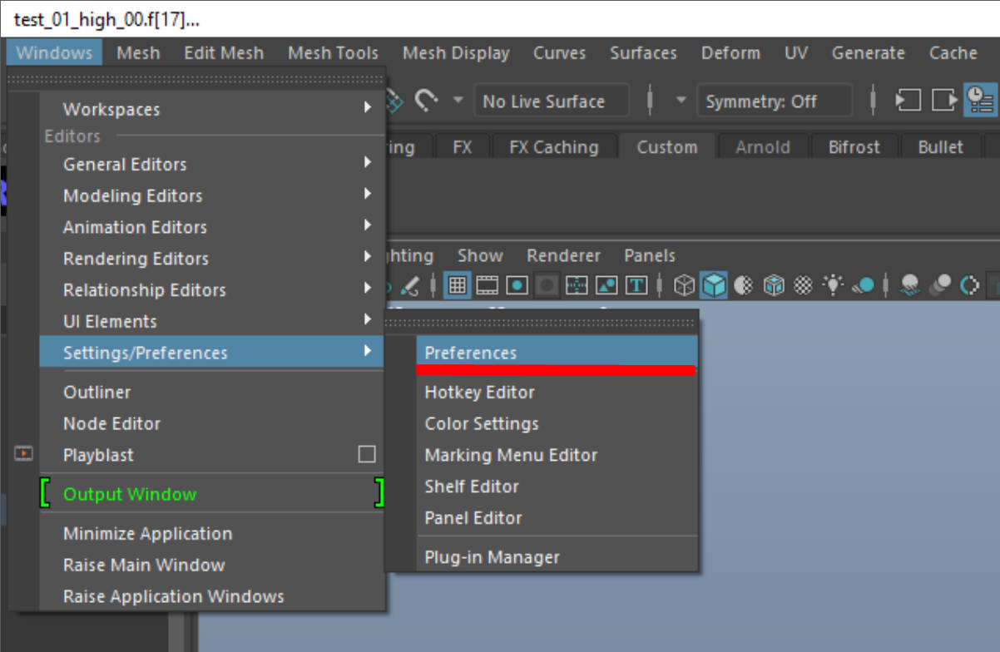{ .img-medium .img-centered }

    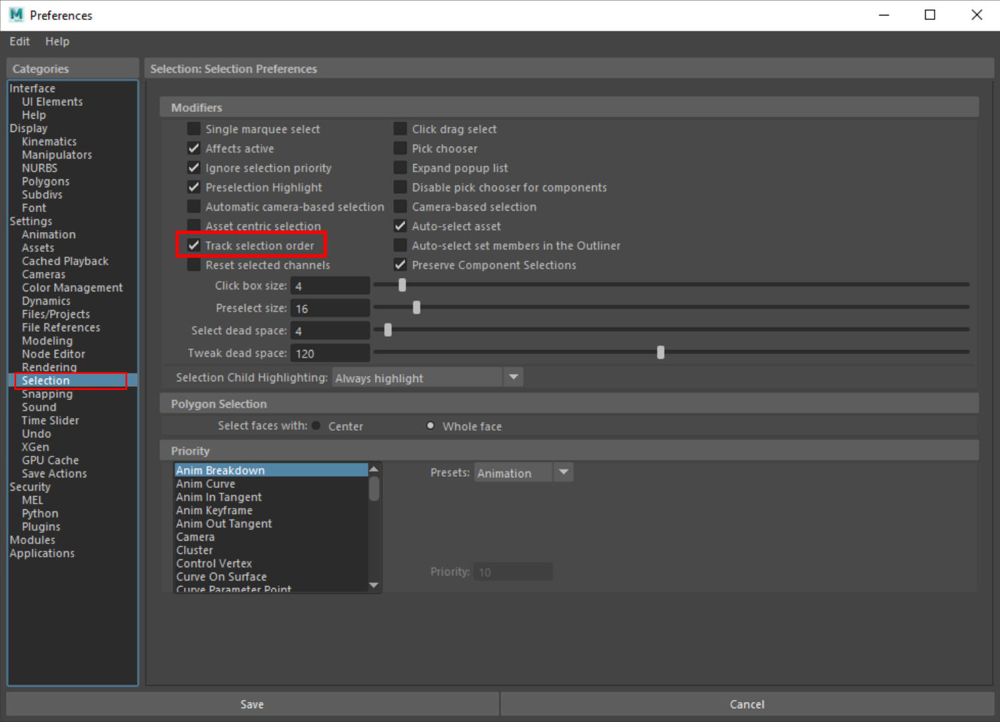{ .img-medium .img-centered }

- **Node Type Color-Coding**: To help you quickly identify what kinds of objects you are about to rename, the tool analyzes the shape node of each selected object and applies a faint background highlight:

    ??? Info "Info - Colour Types"

        📷 Cameras: Faint Grey

        〰️ Curves (NURBS & Bezier): Faint Blue

        📍 Locators: Faint Light Blue

        💡 Lights (Any directional, point, spot, Arnold lights, etc.): Faint Yellow

        📦 Geometry / Transforms (Standard meshes and empty groups): Faint Pink

        🧧 Groups: Faint Red
        

    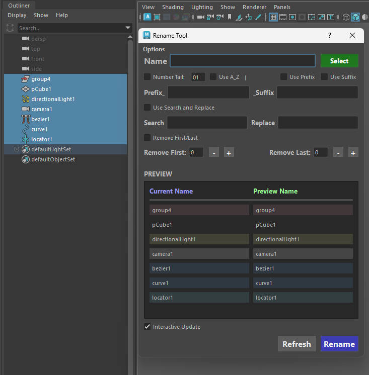{ .img-medium } 

## **Number Tail** 

The **number tail** feature automatically appends sequential numbering to your batch-renamed assets, ensuring every object has a unique, organized identifier.

<figure markdown>
  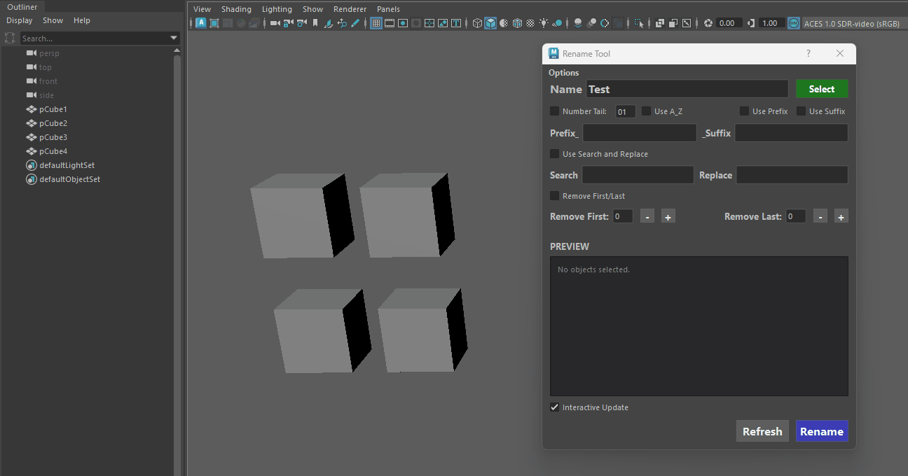{ .img-medium }
  <figcaption>Subsequent numbers applied to selection</figcaption>
</figure>

- **Selection Order Matters**: The tool respects the exact order in which you select your objects in the viewport or Outliner. The first object you click gets the first number, and subsequent selections will count up sequentially (e.g., 1, 2, 3, 4).

- **Custom Zero-Padding**: You have full control over the number format. By simply typing extra zeroes into the text field, the tool dynamically adjusts the padding length of the suffix.

    * Type 1 ➔ _1, _2, _3... _10

    * Type 01 ➔ _01, _02, _03... _10

    * Type 001 ➔ _001, _002, _003... _010

    <figure markdown>
    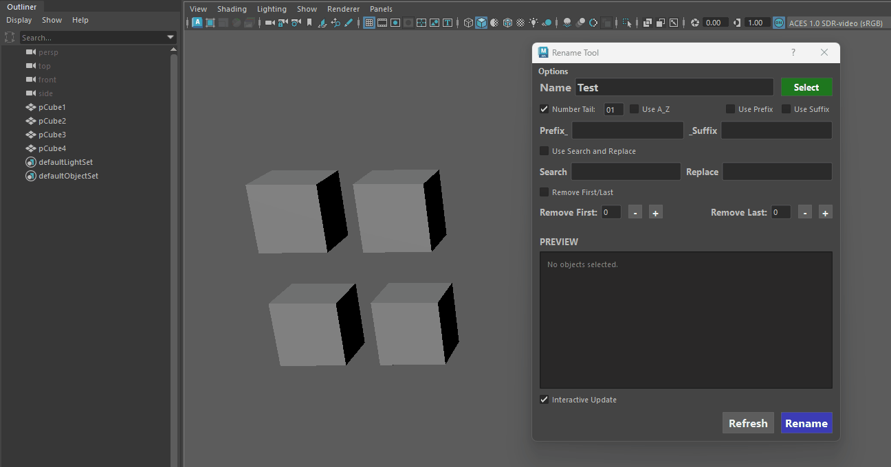{ .img-medium }
    <figcaption>number padding changed</figcaption>
    </figure>

## **A_Z** 

The **A_Z** feature allows you to sequence your batch renames using letters instead of (or alongside) numbers. This is perfect for variation sets, modular kits, or LODs.

<figure markdown>
  { .img-medium }
  <figcaption>Subsequent letters applied to selection</figcaption>
</figure>

- **Case Sensitivity (Lower & Upper Case)**: The tool fully supports both uppercase and lowercase lettering based on what you type. You can start your sequence with a lowercase a (resulting in _a, _b, _c) or an uppercase A (_A, _B, _C). The internal sequence seamlessly flows from a-z into A-Z.

- **End of Alphabet Protection**: If you select more objects than there are available letters left in the sequence, the tool automatically halts the operation and alerts you. This failsafe ensures your naming conventions don't break or generate unexpected characters when you reach the end of the alphabet.

    <figure markdown>
    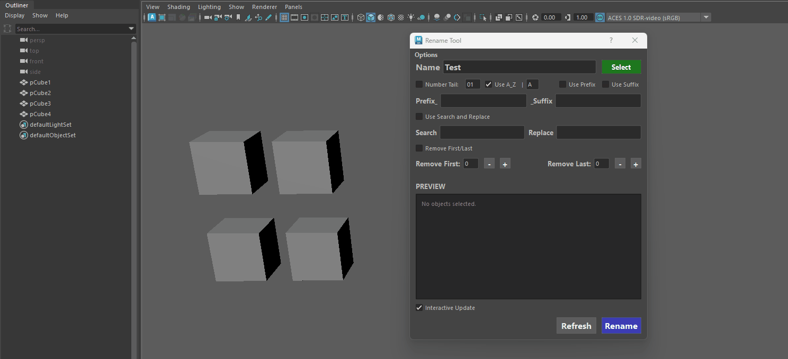{ .img-medium }
    <figcaption>End of alphabet</figcaption>
    </figure>

    * lower-case will traverse through to upper-case letters

    <figure markdown>
    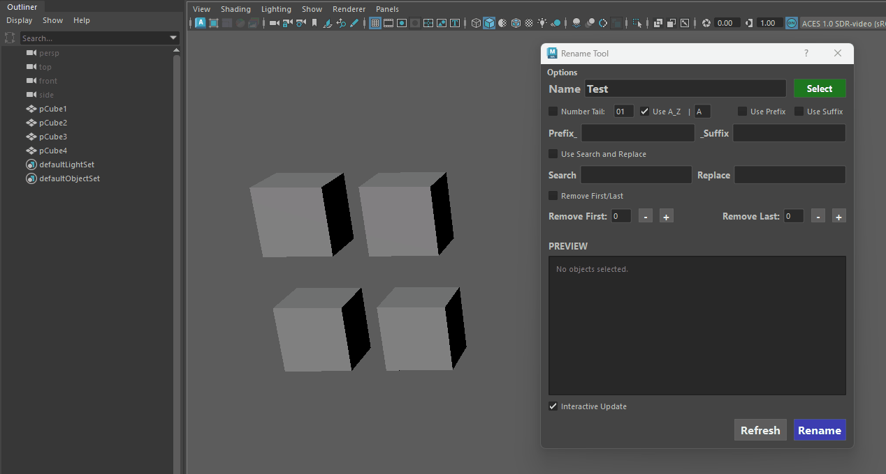{ .img-medium }
    <figcaption>lower-case traversal to upper</figcaption>
    </figure>

- **Auto-Reset for Invalid Inputs**: If you accidentally type a number or special character into the A–Z text field, the tool will instantly catch the error, alert you, and safely reset the field back to the default "A".

    <figure markdown>
    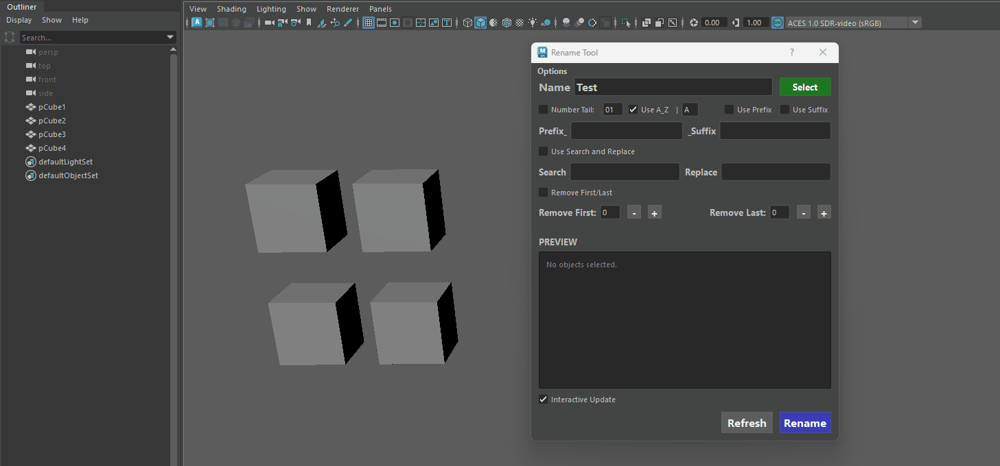{ .img-medium }
    <figcaption>Auto Reset Letter</figcaption>
    </figure>

- **Customizable Underscores (Options Menu)**: By default, the tool adds an underscore before the letter (e.g., Barrel_A, Barrel_B). If your pipeline requires the letter to be directly attached to the base name (e.g., BarrelA, BarrelB), you can easily turn this off by unchecking "Use underscore before A_Z" directly in the top Options menu.

    <figure markdown>
    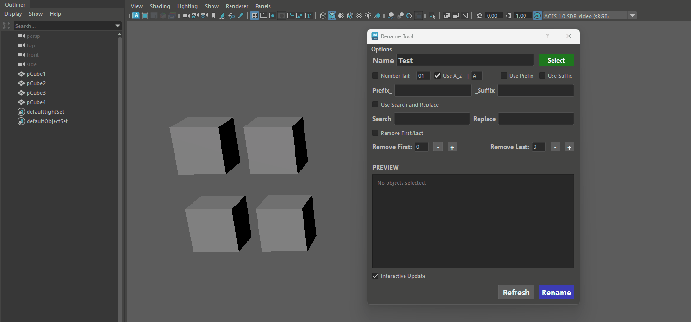{ .img-medium }
    <figcaption>Customizable Underscore</figcaption>
    </figure>

## **Prefix - Suffix** 

The **Prefix and Suffix** features allow you to instantly prepend or append standard pipeline tags to your assets. The tool automatically handles the formatting, seamlessly inserting underscores between the prefix, base name, and suffix so you don't have to type them manually.

<figure markdown>
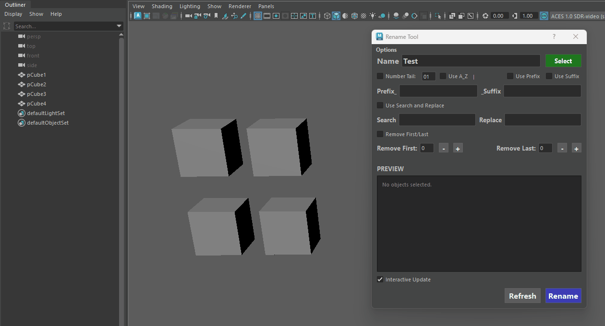{ .img-medium }
<figcaption>Prefix-Suffix</figcaption>
</figure>

- **Maya Rule Protection (No Leading Digits)**: Maya's architecture strictly forbids node names from starting with a number. If you accidentally attempt to start your Prefix with a digit (e.g., 1_Prop), the tool instantly catches the violation, halts the operation, and clears the field with a warning.

    <figure markdown>
    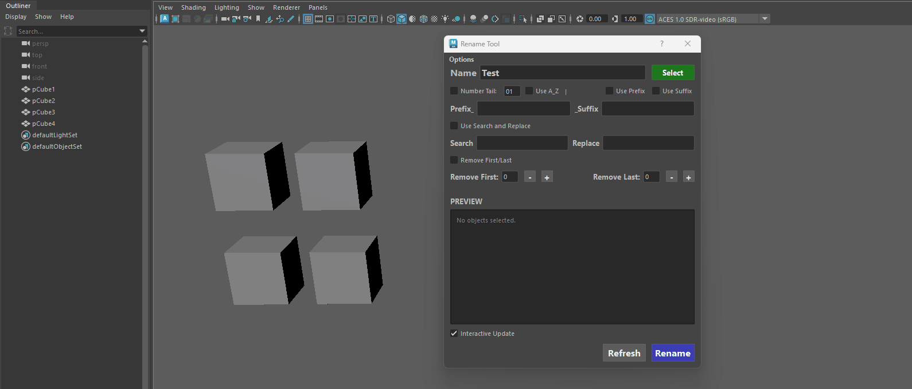{ .img-medium }
    <figcaption>Leading Numbers</figcaption>
    </figure>

- **Pipeline-Safe Validation**: Both text fields actively scan for illegal characters (like spaces, dashes, or special symbols). It ensures your tags contain only letters, numbers, and underscores, keeping your names 100% compliant with game engines and Maya's backend.

    <figure markdown>
    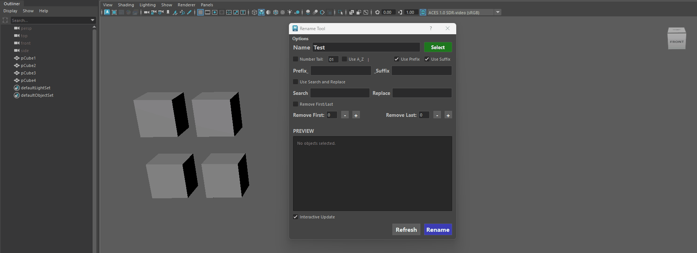{ .img-medium }
    <figcaption>Illegal characters</figcaption>
    </figure>

## **Combining all features** 

The true power of the Rename Tool lies in its ability to combine features seamlessly. Every toggle—Prefixes, Base Names, Number Tails, A–Z sequencing, and Suffixes—can be stacked simultaneously to match even the most complex and strict studio naming conventions.
    
- **Worry-Free Experimentation**: Because of the Real-Time Live Preview, you can check and uncheck different combinations, adjust padding, and change prefixes on the fly. You will see the exact final output for your entire selection instantly—before you commit to a single rename.

    <figure markdown>
    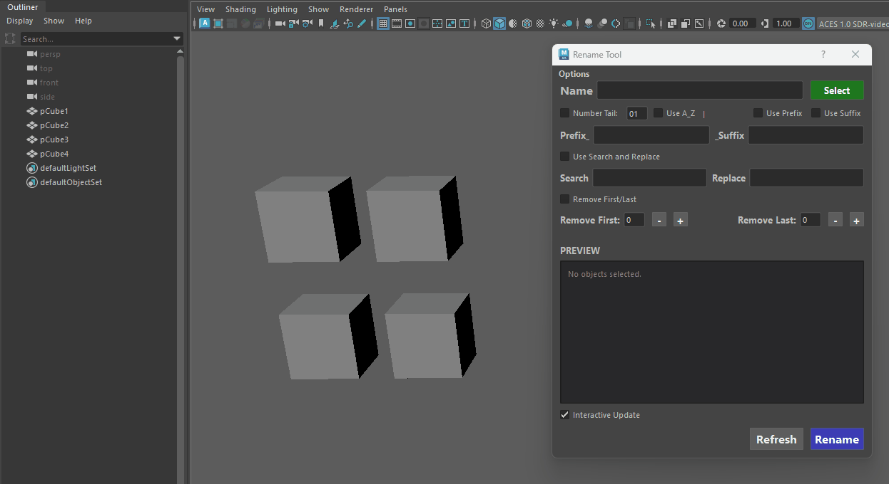{ .img-medium }
    <figcaption>Combining all features</figcaption>
    </figure>

## **Search and Replace** 

The **Search & Replace** feature is a lifesaver for fixing typos, updating outdated naming conventions, or mass-migrating asset tags without having to manually re-type everything.

<figure markdown>
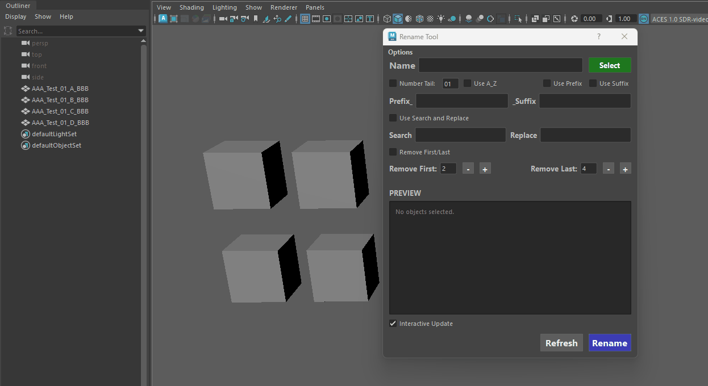{ .img-medium }
<figcaption>Search and Replace</figcaption>
</figure>

- **Case Sensitivity Control**: Controlled directly from the top Options menu, you can toggle strict case sensitivity.

    * Case Sensitive ON: Perfect for targeted fixes (e.g., changing LOD to lod without affecting other uppercase letters).
    * Case Sensitive OFF: Great for sweeping, case-insensitive mass replacements across a messy scene.

    <figure markdown>
    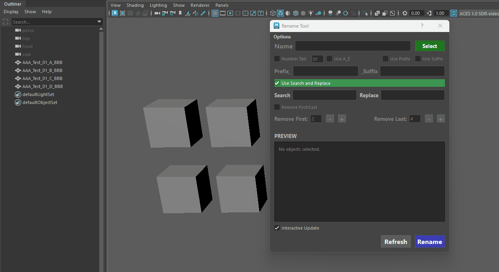{ .img-medium }
    <figcaption>Case-Sensitive/insensitive</figcaption>
    </figure>

- **Smart Clash Protection**: If a replacement accidentally results in two objects having the exact same name, the tool's built-in name clash resolution kicks in automatically, appending numbers to prevent Maya from throwing errors or scrambling your hierarchy.

    <figure markdown>
    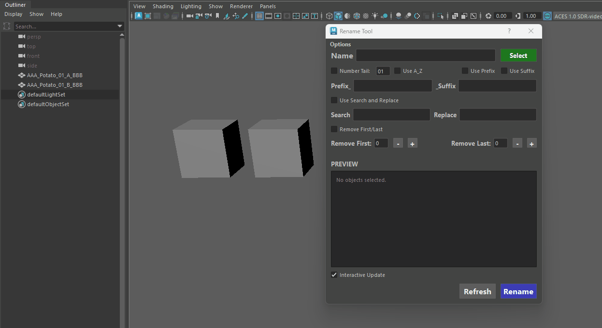{ .img-medium }
    <figcaption>Name Clash Protection</figcaption>
    </figure>

## **Remove First/Last** 

The **Remove First / Last** feature is your go-to tool for instantly cleaning up messy imported assets, stripping out baked-in namespaces, or removing unwanted tags from hundreds of objects at once.

<figure markdown>
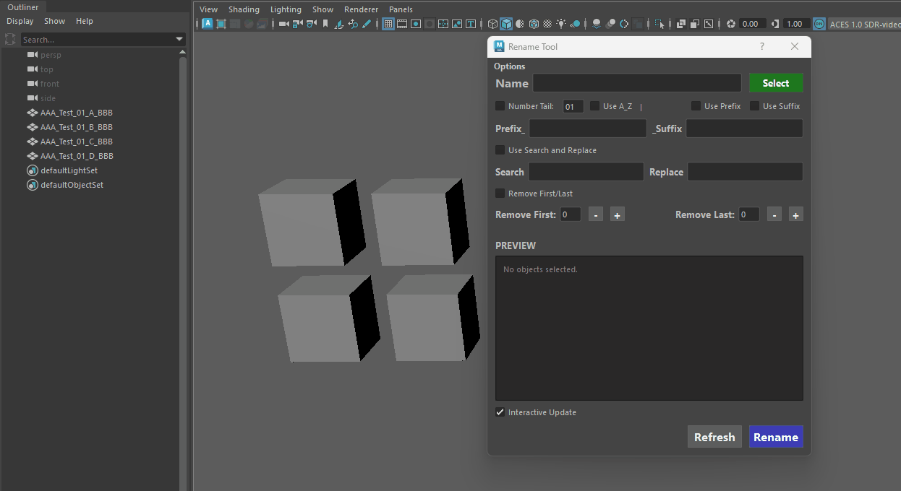{ .img-medium }
<figcaption>Remove First/Last</figcaption>
</figure>

??? Info "Info - Additional features"
    * **Quick Zero-Out Shortcut**: Made a mistake or want to start over? 
    
        Simply ++ctrl++ + Click on any of the **+** or **-** buttons to instantly snap the trim value back to **0**.

    * **Maya Rule Protection (Leading Digits)**: Maya will fatally error if an object name starts with a number. 
    
        If you trim the front of a name and accidentally expose a digit (for example, trimming 5 characters from Prop_01_Barrel leaves 01_Barrel), the tool intelligently detects this and automatically injects an underscore (_01_Barrel) to keep your scene completely stable.

    * **Overshoot Failsafe**: If you accidentally dial the removal number higher than the total length of the object's name, the tool prevents the name from being completely deleted, ensuring your Outliner items never vanish into nameless data.

## **Additional Features** 

### **Interactive Update** 

By default, the **Preview Window** is fully interactive, updating instantly with every keystroke, checkbox toggle, or selection change. 

However, when working in massive production scenes with thousands of dense assets, live-calculating name clashes on every keystroke can sometimes cause UI lag.

-  **Interactive Update Toggle**: Located right above the rename button, the Interactive Update checkbox gives you full control over performance. Unchecking this box pauses the real-time preview calculations, instantly restoring maximum UI responsiveness in extremely heavy scenes.

- **Manual Refresh Button**: When Interactive Update is toggled off, you can type out your complex naming conventions, adjust padding, and dial in character trims with zero lag. Once your setup is ready, simply click the dedicated Refresh button to calculate and display the Preview Window on demand.

    <figure markdown>
    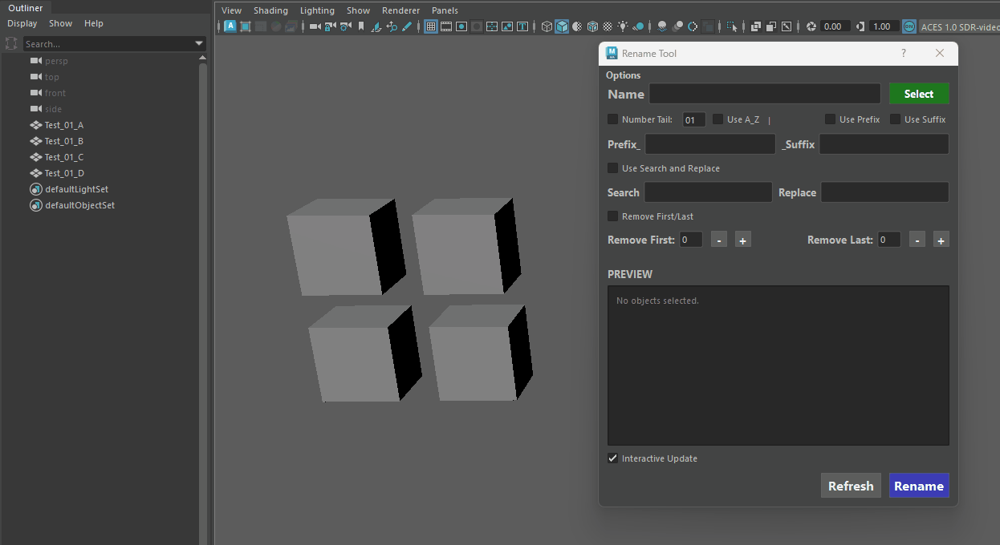{ .img-medium }
    <figcaption>Search and Replace</figcaption>
    </figure>

### **Select Button** 

The **Select** button is much more than just a way to grab objects—it is a context-sensitive multi-tool packed with shortcuts to speed up your workflow and keep your UI clean. Depending on the modifier key you hold, it performs completely different tasks:

- **Select by Name (Standard Click)**: Type any word into the Base Name text field and click Select. The tool will instantly scan your entire scene and select every object that contains that string. It even respects your strict Case Sensitivity toggle from the Options menu!

    <figure markdown>
    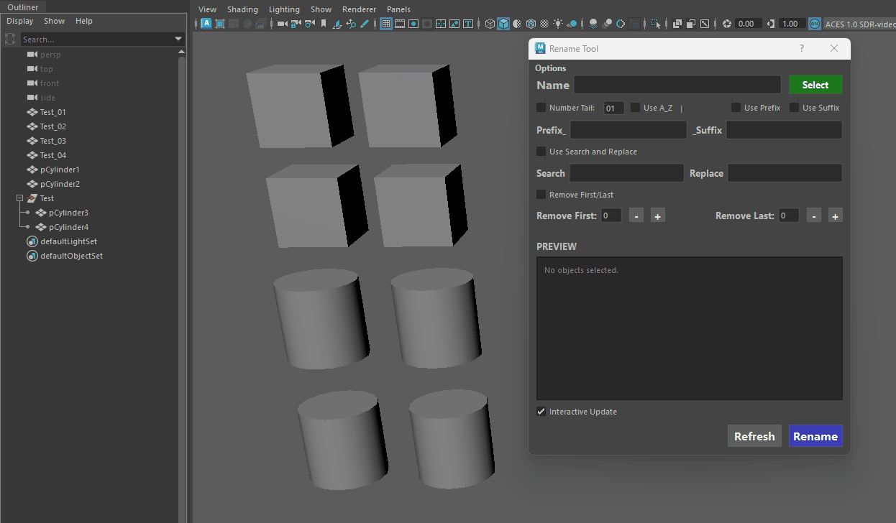{ .img-medium }
    <figcaption>Select by Name</figcaption>
    </figure>

- **Sample Object Name (++alt++ + Click)**: Don't want to type? Simply select an object in the viewport or Outliner and Alt + Click the Select button. It will instantly sample that object's name and paste it directly into the Base Name text field.

- **Reset All Checkboxes (++ctrl++ + Click)**: If you've just finished a complex rename with prefixes, suffixes, and trims, Ctrl + Click will instantly uncheck every single box, giving you a clean slate for your next operation.

- **Reset All Textfields (++ctrl++ + ++shift++ + Click)**: This modifier instantly clears every text field, zeroing out your trims, and restoring the UI to its default *(no entered text)* state.

- **Purge Empty Groups (++shift++ + Click)**: A powerful built-in scene cleanup utility. 

    If you have a messy hierarchy selected, ++shift++ + Click will scan through it and intelligently delete any empty transforms or "junk" groups *(groups containing only hidden intermediate shapes)*. 
    
    If you have nothing selected, it will scan and clean your entire scene in a fraction of a second!

    <figure markdown>
    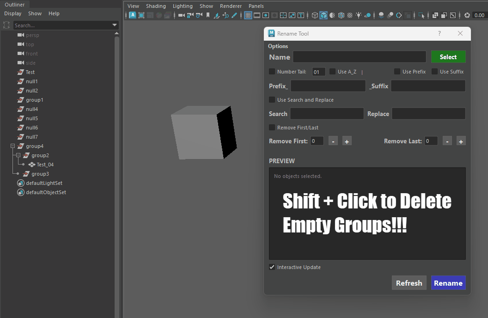{ .img-medium }
    <figcaption>Delete Empty Groups</figcaption>
    </figure>

## **Important Info** 

- If your order of selection is not named correctly please ensure [track selection order](#config-Warning) is checked in the settings.

- Maya **hangs** when UV Editor is open **uvTkResolveAndUpdateTrees**:

    This is a bug in Maya's architecture that causes batch renaming scripts to completely lock up the software.

    ??? Info "Hang Issue"
        
        **What is Happening?**:

        * When you open the UV Editor and its accompanying UV Toolkit in a Maya session, Maya silently creates several background "scriptJobs." 
        
            These scriptJobs act like motion sensors—they watch the scene for any changes *(like object selections or name changes)* so they can automatically update the lists and UI trees inside the UV Toolkit *(specifically the "UV Sets" list at the bottom)*.

            The internal command that updates this UI tree is called  **uvTkResolveAndUpdateTrees**.

        * If you run a batch rename script that processes 1,000 objects in a fast for loop, Maya detects a name change 1,000 times in a fraction of a second. 
        
            Consequently, it triggers the uvTkResolveAndUpdateTrees scriptJob 1,000 times. 
            
            Maya physically cannot redraw the UV Toolkit UI that quickly, so the main processing thread gets choked, resulting in a total UI freeze *(UI Thrashing)*.

        **How Users Can Identify the Issue**:
            
        If a user runs your Rename Tool and experiences a massive slowdown or freeze, they can confirm this specific bug by checking for these three symptoms:

        * **The Script Editor Spam**: If they open the Script Editor, they will see an infinite wall of text printing uvTkResolveAndUpdateTrees; over and over again.

        * **The "Ghost" Hang**: Maya's UI will lock up, turn white, or display "Not Responding," but the CPU usage in their Task Manager will be incredibly low (0-5%). Maya isn't calculating heavy geometry; it is just deadlocked trying to draw UI panels.

        * **The UV Editor Factor**: The script will run blazingly fast in a fresh Maya scene, but the lag will only occur if the user has opened the UV Editor at least once during their current session.

        * **Closing Maya**: Maya will not close immediately, as a result from parsing through all uvTkResolveAndUpdateTrees. 
        
            It could take 2 or 5 minutes to recover *(depending on the complexity of the situation)*. 

