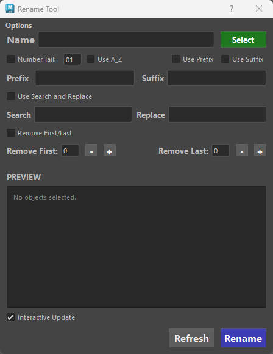
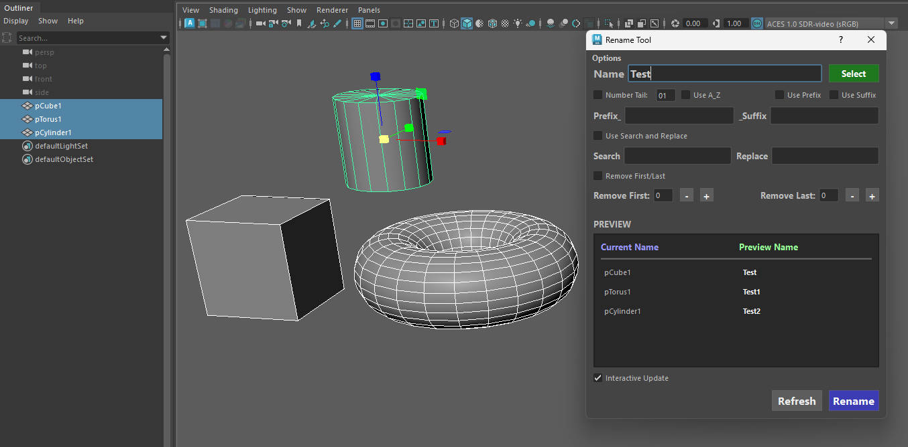
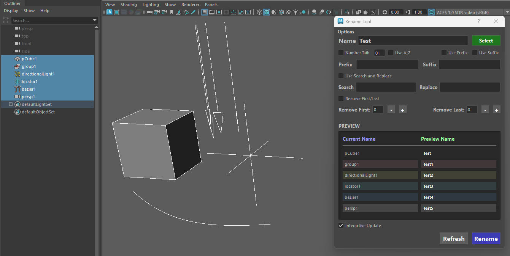
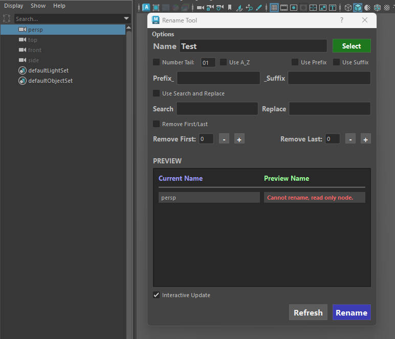
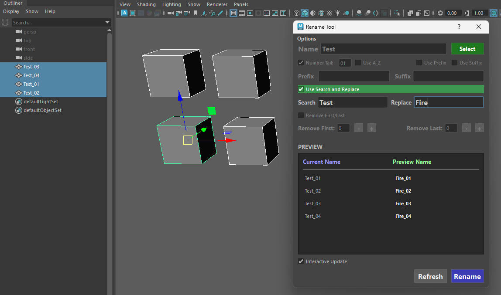
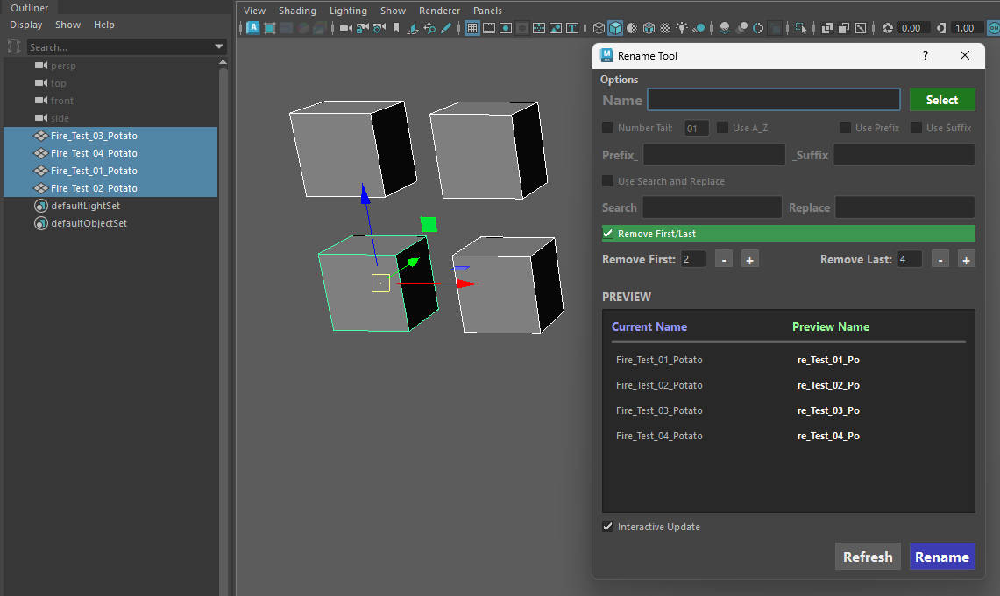
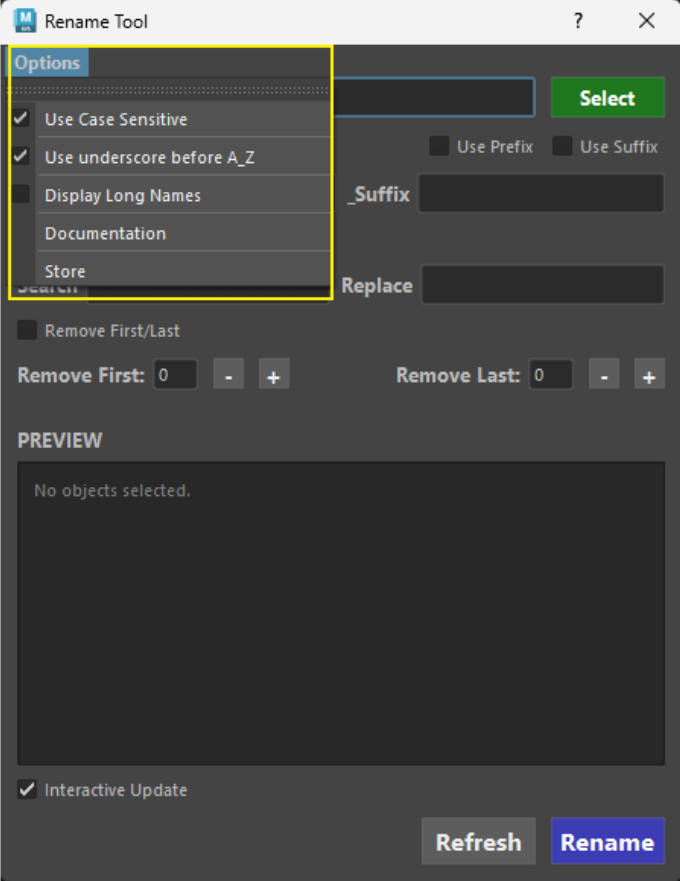

# **Rename Tool** :tools:

## **Intro**

??? Tip "Maya Versions"
    *Tested in Maya 2022-2027*

Rename Tool is a lightweight, high-performance  batch renaming utility for Autodesk Maya. 

Built to handle heavy production scenes, it combines instant live previewing with smart name-clash protection, intelligent character trimming, and single-click asset prep.

### **Key Features** ###

- Real-Time Live Preview & Scene Safety:

    * **Non-Destructive Live Updates**: For every object selected, the tool will provide a preview of the name for every object before being renamed.
    
    { .img-small }

    * **Node Type Color-Coding**: Preview items are faint-colored by type (Cameras, Curves, Locators, Transforms, Lights) for quick visual identification.
    
    { .img-small }

    * **Read-Only Node Protection**: Automatically flags locked, referenced, or default Maya nodes *(Cannot rename, read only node.)* to prevent pipeline breaks.
    
    { .img-small }

    * **Smart Name Clash Resolution**: Intelligently simulates Maya's hierarchy-naming rules to prevent accidental duplicate names by dynamically incrementing numbers.

    * **Search & Replace**: Use the case-sensitive Search & Replace to fix naming conventions instantly.

    { .img-small }

    * **Smart Character Trimming (Remove First/Last)**: Remove $N$ characters from the beginning or end of object names using incremental + / - buttons.

    { .img-small }
    

### **Options Dropdown Window** ###

{ .img-small }

* **Use Case Sensitive**: This option enables you to search and replace case only sensitive text. Uncheck to ignore this rule.
* **Use underscore A_Z**: This option adds an underscore *_* before applying the letter. 
* **Display Long Names**: Enabling this option will display the long names of your selected objects. *(Useful when selecting objects using the same name that belong in different groups. The long name will be able to tell you which group each selection belongs.)*

* **Documentation** - Opens a link to the documentation.

* **Store** - Opens links to ArtStation and Gumroad.