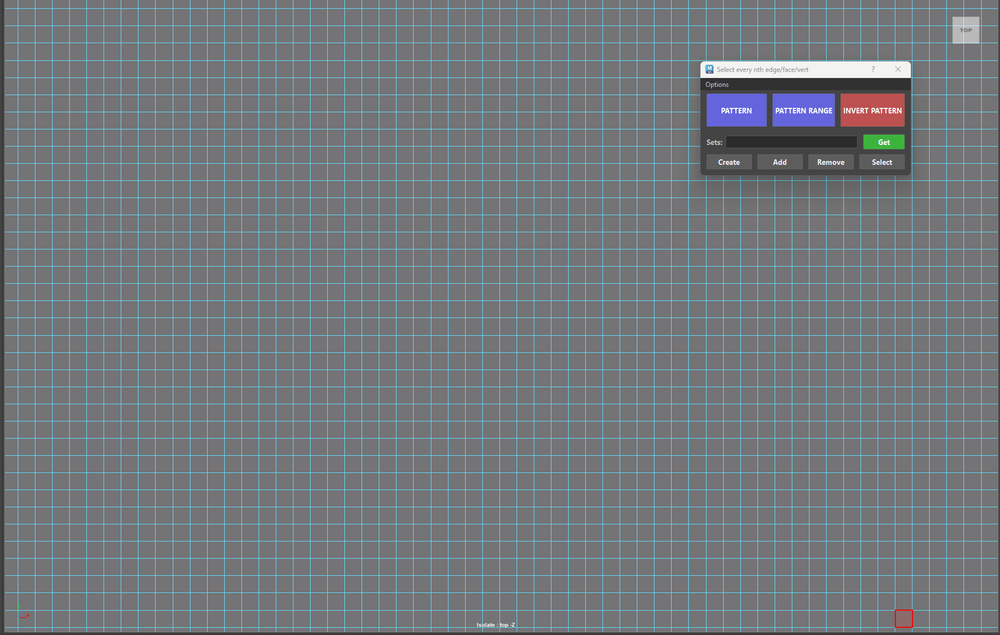
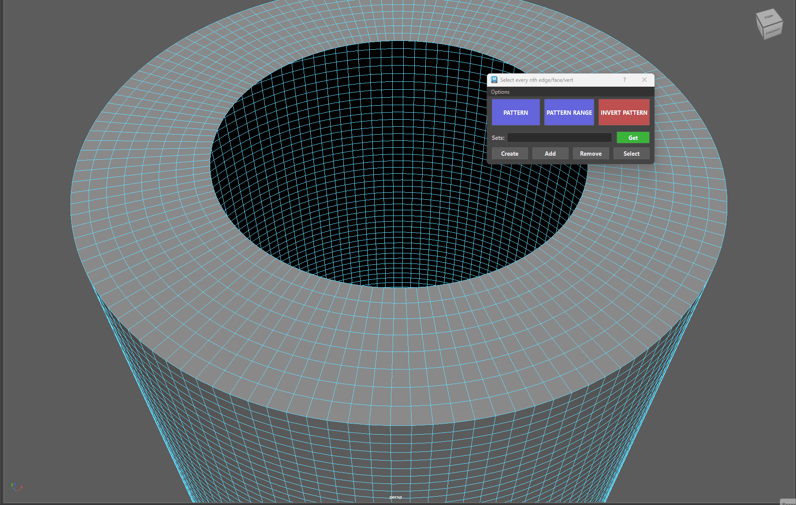
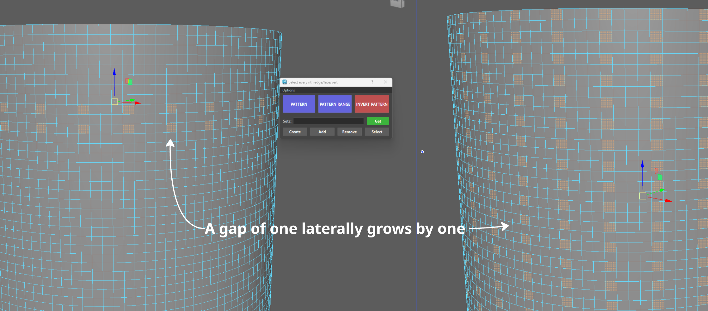
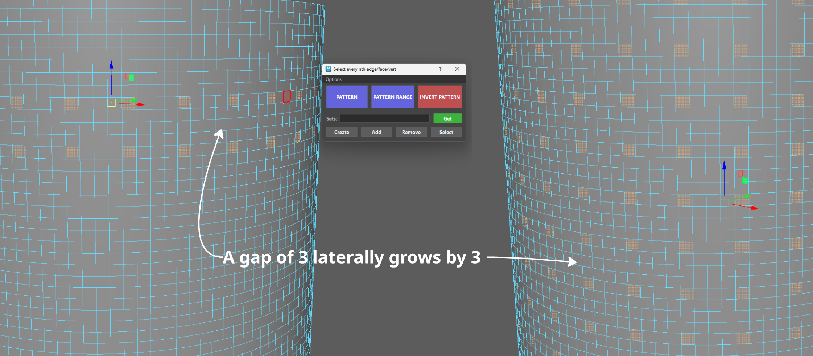

# **Select Nth Edge/Face/Vert**

{ .img-small } 

The Select Every Nth pattern engine lets you generate non-destructive, mathematically precise component selection patterns (edges, faces, or vertices) along loops and rings—without relying on trial-and-error slider adjustments.

<figure markdown="1" style="text-align: center;">
  { .img-medium .img-centered }
  <figcaption>Face Pattern Selection</figcaption>
</figure>

- [`Unified Component Engine`](#): Works natively across Edges, Faces, and Vertices using pure topology math—no selection state churn or viewport lag.

- [`Gap-Driven Spacing`](#): The gap (distance) you leave between your 1st and 2nd selection dictates the stride/spacing for the entire pattern automatically.

- [`Multi-Loop & Multi-Object Support`](#): Select pairs or triplets across multiple parallel loops or across separate polygonal meshes simultaneously.

- [`Lateral Extension (Ctrl + Click)`](#): Perform pattern operations on parallel loops (faces/verts) to extend patterns sideways across grid selections.

- [`Persistent Pattern Storage & Inversion`](#): The tool caches your pattern data by mesh topology. Use **INVERT PATTERN** to flip the selection state within the loop area, or ++ctrl++ + Click to reset the cached pattern.

## **PATTERN**

Generates an infinitely repeating selection pattern along the entire loop or ring based on the distance between two components.

- Select 2 components on a loop (or multiples of 2: 4, 6, 8, etc.).

1. **1st Selection**: Starting point.

2. **2nd Selection**: Sets the spacing/stride for the pattern *(cannot be adjacent to your first selection)*.

3. Click **PATTERN**.

* **Rule**: The total count of selected components must always be an even number (2, 4, 6...).

<figure markdown="1" style="text-align: center;">
  { .img-medium .img-centered }
  <figcaption>Simple Pattern on Face selection</figcaption>
</figure>

??? Info "More examples - Patterns"

    <figure style="text-align: center;">
        
        <figcaption>Multiple Pattern Selection on Faces</figcaption>
    </figure>

    <figure style="text-align: center;">
        
        <figcaption>Multiple Pattern Selection on Vertices</figcaption>
    </figure>

    <figure style="text-align: center;">
        
        <figcaption>Multiple Pattern Selection on edges</figcaption>
    </figure>

- **Lateral Extension (++ctrl++ + Click)**: Select pairs of parallel loops (Faces/Verts) with a gap, then ++ctrl++ + Click PATTERN to extend the pattern laterally across the mesh surface.

    <figure style="text-align: center;">
        
        <figcaption>Multiple Pattern Selection on edges</figcaption>
    </figure>

??? Info "More examples - Lateral Extensions"

    ??? Info "Info - Lateral Spacing Explained"
        - When you trigger Lateral Extend using ++ctrl++ + Click on the PATTERN button, the tool's backend engine runs a two-step topological analysis:

             * Loop Pairing: It identifies which components belong to the same primary loop and groups them into parallel pairs.

             * Adjacency & Lateral Step Calculation: It checks the topological distance (the gap) between the parallel loops themselves.

             * If the parallel rows are directly touching *(0 gap)*, the tool flags an adjacency error.

                * If there is a gap *(e.g., selecting components on Row 1 and Row 3)*, the tool calculates that 2-row lateral stride and projects your longitudinal pattern across all subsequent parallel rows at that exact interval.

        { .img-small } 
        { .img-small } 

    <figure style="text-align: center;">
        
        <figcaption>Lateral Extension on Faces</figcaption>
    </figure>

    <figure style="text-align: center;">
        
        <figcaption>Complex Lateral Extension on Faces</figcaption>
    </figure>

    <figure style="text-align: center;">
        
        <figcaption>Lateral Extension on Vertices</figcaption>
    </figure>

    <figure style="text-align: center;">
        <video class="img-medium" autoplay loop muted playsinline controls>
            <source src="../images/Select_nth_edge_face_vert_Lateral_5.mp4" type="video/mp4">
            Your browser does not support the video tag.
        </video>
        <figcaption>Lateral Extension on Edges</figcaption>
    </figure>

* **Rule**: The total count of selected components must always be an even number (2, 4, 6...).
    
??? failure "Failure - Lateral Extensions"
    You can't have more than 2 components selected on a loop that is going to be used laterally. 
    
    * The tool needs to pair up your selections into clean 2-item sets (one item on Row 1, one matching item on Row 3).

    <figure style="text-align: center;">
        
        <figcaption>Lateral Extension with 3 components vertically</figcaption>
    </figure>

## **PATTERN RANGE**

Restricts the repeating pattern to a specific segment or region of a loop instead of walking the entire mesh boundary.

    Select 3 components within a single loop (or multiples of 3: 6, 9, 12, etc.).

- **1st Selection**: Starting point.

2. **2nd Selection**: Defines the end of the range segment.

3. **3rd Selection**: Dictates the pattern stride—the gap between your 1st and 3rd selection dictates the spacing within that range.

4. Click **PATTERN RANGE**.

- **Rule**: The total count of selected components must always be a multiple of three (3, 6, 9...).

    <figure style="text-align: center;">
        
        <figcaption>Selecting a pattern from a specified range</figcaption>
    </figure>

??? Info "Pattern Range - More examples"

    <figure style="text-align: center;">
        
        <figcaption>Pattern Range with Multiple Selections</figcaption>
    </figure>

    <figure style="text-align: center;">
        
        <figcaption>Pattern Range with Vertices Selected</figcaption>
    </figure>

    <figure style="text-align: center;">
        
        <figcaption>Pattern Range with Edges Selected</figcaption>
    </figure>

## **INVERT PATTERN**

Whenever you create a pattern using **PATTERN** or **PATTERN RANGE**, the tool remembers two quick things behind the scenes:

1. The loop your selection sits on.

2. Which parts are currently highlighted.

When you click Invert Pattern, the tool simply looks at that path and swaps the selection: everything that was selected becomes unselected, and every skipped piece gets highlighted instead!

<figure style="text-align: center;">
    
    <figcaption>Invert Pattern</figcaption>
</figure>

🛡️ Built-in Safety: If you edit your mesh or delete faces after making a pattern, the tool is smart enough to recognize the change and reset itself so it doesn't accidentally select the wrong parts.