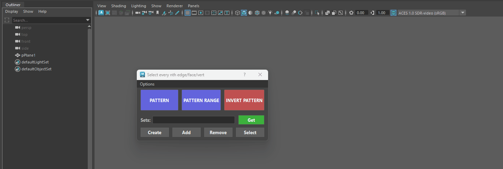
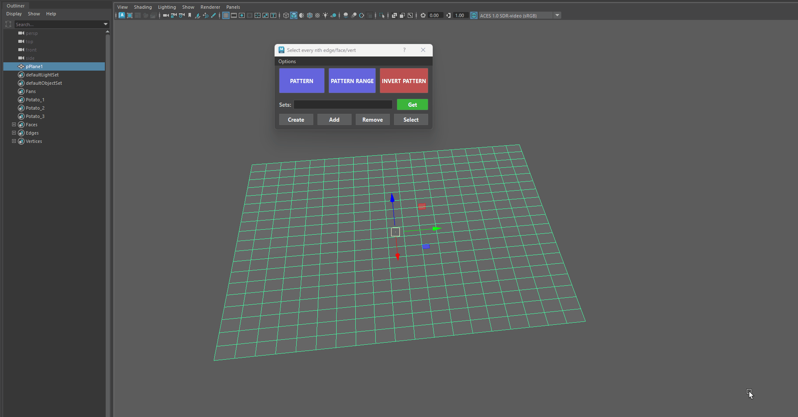
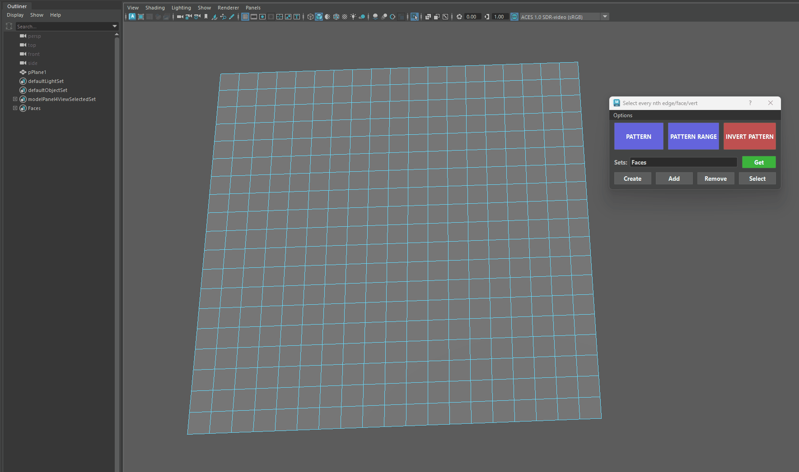
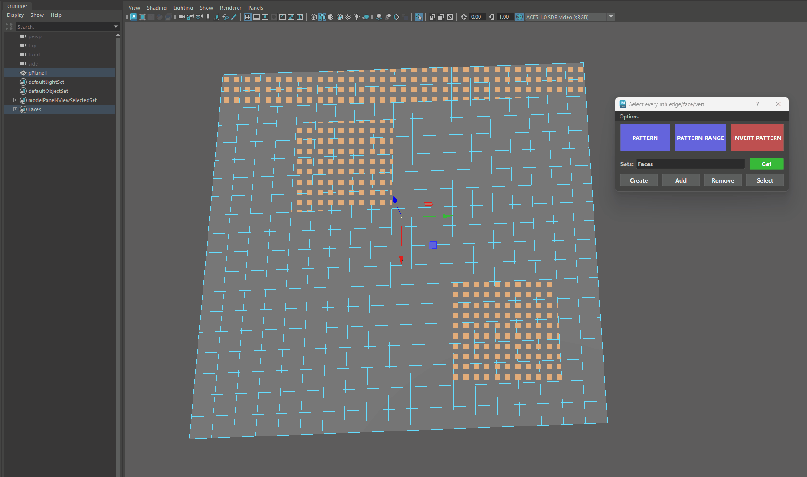
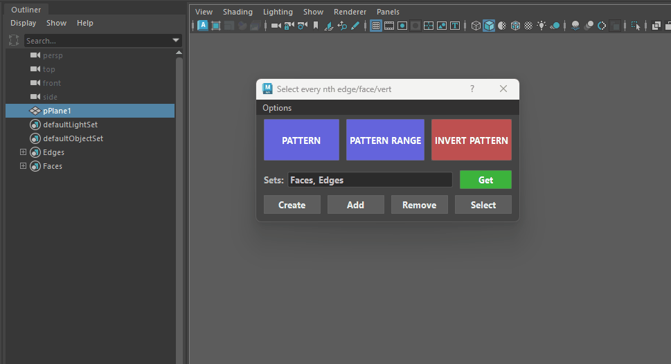
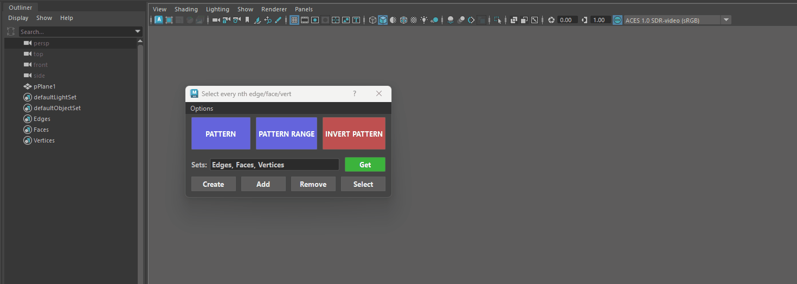
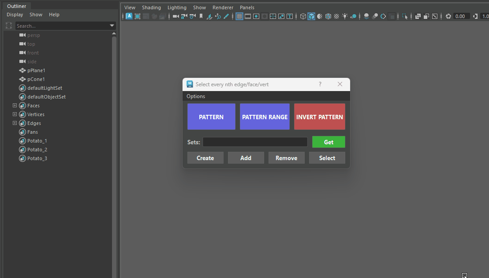
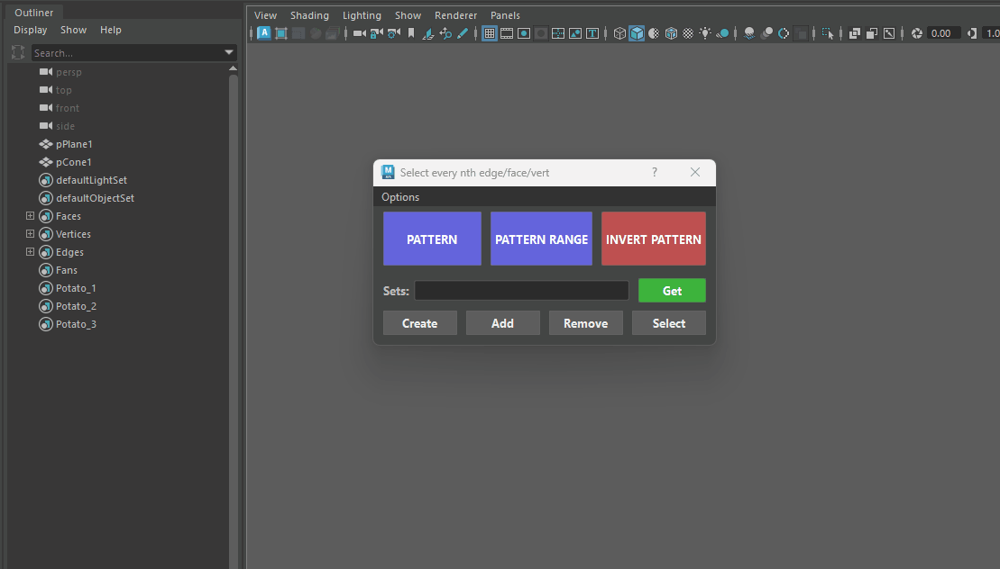
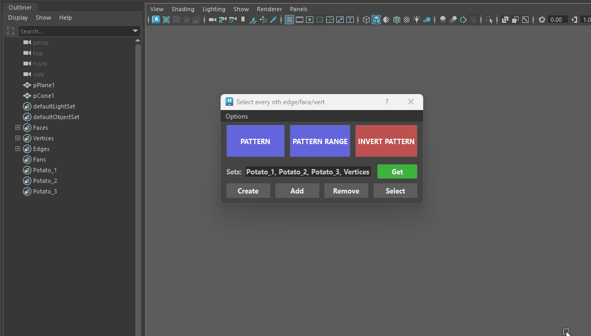

# **Select Nth Edge/Face/Vert**

{ .img-small } 

The Selection Sets feature gives you a quick way to name, save, and recall your selections on the fly—without having to navigate Maya’s Outliner or open extra menus.

##💡 **What Are Selection Sets**?

Think of a Selection Set like a "bookmark" for your components or objects:

1. You pick a group of edges, faces, vertices, or objects.

2. You give them a quick name (like armor_edges or top_cap).

3. Whenever you need them again, one click brings that exact selection back!

## **Creating a Set**

1. **Select** the components or objects on your model.

2. Type a **name** into the Sets text field *(e.g., stripe_pattern)*.

3. Click **Create**.

<figure markdown="1" style="text-align: center;">
  { .img-medium .img-centered }
  <figcaption>Creating a Selection Set</figcaption>
</figure>

??? Info "Create Multiple Sets at once"
    You don't need to create sets one by one! You can create multiple sets simultaneously by typing names separated by commas:
    
    * **top_cap, side_border, detail_pattern**

    <figure markdown="1" style="text-align: center;">
    { .img-medium .img-centered }
    <figcaption>Creating Multiple Selection Sets at Once</figcaption>
    </figure>

## **Select Sets**

The Select button is your one-click activator for Selection Sets. Once you have a set name listed in the text field (or when you want to cycle through sets attached to an object), clicking Select highlights those stored edges, faces, vertices, or objects directly in your 3D viewport.

- **Selecting Named Sets**: Type one or more set names into the text box *(e.g., top_border or setA, setB)* and click Select.

    * The tool searches your scene for those set nodes and highlights all the stored components or objects in your viewport simultaneously.

    * *++shift++ + Click Cycle & Select Forward: Having an Object or Component that contains Sets Selected. 
        - Steps forward through every set attached to your selection, highlighting each set's components one by one in the viewport while updating the text field.

    * *++ctrl++ + ++shift++ + Click Cycle & Select Backward:: Having an Object or Component that contains Sets Selected. 
        - Steps backward through the sets attached to your selected object, highlighting them in reverse order.

<figure markdown="1" style="text-align: center;">
{ .img-medium .img-centered }
<figcaption>Selecting Sets</figcaption>
</figure>

## **Add to a Set**

Select new components on your model and click Add to include them in the active set.

<figure markdown="1" style="text-align: center;">
  { .img-medium .img-centered }
  <figcaption>Creating a Selection Set</figcaption>
</figure>

## **Remove From Set**

Select components and click Remove to take them out of the active set.

<figure markdown="1" style="text-align: center;">
  { .img-medium .img-centered }
  <figcaption>Creating a Selection Set</figcaption>
</figure>

??? Info "Deleting Sets"
    * To completely remove one or more specific **Selection Sets** from your Maya scene:
        2. Type the name of the set *(or comma-separated set names)* into the Sets text field:
         3. Hold ++ctrl++ + ++shift++ and click the Remove button.

    <figure markdown="1" style="text-align: center;">
    { .img-medium .img-centered }
    <figcaption>Deleting Sets</figcaption>
    </figure>

    * Deleting Empty Sets: ++alt++ + Click to Delete All Sets that have no Members *(Empty Sets)*.

    <figure markdown="1" style="text-align: center;">
    { .img-medium .img-centered }
    <figcaption>Deleting Empty Sets</figcaption>
    </figure>    

## **Get Sets**

The Get button is your inspection and query tool for Selection Sets. Instead of manually searching through Maya’s Outliner to see which sets your components belong to, the Get button automatically finds them and displays their names right in the text box.

* **Inspecting Your Model (Items Selected)**: The tool inspects your selection and prints all Selection Sets attached to those specific parts into the text box *(separated by commas)*.
* **Inspecting the Entire Scene (Nothing Selected)**: The tool will fetch and list every custom Selection Set that exists in your current Maya file.

<figure markdown="1" style="text-align: center;">
  { .img-medium .img-centered }
  <figcaption>Creating a Selection Set</figcaption>
</figure>

??? Info "Get Button - Extra Features"

    1. ++shift++ + Click Cycle Forward: Cycles forward through the set names attached to your selection, displaying them one by one in the text box.
        * ++ctrl++ + ++shift++ + Click Cycle Backward: Cycles backward through the attached set names

        <figure markdown="1" style="text-align: center;">
        { .img-medium .img-centered }
        <figcaption>Cycling through Sets</figcaption>
        </figure>

    1. ++alt++ + Click Search / Filter: Filters your scene's selection sets using the keyword currently typed in the text box.
        * Use in conjuction with the **Use Case Sensitive** checkbox from the **Options Menu**. 

        <figure markdown="1" style="text-align: center;">
        { .img-medium .img-centered }
        <figcaption>Search Sets by typing their Names</figcaption>
        </figure>

    1. ++ctrl++ + ++alt++ + Click Outliner Fetch: Grabs the set nodes currently selected in Maya's Outliner and pastes their names into the text box

        <figure markdown="1" style="text-align: center;">
        { .img-medium .img-centered }
        <figcaption>Load Sets From the Outliner</figcaption>
        </figure>

    1. ++alt++ + ++shift++ + Click Clear Field: Instantly clears all text from the Sets text box.

        <figure markdown="1" style="text-align: center;">
        { .img-medium .img-centered }
        <figcaption>Wiping the Text Box</figcaption>
        </figure>

    