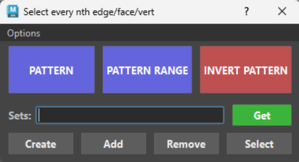

# **Welcome to Select Nth Edge/Face/Vertex & Selection Sets Tool** :tools:

{ .img-small } 

??? Tip "Maya Versions"
    *Tested in Maya 2020-2027*

Stop clicking every other edge. Select any repeating pattern of edges, faces or verts in two clicks — now rebuilt on Maya's OpenMaya API for instant results on dense meshes. Includes a full Quick Selection Sets toolkit.

### Pattern

Select a **pair** of components in the same loop, click **PATTERN**. The spacing between the pair defines the repeat.

- Works on edges, verts and faces
- Open loops and mesh borders handled natively
- Multiple objects at once — pairs are resolved per mesh

### Combine pairs for intricate patterns

You're not constrained to a single pair. Any **multiple of 2** works — each consecutive pair (1st+2nd, 3rd+4th, ...) generates its own pattern, and all results combine into one selection:

- Pairs on **different loops** → several patterns across the mesh in one click
- Pairs with **different spacings** → complex rhythms (e.g. every 2nd on one loop, every 5th on another)
- All of it lands in a **single selection and a single undo step**, and can be stored as one selection set

Blazing fast — built on the OpenMaya API