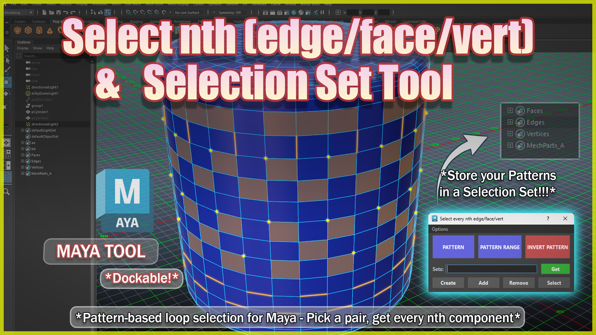
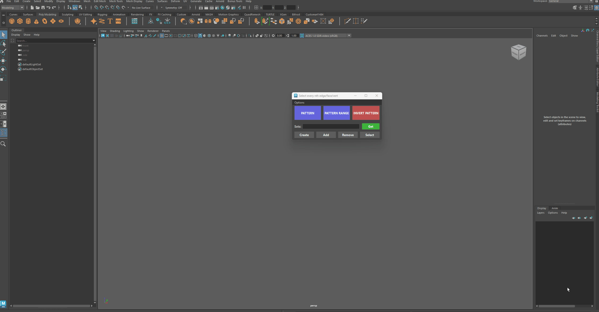
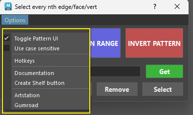
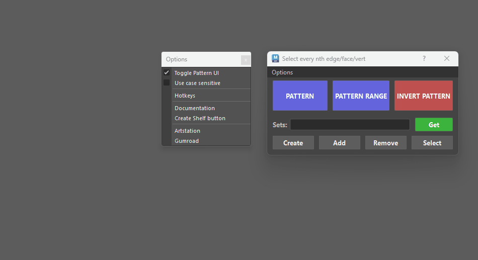
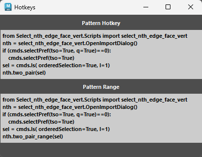

# **Select Nth Edge/Face/Vertex & Selection Sets Tool** :tools:

{ .img-medium } 

??? Tip "Maya Versions"
    *Tested in Maya 2020-2027*

Stop clicking every other edge. Select any repeating pattern of edges, faces or verts in two clicks — now rebuilt on Maya's OpenMaya API for instant results on dense meshes. Then save your patterns straight into Quick Selection Sets and reuse them anytime.

### Pattern

Select a **pair** of components in the same loop, click **PATTERN**. The spacing between the pair defines the repeat.

- Works on edges, verts and faces
- Open loops and mesh borders handled natively
- Multiple objects at once — pairs are resolved per mesh

### Combine pairs for intricate patterns

You're not constrained to a single pair. Any **multiple of 2** works — each consecutive pair (1st+2nd, 3rd+4th, ...) generates its own pattern, and all results combine into one selection:

- Pairs on **different loops** → several patterns across the mesh in one click
- Pairs with **different spacings** → complex rhythms (e.g. every 2nd on one loop, every 5th on another)
- All of it lands in a **single selection and a single undo step**, and can be stored as one selection set

Blazing fast — built on the OpenMaya API

### Selection Sets

- The Selection Sets module provides a lightweight, keyboard-driven manager for creating, querying, modifying, and selecting Maya objectSet nodes directly from the tool interface—without opening the Outliner or Set Editor.

### Dockable

- The tool can be integrated within Maya's UI.

<figure markdown="1" style="text-align: center;">
  { .img-medium .img-centered }
  <figcaption>Docking the tool</figcaption>
</figure>

### Options Menu

{ .img-small } 

- Toggle Pattern UI: Swaps the tool window layout between Full Mode and Compact Mode.

<figure markdown="1" style="text-align: center;">
  { .img-medium .img-centered }
  <figcaption>Swapping Layout Between Full and Compact</figcaption>
</figure>

- **Use case sensitive**: Toggles whether searching for selection sets cares about capital and lowercase letters.

    * **Unchecked *(Default)***: Searches are not case-sensitive. Searching for armor will match Armor_Set, ARMOR, and armor_faces.

    * **Checked**: Searches are strictly case-sensitive. Searching for armor will only match lowercase armor sets, ignoring capital letters.

- **Hotkeys**: Opens a standalone helper window containing ready-to-copy Python hotkey scripts.
    * If you prefer triggering PATTERN or PATTERN RANGE directly via custom Maya keyboard shortcuts without opening the full UI every time, you can copy the code snippets straight from this window into Maya's Hotkey Editor.
    
    { .img-small .img-centered } 

- **Documentation**: Opens the official online documentation page in your default web browser.

- **Create Shelf Button**: Automatically adds a customized tool icon to your currently active Maya Shelf.
    * Gives you a one-click launcher directly on your shelf (nth) so you don't have to execute Python code in the Script Editor every time you open a new Maya session.

- **Artstation & Gumroad**: Direct links to the official store pages.