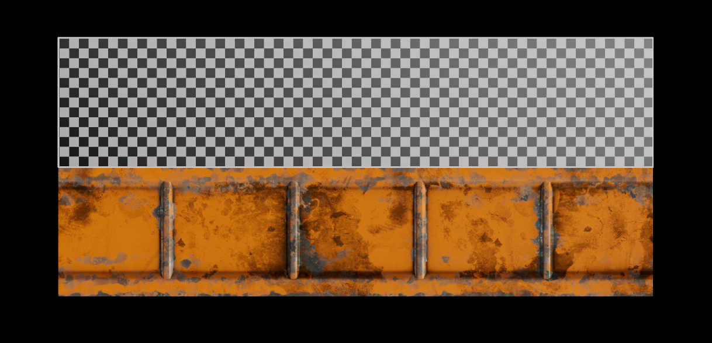

# :octicons-tools-16: **<span style="color:rgba(195, 221, 80, 1);">Installing Trim Speed Unfold</span>**  

{ .img-large .img-centered }
### **<span style="color:rgba(195, 221, 80, 1);">Step 1 - Setting up</span>** 
<div class="grid cards" markdown>

-   :octicons-copy-16:{ .lg .middle } __[`Setting up`](#)__

    ---

    1.Unzip the [`Speed_Trim_Unfold_XXXX.zip`](#) file.
   
    2.Copy-paste the [`speed_trim_unfold.py`](#) file in your [`\Documents\Maya\Scripts`](#) folder.
    
    3.Open [`Maya`](#). 

    <!-- [:octicons-arrow-right-24: Getting started](#) -->
    


</div>


### **<span style="color:rgba(195, 221, 80, 1);">Step 2 - Activating</span>** 

<div class="grid cards" markdown>

-   :octicons-copy-16:{ .lg .middle } __[`Python Code`](#)__

    ---

    Copy the 2 ^^**python**^^  lines below to a ^^**shelf**^^  or bind these to a ^^**hotkey**^^  to load the tool.

    ``` py linenums="1"
    import speed_trim_unfold
    speed_trim_unfold.execute_trim()
    ```


</div>


</div>


### **<span style="color:rgba(195, 221, 80, 1);">Step 3 - Creating Shelf button code</span>** 

- Since this tool has no UI, this code will automatically create a shelf button. 
    * **Click** to run the tool
    * **Double click** to open a **<span style="color:rgba(3, 173, 108, 1);">web browser link</span> to the **<span style="color:rgba(3, 173, 108, 1);">documentation</span>.

<div class="grid cards" markdown>

-   :octicons-copy-16:{ .lg .middle } __[`Python Code`](#)__

    ---

    Use the script editor to copy the ^^**python**^^  lines below to automatically create a shelf button.

    ``` py linenums="1"
    import maya.cmds as cmds
    import webbrowser

    def create_speed_trim_shelf_button():
        active_shelf = cmds.tabLayout("ShelfLayout", query=True, selectTab=True)
        buttons = cmds.shelfLayout(active_shelf, q=True, ca=True)
        button_exists = False

        for b in buttons:
            if "separator" in b:
                pass
            else:
                label = cmds.shelfButton(b, q=True, l=True)
                if "Speed Trim" == label:
                    button_exists=True
                    break
        
        if not button_exists: 
            single_click_cmd = "import speed_trim_unfold; speed_trim_unfold.execute_trim()"
            double_click_cmd = "import webbrowser; webbrowser.open('https://www.youtube.com/')"
            current_shelf = cmds.tabLayout("ShelfLayout", query=True, selectTab=True)
            cmds.shelfButton(
                parent=current_shelf,
                label="Speed Trim",
                annotation="Click to Execute Trim / Double-Click for Documentation",
                image1="checker.svg",
                command=single_click_cmd,
                imageOverlayLabel='TRIM',
                overlayLabelColor=[1.0, 1.0, 0.0],
                doubleClickCommand=double_click_cmd,
                sourceType="python"

            )
            
            print(f"Successfully added 'Speed Trim' button to shelf: {current_shelf}")
        else:
            print(f"Shelf button already exists.")

    create_speed_trim_shelf_button()
    ```


</div>

Click the button below to learn how to create hotkeys and shelf buttons.

[Creating Hotkeys/Shelf Buttons](../Create%20Hotkeys%20Shelf%20Buttons/index.md){ .md-button .md-button--primary }