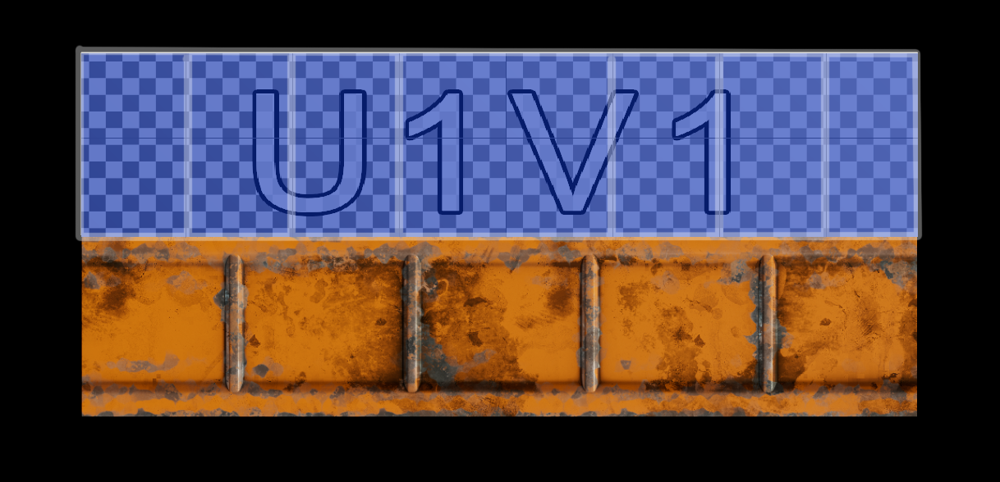
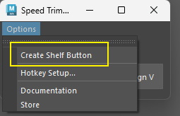

# :octicons-tools-16: **<span style="color:rgba(195, 221, 80, 1);">Installing Speed Trim Unfold</span>**  

{ .img-large .img-centered }
### **<span style="color:rgba(195, 221, 80, 1);">Step 1 - Setting up</span>** 
<div class="grid cards" markdown>

-   :octicons-copy-16:{ .lg .middle } __[`Setting up`](#)__

    ---

    1.Unzip the [`Speed_Trim_Unfold.zip`](#) file.
   
    2.Copy-paste the [`Speed_Trim_Unfold`](#) folder into your [`\Documents\Maya\Scripts`](#) folder.
    
    3.Open [`Maya`](#). 

    <!-- [:octicons-arrow-right-24: Getting started](#) -->
    


</div>

### **<span style="color:rgba(195, 221, 80, 1);">Step 2 - Activating UI</span>** 

<div class="grid cards" markdown>

-   :octicons-copy-16:{ .lg .middle } __[`Python Code`](#)__

    ---

    Copy the 2 ^^**Python**^^  lines below and bind these on a ^^**hotkey**^^ or ^^**shelf button**^^ to execute the tool.

    ``` py linenums="1"
    from Speed_Trim_Unfold import speed_trim_unfold
    speed_trim_unfold.show_ui()

    ```

</div>


### **<span style="color:rgba(195, 221, 80, 1);">Hotkeys</span>** 

<div class="grid cards" markdown>

-   :octicons-copy-16:{ .lg .middle } __[`Python Code`](#)__

    ---

    Unfold Horizontally - Long Align <span style="color:rgba(195, 221, 80, 1);">*(Recommended)**</span>

    Copy the 2 ^^**Python**^^  lines below and bind these on a ^^**hotkey**^^ to unfold ^^horizontally^^ and align your shells alongside the ^^long^^ side your targets bounding box. 

    ``` py linenums="1"
    from Speed_Trim_Unfold import speed_trim_unfold
    speed_trim_unfold.unfold_long()

    ```
    Unfold Vertically - Short Align

    Copy the 2 ^^**Python**^^  lines below and bind these on a ^^**hotkey**^^ to unfold ^^vertically^^ and align your shells alongside the ^^short^^ side your targets bounding box. 
    
    ``` py linenums="1"
    from Speed_Trim_Unfold import speed_trim_unfold
    speed_trim_unfold.unfold_short()
    ```

</div>


??? note  "Speed Trim Unfold Shelf Image - Shelf Button Info"

    First time you fire up the tool **(Step 2)** click on the <span style="color:rgb(221, 240, 115);">**Options Menu**</span>. 
    
    There you will find a <span style="color:rgb(221, 240, 115);">**create shelf button**</span> you can use that will automatically create a shelf button for you.
    
    { .img-small }

    Downloading this image is not necessary *(exists only as backup)*.

    <figure markdown="1" style="margin: 0; display: inline-block;">

    [](../Speed%20Trim%20Unfold/images/Speed_Trim.png){: .md-button download="Speed_Trim.png" }

    <figcaption style="text-align: center;"><span style="color:rgb(168, 136, 228);"></span></figcaption>
    </figure>


Click the button below to learn how to create hotkeys and shelf buttons.

[Creating Hotkeys/Shelf Buttons](../Create%20Hotkeys%20Shelf%20Buttons/index.md){ .md-button .md-button--primary }