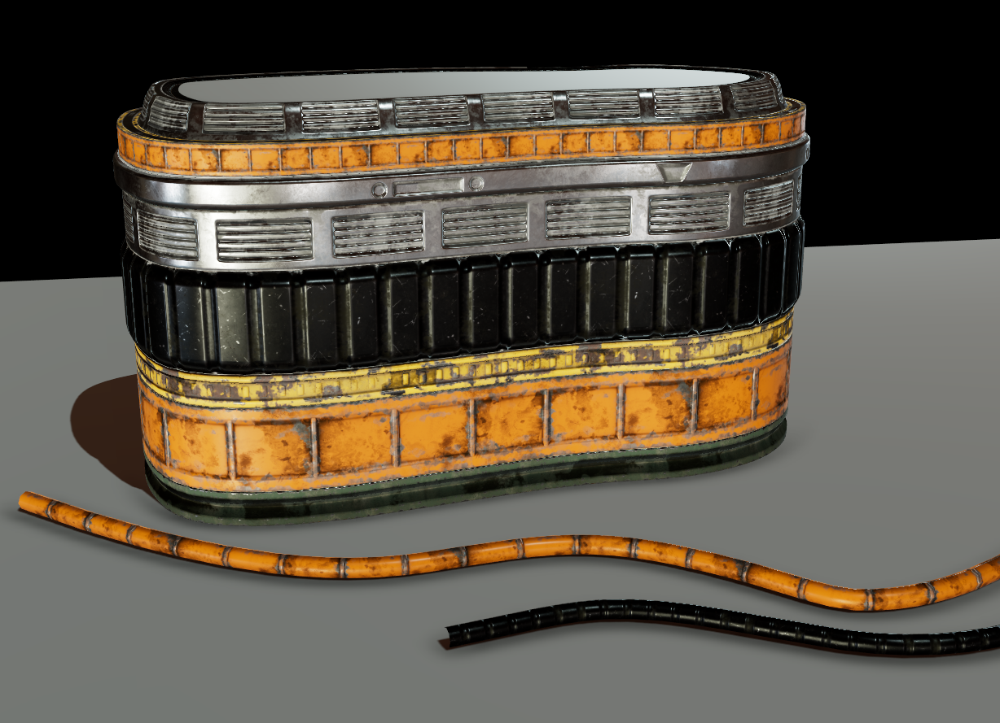
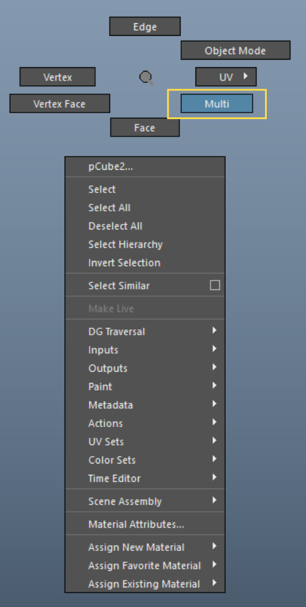
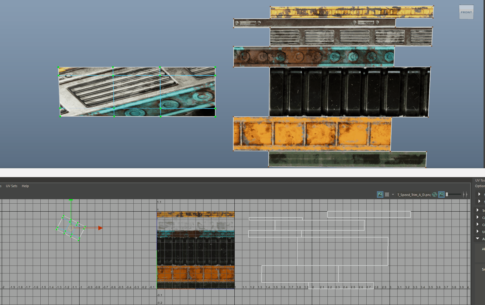
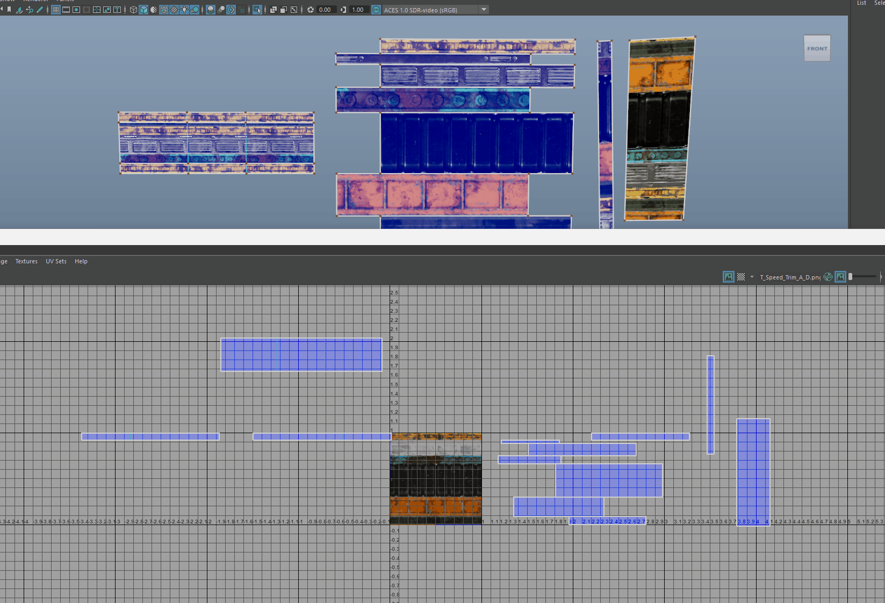
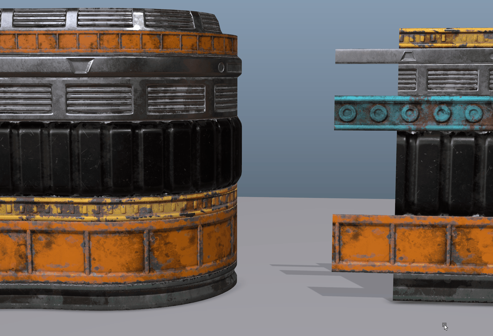
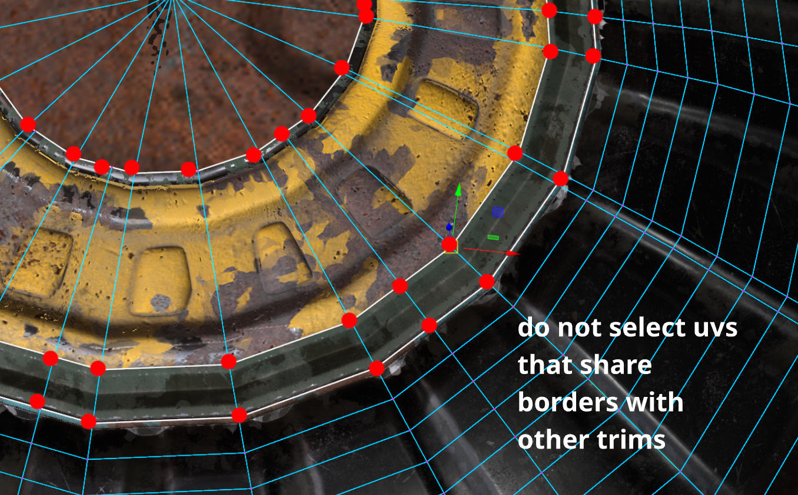
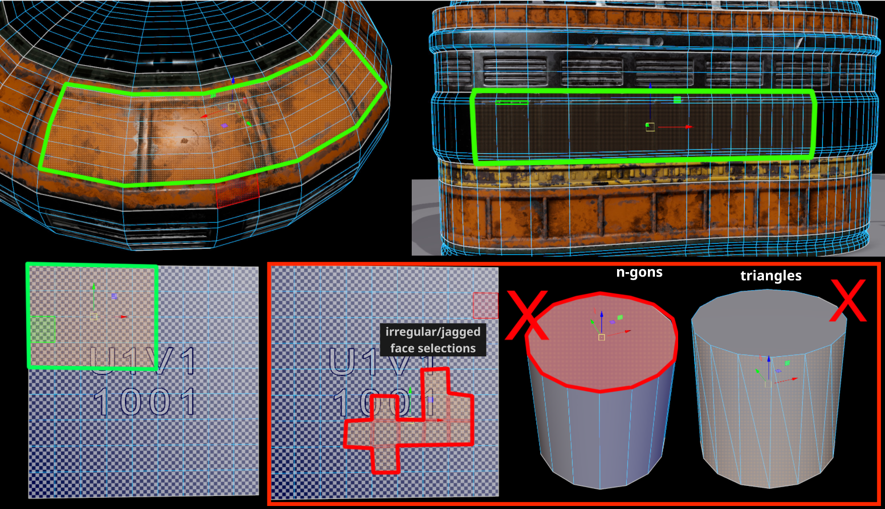

# **Speed Trim Unfold** :tools:

## **Intro**

<!-- >

  

    <iframe 
      src="https://www.youtube.com/embed/8Ku2C87xnfc" 
      frameborder="0" 
      allow="autoplay; encrypted-media">
    </iframe>
  

-->

{ .img-large .img-centered }

**Speed Trim Unfold** is a tool that will quickly unfold your trim sheets and also map those to any existing laid out trim sheet.

It's a one click solution to save you time and make UVing a more fun and engaging process. 

## **How it works** ##

Depending on the type of component you have chosen the tool has different behaviours. 

Please check the Rules section 

- The tool works by selecting:
    * ### **Faces selection** (automatic approach) ###
        <figure>
        
        <figcaption>**Unfolding face selections**</figcaption>
        </figure>

        * If you have selected only faces and those faces loop around in a closed circuit (like the faces of a cylinder) then the tool will create an automatic seam to cut through those faces.
        <figure>
        
        <figcaption>**Unfolding a closed loop of faces**</figcaption>
        </figure>
    
    * ### **Faces and edges selection** (user defined) ###
        * This operation requires the user to have faces and edges selected. The seams on your UV shell will be determined by your selected edges.
        * To select multiple different components at the same time hold down right click and select **Multi**.
        
        { .img-small .img-centered }
        
        <figure>
        
        <figcaption>**Unfolding a closed loop of faces**</figcaption>
        </figure>

    *  ### **UV selection** (for aligning to existing trims). ###
        * After your trims have been unfolded your selection will change to a UV selection. This means you can activate the other feature of the tool which is aligning and scaling it to match any other trim sheet. 
        * With your trims selected *(source)*, select a UV from another trim *(target)* and the tool will orient *(vertically or horizontally)* scale and move all initial trim uv shells to match the size and placement of the target trim UV shell.

        <figure>
        
        <figcaption>**Aligning trim sheets**</figcaption>
        </figure>

        * The orientation of your shell is entirely dependent on the target orientation. 
            * The tool calculates the bounding box of your target uv shell to determine its orientation. If it's longer on the V axis, it knows it's vertical and will rotate your source uvs to match that orientation.

        <figure>
        
        <figcaption>**Aligning vertically**</figcaption>
        </figure>

        * After the operation the tool will unfold your UV in a gridified manner. The spacing *(rows and columns)* of your UV shell are entirely dependant on your topology *(Longer sections will be unfolded horizontally)*.
        * The tool will unfold your selection horizontally and place all shells in the center of the 0-1 UV space so all shell occupy the same space.
            * This is done so users can map multiple selections of trims at the same time. 

        ???+ Info "Info - Further details"
            * You don't have to have the entire shell selected, a single uv from the source to the target will suffice *(same rule applies for the target as well)*.
            * The tool will deselect the target UVs after the operation so you can re-map your shell to another trim if needed. 
            * If you have multiple UV's selected the tool will recognise the last selected as the target.
            * Works with multiple source UV trim shells from different selected objects.
            * ### Aligning directly from the viewport ###
            * It is even possible to align to existing trims directly from the viewport - without opening the UV Editor. Simply select a face, convert that face to uv then select a target uv from a trim you with to match.
            
            ??? "Converted Face + UV"
                * This is the only way you can work within the viewport.
                * Although selecting 2 faces and converting those to uv will work, Maya cannot track the selection order thus failing to correctly map the correct trim sheet. 

            <figure>
            
            <figcaption>**Align shells directly from viewport**</figcaption>
            </figure>
                
            { .img-large .img-centered }

            ??? Warning "Important - Aligning from viewport"
                - Be careful when converting your selection to uv when working from the viewport. 
                    * When converting vertices or edges that share border edges you will also select uvs that are shared between shells.
                    * This will mess up the number of shells to be aligned and possibly their orientation.

## **Rules** ##

The tool will not work if you have only objects selected, it requires component selections.

- ### Selection ###
    * Selection: 
        * The tool only accepts **Face**, **Face/Edge** and **UV** selections.
- ### Topology ###
    * No **n-gons**.
        * If any detected the tool will abort and select the ngons instead. 
    * No  **triangles** on your face selection as the tool unitizes each face. 
        * If any detected you uv shell will fail to be stitched in a gridified way.
    * Avoid **Fairregular/jaggedce** face selections (they usually mess up the spacing, and orientation of your uv shell). 
    * Ensure you have **square** or **rectangle** face selections.
    { .img-large .img-centered }
    

- ### Track Selection Order ###
    * Order of operations matter for this tool. If you are experiencing issues with aligning UVs check **Track Selection Order** in your preferences.
        * Go to Windows -> Settings/Preferences -> Preferences -> Selection.
            * Under modifier you should see the Track Selection Order checkbox.
        
        { .img-large .img-centered }

