# **Breakdown**

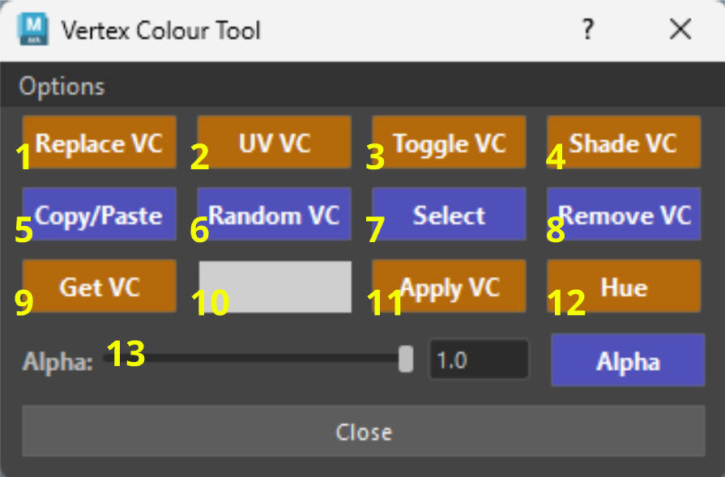{ .img-medium .img-centered} 

??? Info "Important - Selection Order"
    For certain features of the Vertex Colour Tool you will need Maya to **Track Selection Order**.
    
    If features like **Copy/Paste** or **Replace VC** etc. do not work correctly, make sure track selection order is enabled in your **Settings/Preferences** window *(under Selection)*.
    
    { .img-medium .img-centered }

    { .img-medium .img-centered }

??? Info "Important - Untrusted Plugin Loading - Security Warning"

    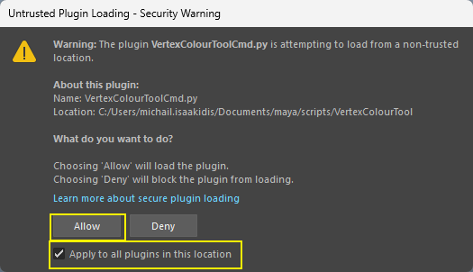{ .img-medium .img-centered} 

    The first time you use the tool, Maya will show an "Untrusted Plugin Loading" warning for VertexColourToolCmd.py.
    
    **VertexColourToolCmd.py** is the tool's undo support — click Allow *(tick "Apply to all plugins in this location" to not be asked again)*. More info about this [here.](#config-Untrusted Plugin)

## **1. Replace VC**

- Bulk-replace specific vertex colors on your objects.

    * Pick a color from the swatch (10), then select a face on your mesh. All faces sharing that exact color will be replaced with your new swatch color.

    <figure style="text-align: center;">
        
        <figcaption>Replace VC from Swatch</figcaption>
    </figure>

    * ++ctrl++ + Click: Select multiple faces, the colour of your first selected face will be used to replace all similar colours from the rest of your selection.

    <figure style="text-align: center;">
        
        <figcaption>Replace VC from face selection</figcaption>
    </figure>

## **2. UV VC**

- Sets a random vertex colour per UV Shell. 

    <figure style="text-align: center;">
        
        <figcaption>Random Colour Per UV Shell</figcaption>
    </figure>

    * Selecting a face will only change the vertex colour of the UV shell to which it belongs.
    * ++ctrl++ + Click: to cut UV edges *(if you have faces selected, those are converted to perimeter edges before being cut)*
    * ++shift++ + Click: to sew UV edges.
    * ++alt++ + Click: to select UV border edges *(from Object mode, not component)*.
    * ++ctrl++ + Click: with selected objects to create a camera projection of the UV's.
    * ++alt++ + ++shift++ Click: in object mode the tool re-projects the UV's from the camera's point of view and for each different vertex colour it will create a UV Shell.
        * Useful for Zbrush workflow so you can polygroup by UV Shell.
        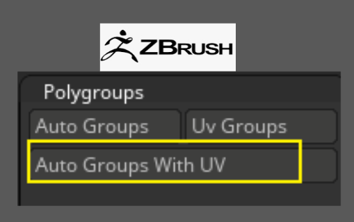{ .img-small } 

        The tool will Unfold your UV's, orient them and lay them out in the 0-1 UV space.
        <figure style="text-align: center;">
            
            <figcaption>Re-project UV Shells in 0-1 space</figcaption>
        </figure>

## **3. Toggle VC**

- Toggles the visibility of vertex colours in your scene.

    * Toggles vertex color visibility on the selected object *(or globally if nothing is selected)*.
        <figure style="text-align: center;">
            
            <figcaption>Toggle Visibility on all or Selected</figcaption>
        </figure>

    * ++ctrl++ + Click: Force-turns off vertex color display for all objects in the scene.
        <figure style="text-align: center;">
            
            <figcaption>Turn off Visibility on all Objects in your Scene</figcaption>
        </figure>

## **4. Shade VC**

- Changes the Color Material Channel to dictate how colors interact with scene lighting.
    * Click: Diffuse
    * ++ctrl++: None
    * ++alt++: Ambient + Diffuse
    * ++shift++: Emission
    * ++ctrl++ + ++shift++: Ambient

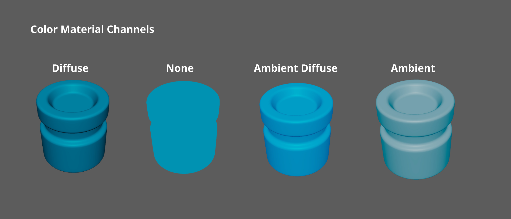{ .img-medium .img-centered}

## **5. Copy/Paste**

- Instantly copies the vertex color of the  last selected face and pastes it onto all other currently selected faces.

    <figure style="text-align: center;">
        
        <figcaption>Copy Paste VC Faces</figcaption>
    </figure>

## **6. Random VC**

- Gives a random vertex colour to a selected object, face or vertex.
    
    <figure style="text-align: center;">
        
        <figcaption>Assigning Random VC</figcaption>
    </figure>

    * ++shift++ Click: Applies the same random color to multiple selected objects or groups.
    
    <figure style="text-align: center;">
        
        <figcaption>Assigning Same Random VC to Selected Objects</figcaption>
    </figure>

    * ++ctrl++ Click: Gives different sub-objects/children their own unique random color (Object mode).
    <figure style="text-align: center;">
        
        <figcaption>Assigning Same Random VC to Sub-Objects</figcaption>
    </figure>

    * ++ctrl++ + ++shift++ + Click: Applies unique random colors per-selected component.
    <figure style="text-align: center;">
        
        <figcaption>Assigning Random VC to Components</figcaption>
    </figure>

## **7. Select**

- Create smart selections based on vertex color data *(similar to polygroup selection in Zbrush)*.
    * Click (Object Mode): Selects all faces matching the active swatch color (10).
    <figure style="text-align: center;">
        
        <figcaption>Select From Swatch</figcaption>
    </figure>
    * Click (Face Mode): Selects all faces matching the color of your currently selected face.
    <figure style="text-align: center;">
        
        <figcaption>Select From Face</figcaption>
    </figure>
    ??? Tip "Info - Create Selection Sets using the Select Button"

        The Select button also has the ability to create a custom *(or fixed)* **Selection Sets**.

        * ++ctrl++ Click: Creates a custom selection set named baking_manager_set.
        <figure style="text-align: center;">
            
            <figcaption>Create baking_manager_set Selection Set</figcaption>
        </figure>        
        * ++ctrl++ + ++shift++ Click: Adds selection to the baking_manager_set.
        <figure style="text-align: center;">
            
            <figcaption>Add components to baking_manager_set Selection Set</figcaption>
        </figure>  
        * ++alt++ + Click: Removes selection from the baking_manager_set.
        <figure style="text-align: center;">
            
            <figcaption>Remove components from baking_manager_set Selection Set</figcaption>
        </figure> 
        * ++alt++ + ++ctrl++ Click: Deletes the baking_manager_set.
        <figure style="text-align: center;">
            
            <figcaption>Deletes the baking_manager_set Selection Set</figcaption>
        </figure> 
        * ++alt++ + ++ctrl++ + ++shift++ Click: Opens Maya's "Create Quick Select Set" dialog.
        <figure style="text-align: center;">
            
            <figcaption>Opens Maya's "Create Quick Select Set" dialog</figcaption>
        </figure> 
## **8. Remove VC**

- Removes the vertex color from the selected object.
    <figure style="text-align: center;">
        
        <figcaption>Remove VC</figcaption>
    </figure>
    
    

    ??? Bug "Maya Bug - Vertex Paint is not Removed"
        There is a Maya bug where the vertex paint is not removed. This usually happens when you already have vertex paint and apply some additional modelling to your object. 

        It is advised on those instances to use the ++ctrl++ + Click feature of the tool which deletes the Colour Set of the selected Object, or use ++ctrl++ + ++shift++ which will delete history but will remove the colours on selected components.

        <figure style="text-align: center;">
            
            <figcaption>Maya Bug Preventing Vertex Colour from being Removed</figcaption>
        </figure>

    * ++ctrl++ + Click: Completely deletes the underlying Color Set.

        When you apply Vertex Paint on any of your objects, a "Color Set" is created in Maya that holds all the colour information for each object. 

        ++ctrl++ + Click the Get Button to open it or find it under "Mesh Display -> Color Set Editor" in the "Modelling" tab.

        ??? Info "Info - Color Set Editor"

            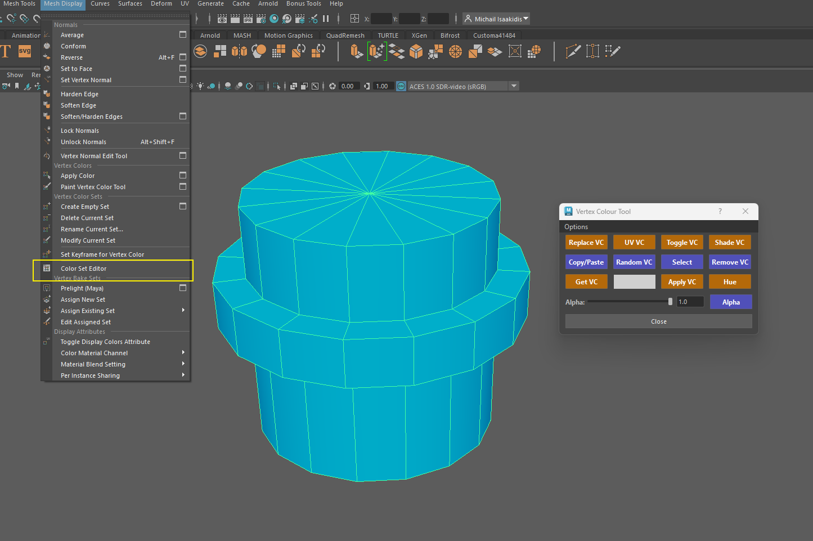{ .img-medium } 
            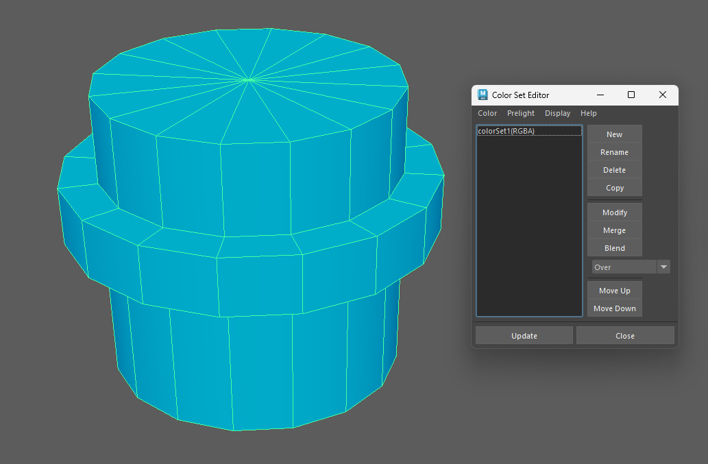{ .img-medium } 

    * ++ctrl++ + ++shift++ Click: Aggressive fallback fix if Maya refuses to delete colors. Works only in component mode.
    
        **Note**: Deletes history and ungroups the object.

## **9. Get VC**

- Samples the color from a selected component and loads it into the Swatch (10).
    * Works with components or in Object Mode. 
        1.  When multiple components selected it only retrieves the first one that has Vertex Colour applied.
        2.  In Object Mode it looks through all of the object's components and retrieves the first one that has Vertex Colour applied.

    <figure style="text-align: center;">
        
        <figcaption>Retrieves the colour of the selected component</figcaption>
    </figure>

    * ++alt++ + Click: Opens Maya's Apply Color Options.
        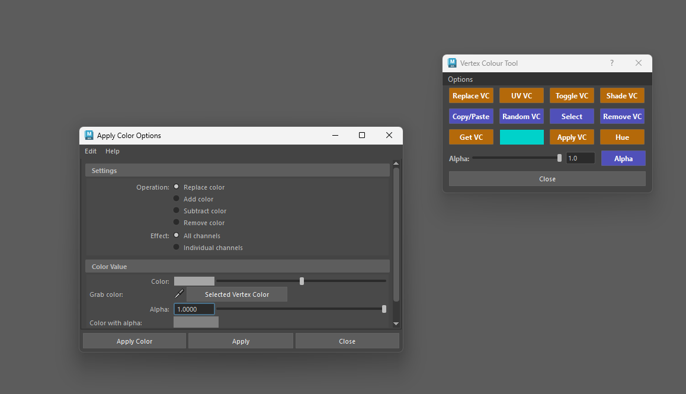{ .img-medium } 
    * ++ctrl++ + Click: Opens the Color Set Editor.
    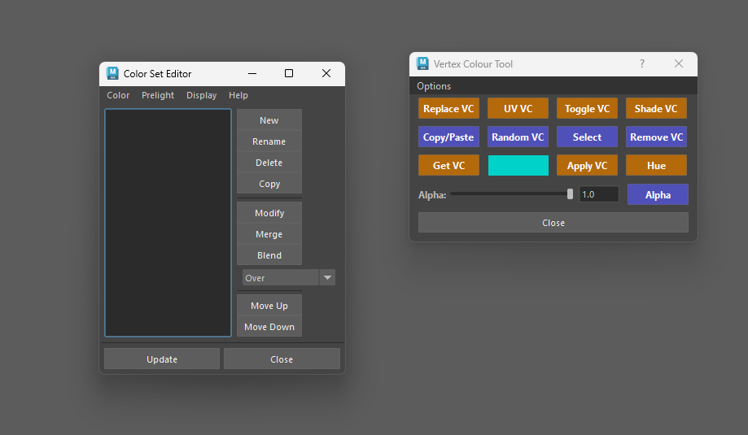{ .img-medium } 
    * ++shift++ + Click: Opens the Paint Vertex Color Tool.
    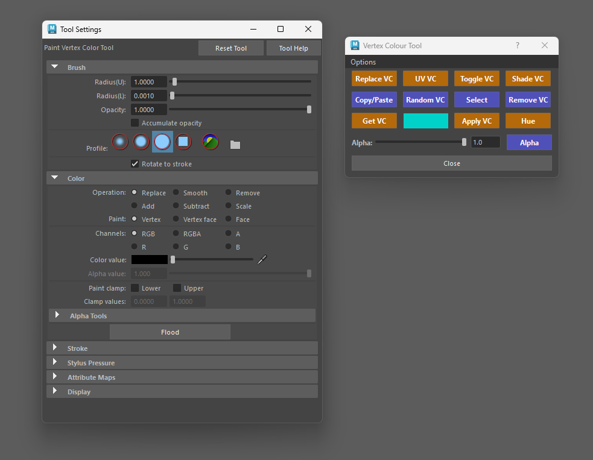{ .img-medium } 

    

    * ++ctrl++ + ++alt++ + ++shift++ + Click: Toggles Maya's Color Management View Transform to "Un-tone-mapped" & Rendering Space to "scene-linear Red.709-sRGB"to ensure accurate color sampling.
    
    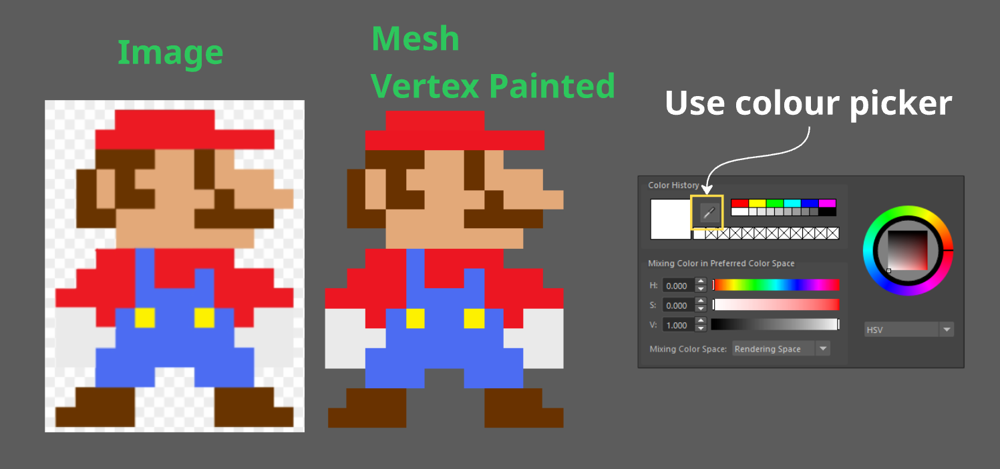{ .img-medium .img-centered} 

    ???+ Warning "Important - Sampling Colours"
        Use this when you want to sample colours (e.g. trying to match colours from a different application).

        * When sampling colours with Maya's default ColorSpace values will exceed the 0-1 range for **RGB**. If you try and apply that colour on an object the vertex colour applied will be rendered black.
        <figure style="text-align: center;">
            
            <figcaption>White Value Sampled is above 0-1 (RGB) causing the VC to be set to black</figcaption>
        </figure>
        * This feature changes the Color Space in Maya so the colour sampled does not exceed the 0-1 value range for **RGB**. 
        <figure style="text-align: center;">
            
            <figcaption>White Value is Clamped to 1 Rendered Correctly</figcaption>
        </figure>

        * You can check Maya's Color Management Preferences in the Preferences Window to see what changes are being made. 
        <figure style="text-align: center;">
            
            <figcaption>Color Management Preferences</figcaption>
        </figure>

## **10. Color Swatch**

- Opens the color picker. This sets the active color used by *Apply VC, Replace VC, and Select*.
    *  **Double-Click** to open full window.
    <figure style="text-align: center;">
    
    <figcaption>Colour Swatch</figcaption>
    </figure>

## **11. Apply VC**

- Applies the current swatch color and alpha to your selection.
    <figure style="text-align: center;">
    
    <figcaption>Applies the Colour from the Swatch</figcaption>
    </figure>
    * ++shift++ + Click  (Faces): Applies the color of the last selected face to all other selected faces *(much faster approach)*. Does the same exact thing as the Copy/Paste button.
    <figure style="text-align: center;">
    
    <figcaption>Copy the value of the last selected face to the rest of your selection</figcaption>
    </figure>
    * ++ctrl++ + Click  (Faces): Opens the Paint Vertex Color Tool to apply colors via a texture based on your UV layout.
        * The Vertex Paint application is determined by the objects UV layout *(from the active UV Set)*.

    <figure style="text-align: center;">
    
    <figcaption>Image based application of VC</figcaption>
    </figure>

    ???+ Tip "Tip - Texture Based Interpolation (Smooth VS Faceted)"
        - You can change the interpolation of how the Vertex Colour are applied from the image by changing the paint mode in the Paint Vertex Color Tool.
            * Vertices will give you smoother results, while Faces will give you a more faceted one.

        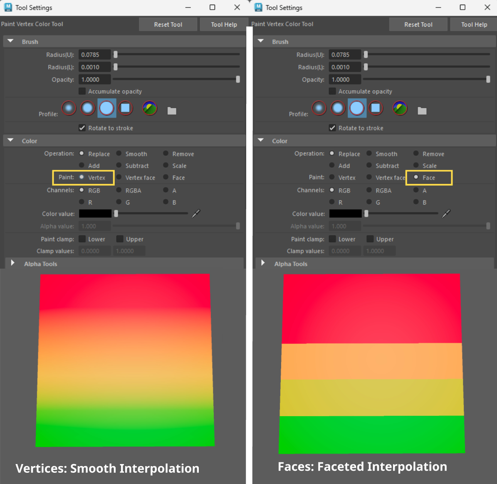{ .img-small .img-centered  } 

- ### Using sRGB - Linear textures to apply vertex colours

    ??? Tips "Important information about Texture Colour Space - sRGB vs Linear" 

        * When you use an image to create vertex colours (++ctrl++ + Click on **Apply VC**), the image's pixel values are copied as-is. 
        
            Image files store colours sRGB-encoded, but Maya treats vertex colours as linear data — so the viewport applies its display transform on top of the already-encoded values, and the result looks washed out and brighter than the source image.

        * In the **Options Menu** the checkbox **Convert sRGB to Linear on Image Import**,  converts the imported vertex colours from sRGB to linear immediately after the import, so what you see in the viewport matches the source texture. 
            
            The conversion runs per face-vertex (respecting the **Paint mode** of the **Paint Vertex Color Tool** — Vertex, Vertex face, or Face), leaves alpha untouched, and is fully undoable as part of the import.

        * Disable it if your target engine or pipeline expects raw sRGB values stored in the vertex colours (e.g. a shader that handles the conversion itself).

        - Examples: 

        - The Issue: Washed out Vertex colours not matching the source image colour values.
            
            ???+ Tips "View Transform"
                Ensure your **View Transform** is always set to **Un-tone-mapped (sRGB)** when you are trying to match colours, as this will match external apps like Photoshop, Unreal etc. 

        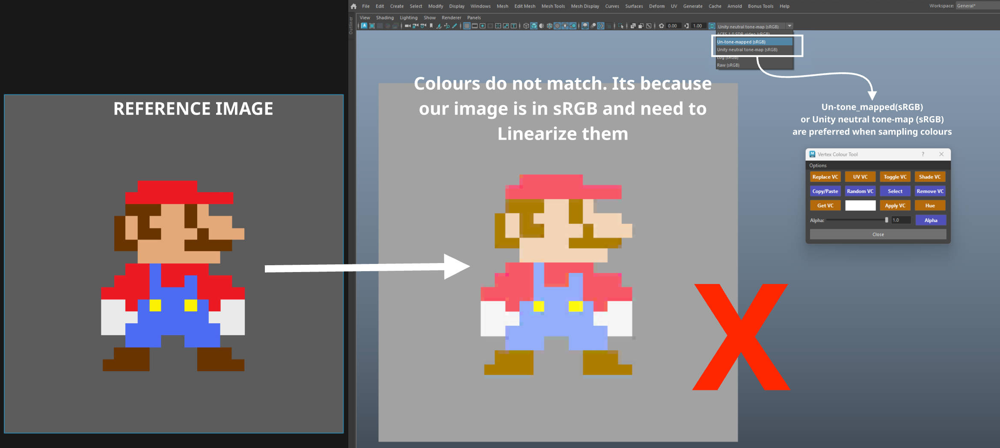{ .img-medium .img-centered  } 

        - Notice how if we change our **View Transform** to **RAW** the colours in our viewport match the reference image.
        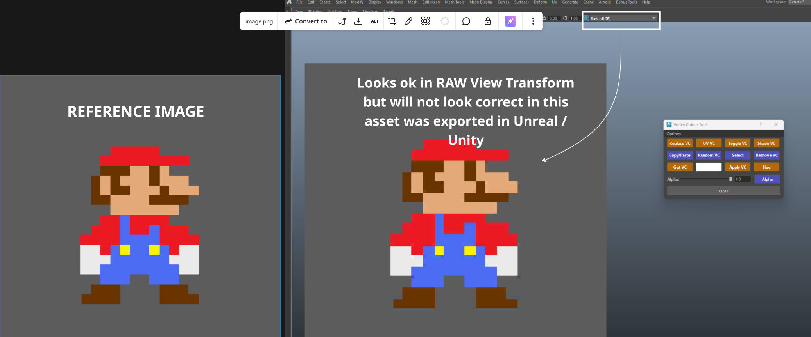{ .img-medium .img-centered  } 

        - **2 Ways to Fix:**
            * **Fix 1: Convert your image to Linear in Photoshop.**
            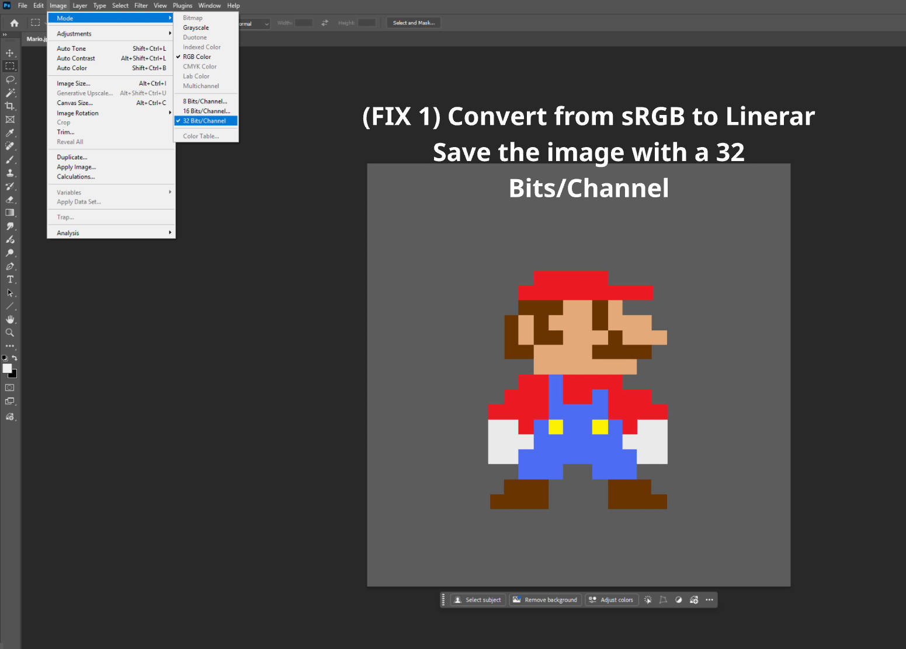{ .img-medium .img-centered  } 

            - **Fix 2: Use Checkbox - Convert sRGB to Linear on Image Import.**

                * 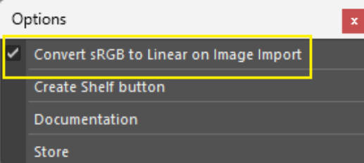{ .img-small .img-centered} 

                <figure style="text-align: center;" markdown>
                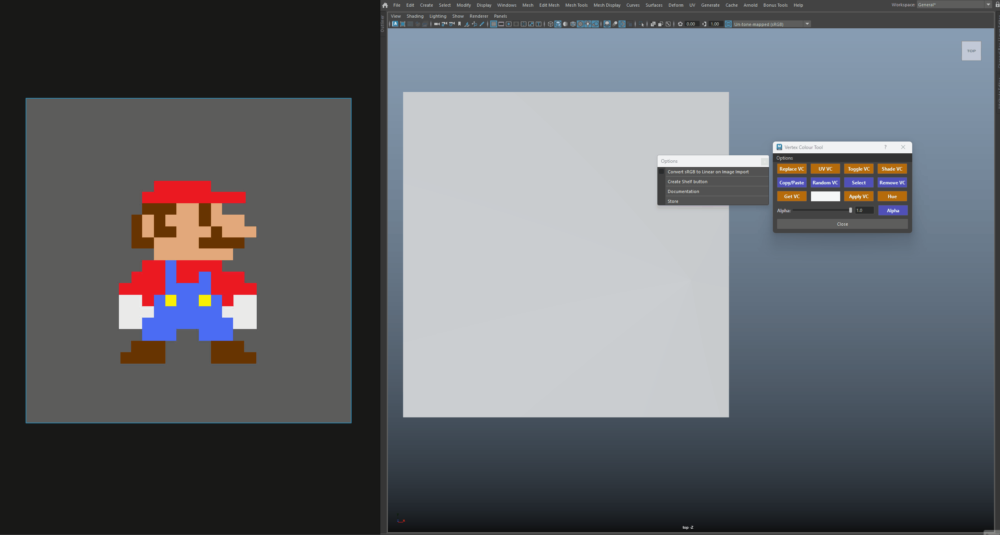{ .img-medium }
                <figcaption>Converting sRGB to Linear</figcaption>
                </figure>

        * This is the easier option and automatically converts the colours when applied to your object in Maya *(no texture conversion in Photoshop needed)*. 
        * By default the value is always on, so if you notice and discrepancies with your reference image, uncheck the checkbox and try again. 
        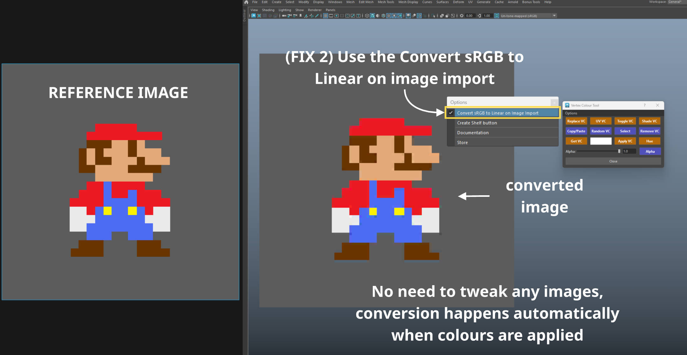{ .img-medium .img-centered  } 

        - Final Result in **Unreal Engine**

        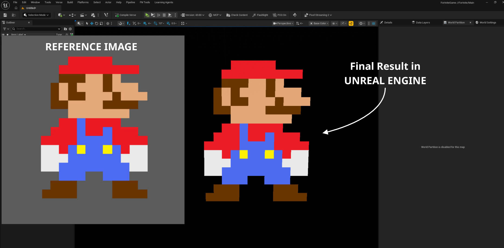{ .img-medium .img-centered  } 

## **12. Hue**

- Shifts the hue of the selected vertices/faces to match the hue currently loaded in the Color Swatch (10), while preserving existing luminosity/saturation.
    * You can interpolate the Hue changes by switching from Vertex to Face Mode.
    <figure style="text-align: center;">
    
    <figcaption>Hue Changes</figcaption>
    </figure>

## **13. Alpha Controls (Slider, Input & Button)**

- Use the slider or text box to dial in your exact opacity (0.0 to 1.0).
    * Click (Alpha Button): Applies the slider's alpha value to your selection.
    <figure style="text-align: center;">
    
    <figcaption>Applying Alpha VC</figcaption>
    </figure>
    * ++ctrl++ + Click (Alpha Button): Samples the alpha value from your selection and updates the slider.
    <figure style="text-align: center;">
    
    <figcaption>Retrieving Alpha Values</figcaption>
    </figure>
    * ++shift++ + Click (Alpha Button): Applies a completely random alpha value to the selection.
    <figure style="text-align: center;">
    
    <figcaption>Assigning Random Alpha Values</figcaption>
    </figure>

## **Options Menu**

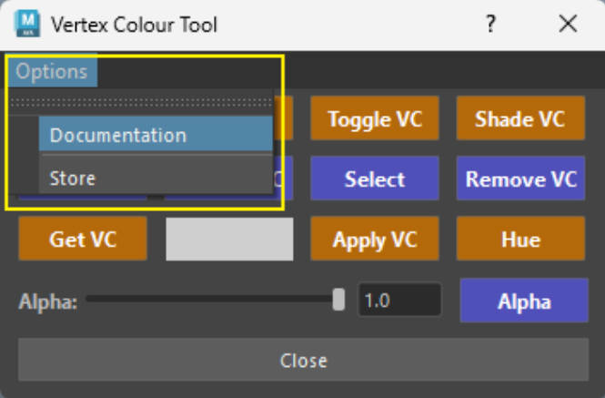{ .img-small } 

* Convert sRGB to Linear on Image Import - Refers to when using texture images to create vertex colours (++ctrl++ + Click the **Apply VC** button). 

    * For more info click [here (sRGB -Linear)](#using-srgb-linear-textures-to-apply-vertex-colours)

* Create Shelf Button - Creates a shelf button for this tool directly on your active Maya shelf.

* Documentation - Opens a link to the documentation.

* Store - Opens links to ArtStation and Gumroad.

## Important Reminders

### Track Selection order

- Ensure Track selection order is enabled in the Maya Preferences [here.](#config-Selection Order)

### Untrusted Plugin Loading - Security Warning

{ .img-medium .img-centered} 

- Why does Maya show a security warning the first time?

    The first time you use the tool, Maya will show an "Untrusted Plugin Loading" warning for VertexColourToolCmd.py. This is normal and nothing to worry about.

- Maya will ask for confirmation before loading any plug-in that lives outside Maya's own install folders — including plug-ins in your personal scripts directory, which is where this tool is installed. Maya isn't detecting anything harmful; it simply doesn't recognise the location as trusted yet.

- VertexColourToolCmd.py is part of the Vertex Colour Tool. It's a small companion plug-in that makes vertex colour painting fully undoable — it stores each paint operation in the mesh's construction history, so **Ctrl+Z** removes the paint without touching the rest of your history.

- Click Allow to load it. Tick Apply to all plugins in this location"ow" first if you don't want to be asked again — this tells Maya to trust the tool's folder from now on. If you click Deny, the tool still works, but painting won't be undoable and you'll see a warning in the Script Editor.

You can review or change trusted locations at any time under Windows → Settings/Preferences → Preferences → Security.

### Vertex Paint Not Removed
- If you are unable to simply remove vertex paint from your objects find all the info [here.](#config-Remove_Vertex_Colour)

### Sampling Colours
- If you need to sample colours follow the guide [here.](#config-Sampling_Colours)

### Working with High Poly Counts

- The tool has been heavily optimized to work on high poly meshes. 

    Because of this the tool bypass standard construction history.

- The tool has been tested applying Vertex Colours with 500K faces and the results take just a few seconds.

    <figure style="text-align: center;">
    
    <figcaption>Applying Vertex Colour on a 1.2m tris object</figcaption>
    </figure>

- Please make sure to **save** your scene before working on higher polycounts as the computational process may take some time.
    

    ??? Info "Info - Built-in Poly Count Thresholds & Warnings"

        * 150,000 Faces (Select Threshold):
            If you attempt to apply a swatch color directly to more than 150,000 selected faces, the tool pauses and triggers a confirmation popup warning you that the operation may take some time.
        

        <figure style="text-align: center;">
        
        <figcaption>Window Pop up when working with a (1.2m tris) High Poly Object</figcaption>
        </figure>