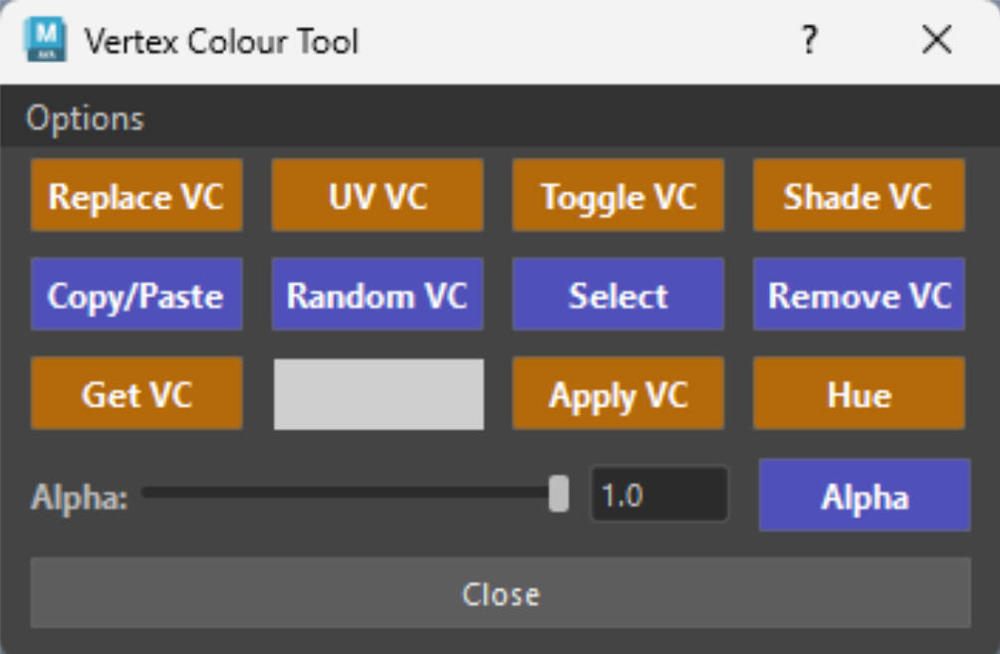
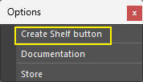

# :octicons-tools-16: **<span style="color:rgb(238, 235, 77);">Installing Vertex Colour Tool</span>**

{ .img-small } 

### <span style="color:rgb(238, 235, 77);">**Step 1 - Setting up**</span>
<div class="grid cards" markdown>

-   :octicons-copy-16:{ .lg .middle } __[`Setting up`](#)__

    ---

    1.Unzip the [`VertexColourTool.zip`](#) file.
    
    2.Copy paste the [`VertexColourTool`](#) **folder** in your [`\Documents\Maya\Scripts`](#) folder.
    
    3.Open [`Maya`](#). 

    <!-- [:octicons-arrow-right-24: Getting started](#) -->
    


</div>


### <span style="color:rgb(238, 235, 77);">**Step 2- Activating**</span>

<div class="grid cards" markdown>

-   :octicons-copy-16:{ .lg .middle } __[`Python Code`](#)__

    ---

    Copy the 2 ^^**python**^^  lines below on a ^^**shelf**^^  or bind these to a ^^**hotkey**^^  to load the tool.

    ``` py linenums="1"
    from VertexColourTool import Vertex_Colour
    Vertex_Colour.VertexColour().show_dialog()
    ```


</div>


??? note  "Vertex Colour Tool Shelf Image - Shelf Button Info"

    First time you fire up the tool click on the <span style="color:rgb(221, 240, 115);">**Options Menu**</span>. 
    
    There you will find a <span style="color:rgb(221, 240, 115);">**create shelf button**</span> you can use that will automatically create a shelf button for you.
    
    

    Downloading this image is not necessary *(exists only as backup)*.

    <figure markdown="1" style="margin: 0; display: inline-block;">

    [](../Vertex%20Colours%20Tool/images/vertex_colors_icon.png){: .md-button download="Vertex_Colour_Tool_Image.png" }

    <figcaption style="text-align: center;"><span style="color:rgb(168, 136, 228);"></span></figcaption>
    </figure>

Click the button below to learn how to create hotkeys and shelf buttons.

[Creating Hotkeys/Shelf Buttons](../Create%20Hotkeys%20Shelf%20Buttons/index.md){ .md-button .md-button--primary }

