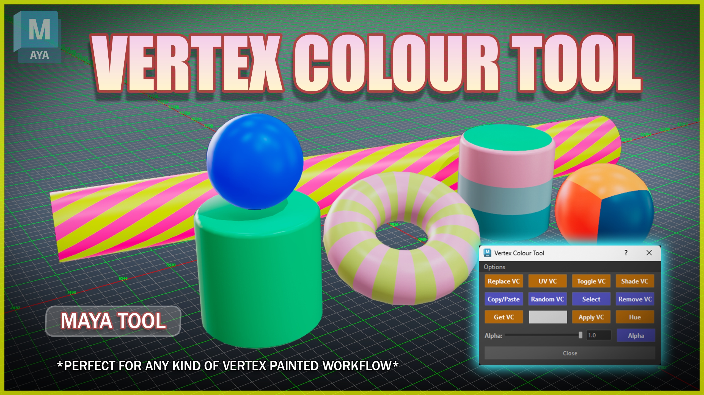

# **Vertex Colours** 

{ .img-medium } 

??? Tip "Maya Versions"
    *Tested in Maya 2022-2027*

If you're tired of fighting with Maya's default vertex color tools, the **Vertex Colour Tool** is here to make your life a whole lot easier. 

Instead of menu-diving and digging through a dozen different Maya windows just to change a hue or fix an alpha, this puts absolutely everything you need into one clean, compact UI. 

Think of it as your trusty sidekick for texturing and **baking** prep. Whether you need to quickly generate **ID maps**, sort out your UVs by color islands, or bulk-replace colors across a massive mesh, this script has your back. 

It’s packed with handy keyboard shortcuts, **smart color-based selection tools**. 

It really bridges the gap between modeling and texturing, saving you tons of time *(and headaches)* along the way!